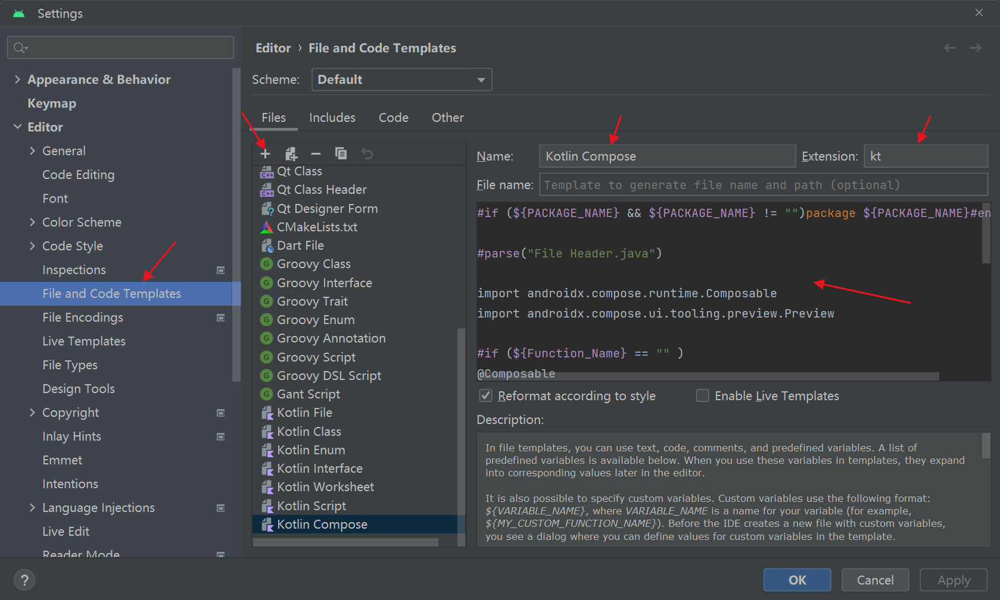

## Jetpack Compose

### 函数修饰符
[函数修饰符介绍](./compose/compose_annotation.md)

### 组件
创建组件模板


```
#if (${PACKAGE_NAME} && ${PACKAGE_NAME} != "")package ${PACKAGE_NAME}#end

#parse("File Header.java")

import androidx.compose.runtime.Composable
import androidx.compose.ui.tooling.preview.Preview

#if (${Function_Name} == "" )
@Composable
fun ${NAME}() {
}@Preview
@Composable
fun ${NAME}Preview() {${NAME}()
}
#end#if (${Function_Name} != "" )
@Composable
fun ${Function_Name}() {
}@Preview
@Composable
fun ${Function_Name}Preview() {${Function_Name}()
}
#end
```

组件对比

| Android  | Compose  |
|  ----  | ----  |
|  Button  | Button  |
|  TextView  | [Text](./compose/compose_text.md)  |
|  EditText  | TextField  |
|  ImageView  | Image  |
|  LinearLayout(h)  | Row  |
|  LinearLayout(v)  | Column  |
|  FrameLayout  | Box  |
|  RecyclerView(v)  | LazyColumn  |
|  RecyclerView(h)  | LazyRow  |
|  Snackbar  | Snackbar  |


#### Modifier修饰符

#### Slots API

CompositionLocalProvider
Scaffold