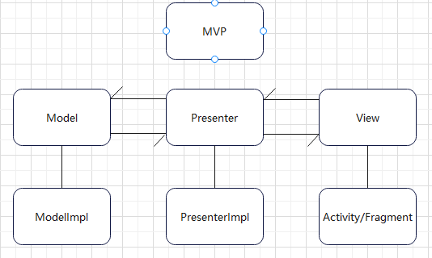

### MVC

在安卓开发中，MVC（Model-View-Controller）是一种软件设计模式，用于组织和管理应用程序的结构和逻辑。具体来说，安卓中的MVC模式可以理解为以下对应关系：

1. Model（模型）：模型是应用程序中的数据和业务逻辑。在安卓中，模型通常是指数据的来源和处理，例如从数据库中读取数据、对数据进行操作和更新等。

2. View（视图）：视图负责显示模型中的数据和用户界面。在安卓中，视图通常是指UI元素，如按钮、文本框、图表等，以及布局文件（XML文件）。

3. Controller（控制器）：控制器负责处理用户输入、更新模型数据和管理视图的行为。在安卓中，控制器通常是指活动（Activity）或片段（Fragment），它们接收用户输入、调用模型的方法来更新数据，并在需要时更新视图。

#### 优点
1. 分离关注点：MVC将应用程序的逻辑分为模型、视图和控制器，使得代码更具可读性和可维护性。
2. 可重用性：MVC中的模型和视图是独立的，可以在不同的场景中重用。
3. 松耦合：模型、视图和控制器之间的耦合度较低，使得对于其中一个部分的修改不会影响其他部分。
4. 容易进行单元测试：MVC中的控制器和模型都可以进行单元测试，以保证代码的质量。

#### 缺点
1. 视图和控制器之间的耦合：控制器对视图的直接引用可能导致它们之间的强耦合，造成代码的复杂性增加。
2. 逻辑分散：MVC中的控制器负责处理用户输入和控制模型和视图之间的交互，导致应用程序逻辑分散在各个控制器之间。
3. 随着界面及其逻辑的复杂度不断提升，Activity类的职责不断增加，以致变得庞大臃肿

### MVP

在安卓开发中，MVP（Model-View-Presenter）是一种基于MVC模式的变种模式，它用于组织和管理应用程序的结构和逻辑。在安卓中，MVP模式可以理解为以下对应关系：

1. Model（模型）：与mvc相同

2. View（视图）：与mvc相同

3. Presenter（展示者）：展示者是连接模型和视图的中间层。它负责处理用户输入、调用模型的方法来更新数据，并在需要时更新视图。展示者还负责控制视图的行为和逻辑，例如处理点击事件、显示数据等。

#### 优点
1. 更好的测试性：MVP中的视图和模型之间通过Presenter进行交互，使得视图和模型可以进行独立的单元测试。
2. 解耦：MVP将视图和模型完全解耦，使得它们可以独立地进行开发和修改。
3. 可维护性：MVP架构使得代码更易于理解和维护。
4. 灵活性：Presenter可以根据具体的需求进行定制，使得应用程序更加灵活。

#### 缺点
1. 复杂性增加：MVP架构中增加了Presenter的角色，使得整体架构变得更加复杂。
2. 学习曲线：对于没有使用过MVP的开发人员来说，学习和理解MVP架构可能需要一定的时间和经验
3. 接口爆炸式增加

### mvp搭建


View层接口
```java
interface ILoginView {
    fun loginSuccess(data: LoginBean?)

    fun loginFail(msg: String?)
}
```
View层实现：由图可知v层需要p层对象
```java
class LoginActivity : AppCompatActivity, ILoginView {
    private lateinit var p: ILoginPresenter
    override fun init() {
        p = LoginPresenterImpl(this, this)
        xx.setOnClickListener {
            p.login("xxx", "xxx")
        }
    }
    override fun loginSuccess(data: LoginBean?) {
    }

    override fun loginFail(msg: String?) {
    }
}
```
p层接口
```java
interface ILoginPresenter {
    fun login(name: String, pwd: String)
}
```
p层实现：由图可知p层需要model和view对象，一般数据校验可以在此执行
```java
class LoginPresenterImpl(private val context: Context, private val loginView: ILoginView) :
    ILoginPresenter, ILoginModel.ILoginCallBack {
    private val model = LoginModelImpl()
    override fun login(name: String, pwd: String) {
        //数据校验处理
        model.login(context, name, pwd, this)
    }
    override fun onSuccess(data: LoginBean?) {
        //数据校验处理
        loginView.loginSuccess(data)
    }
    override fun onFail(msg: String?) {
        loginView.loginFail(msg)
    }
}
```
model层接口：需要回调给p层数据
```java
interface ILoginModel {
    fun login(context: Context, name: String, pwd: String, callBack: ILoginCallBack)

    interface ILoginCallBack {
        fun onSuccess(data: LoginBean?)

        fun onFail(msg: String?)
    }
}
```
model层实现
```java
class LoginModelImpl : ILoginModel {
    override fun login(
        context: Context,
        name: String,
        pwd: String,
        callBack: ILoginModel.ILoginCallBack
    ) {
        //网络请求
}
```
google方案实现
增加一个契约类，将接口类全部移到类中
```java
interface LoginContract {
    interface IModel {
        //省略
    }

    interface IView{
        //省略
    }

    interface IPresenter {
       //省略
    }
}
```