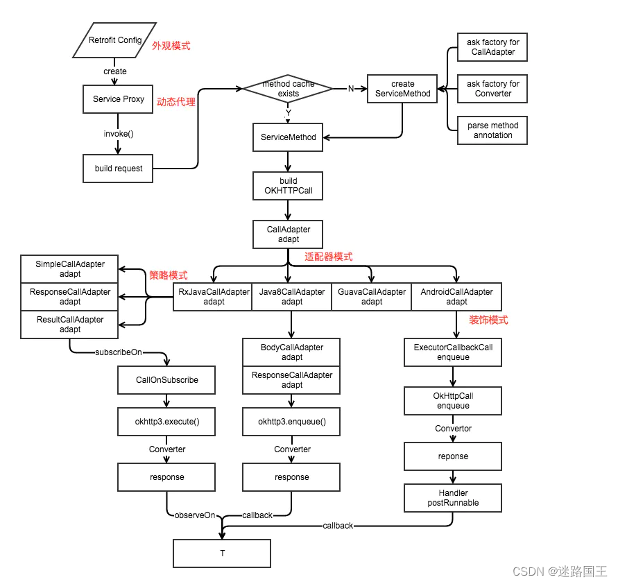

### EventBus
使用注解、反射、3.x后添加apt代替反射

### mmkv
github: https://github.com/Tencent/MMKV/

写入快，小数据快，支持多进程，不会自动备份数据，初始化加载文件或大字符时可能会卡顿

诞生目的：解决高频主线程写数据

### datastore
诞生目的：代替SharedPreferences

支持多进程，会自动备份，大数据存储比mmkv快

### OKhttp

保持长连接：加快请求效率，重复使用socket，需要服务器支持

key: Connection value: keep-alive

如果响应返回也有是keep-alive说明支持，如果是close则不支持

http1.1开始支持，但只能串行(保证有序)，即上一个请求完成后才能下一个请求

http2.0支持并行(多了顺序标识保证有序)

OkHttp缓存默认关闭需要调用.cache(path)

#### 分发流程

```kotlin
override fun enqueue(responseCallback: Callback) {
    check(executed.compareAndSet(false, true)) { "Already Executed" }

    callStart()
    client.dispatcher.enqueue(AsyncCall(responseCallback))
}
```
check先使用CAS机制保证只能执行一次异步请求，然后dispatcher分发器
```kotlin
internal fun enqueue(call: AsyncCall) {
    synchronized(this) {
    // 添加到准备队列中
    readyAsyncCalls.add(call)
    if (!call.call.forWebSocket) {
        val existingCall = findExistingCallWithHost(call.host)
        if (existingCall != null) call.reuseCallsPerHostFrom(existingCall)
      }
    }
    promoteAndExecute()
}
private fun promoteAndExecute(): Boolean {
    //...
    synchronized(this) {
      val i = readyAsyncCalls.iterator()
      while (i.hasNext()) {
        val asyncCall = i.next()
        // 最大异步请求64个
        if (runningAsyncCalls.size >= this.maxRequests) break // Max capacity.
        // 同一个host不能大于5，比如请求百度不能同时来6次，第6次等待
        if (asyncCall.callsPerHost.get() >= this.maxRequestsPerHost) continue // Host max capacity.

        i.remove()
        asyncCall.callsPerHost.incrementAndGet()
        // 添加到需要执行的请求队列中
        executableCalls.add(asyncCall)
        // 添加到执行队列中
        runningAsyncCalls.add(asyncCall)
      }
      isRunning = runningCallsCount() > 0
    }

    for (i in 0 until executableCalls.size) {
      val asyncCall = executableCalls[i]
      asyncCall.executeOn(executorService)// 遍历执行异步请求
    }

    return isRunning
  }

fun executeOn(executorService: ExecutorService) {
    //...
    try {
    executorService.execute(this) //执行run方法
    } 
    //...
}
executorService：相当于Executor.newCachedThreadPool

// SynchronousQueue: 不用等待前面请求，并行执行
ThreadPoolExecutor(0, Int.MAX_VALUE, 60, TimeUnit.SECONDS,
    SynchronousQueue(), threadFactory("$okHttpName Dispatcher", false))

override fun run() {
    //...
    finally {
        // 会重写执行promoteAndExecute方法触发下一个请求(如果还有下一个请求)
        client.dispatcher.finished(this)
    }
}
```
同步请求execute区别就是直接添加到runningAsyncCalls中执行请求

#### 拦截器
1. 重试重定向拦截器：判断是否取消，获得结果后根据响应码判断是否重定向，满足条件会重启所有拦截器
2. 桥接拦截器：自动添加host等http协议必备的请求头，cookie相关
3. 缓存拦截器：缓存相关
4. 连接拦截器：负责找到或者创建一个拦截器，不会额外处理数据
5. 请求服务器拦截器：真正与服务器通信

自定义拦截器

Interceptor和NetworkInterceptor：前者添加到最开始，后者添加到最后，所以请求有前者先获得，响应由后者先获取，因为先请求后响应

HttpLoggingInterceptor添加到上面两个效果不同，后者由于放最后能拿到所有请求内容

分发器工作流程

同步：主要记录到队列中直接请求；异步：需要先放到准备队列满足64和5条件后再请求

拦截器分发流程

责任链模式

请求流程：创建client->realCall->同步、异步(AsynCall)->分发器->拦截器请求

getResponseWithInterceptorChain：所有拦截器所在

##### 重定向拦截器

最多20次，.retryOnConnectionFailure(false)关闭重试默认开启

某些异常不重试：协议异常(204)、io中断异常(Socket重试除外)、证书异常、证书验证异常

### Retrofit
官方网址：https://github.com/square/retrofit

本身不支持网络请求，面向切面编程，aop思想

#### 应用8种设计模式
构建者模式(Builder)：使用规则是参数超过5且可选时，Retrofit的创建时使用到

外观模式：容易使用，符合迪米特法则，create即可创建实例；三方sdk常用

装饰者模式：组合的形式拓展功能，如io中的BufferedoutputStream(FileOutputStream(File))可以单独也可以组合使用，根据需求增减十分灵活；retrofit在ExecutorCallbackCall拓展OkHttpCall功能，添加切换到主线程功能(MainThreadExecutor采用Handler)

代理模式vs装饰者模式区别：代理后对象变了，装饰后只是增强功能

适配器模式：OkHttpCall转成ExecutorCallbackCall

策略模式：CallAdapter根据不同返回类型采取不同算法



#### 原理
核心知识：动态代理、注解、反射

Retrofit的创建
```kotlin
Retrofit.Builder()
    .baseUrl(BASE_URL)
    .client(createDefaultOkhttp())
    .addConverterFactory(GsonConverterFactory.create())
    .build()
```
实例生成，是动态生成了实现类
```kotlin
retrofit.create(ChatGptApi::class.java)
```
create的源码使用了动态代理
```java
public <T> T create(final Class<T> service) {
    validateServiceInterface(service);
return (T)
    Proxy.newProxyInstance(
        service.getClassLoader(),
        new Class<?>[] {service},
        new InvocationHandler() {
            private final Platform platform = Platform.get();
            private final Object[] emptyArgs = new Object[0];

            @Override
            public @Nullable Object invoke(Object proxy, Method method, @Nullable Object[] args)
                throws Throwable {
            if (method.getDeclaringClass() == Object.class) {
                return method.invoke(this, args);
            }
            args = args != null ? args : emptyArgs;
            return platform.isDefaultMethod(method)
                ? platform.invokeDefaultMethod(method, service, proxy, args)
                : loadServiceMethod(method).invoke(args);
            }
        });
}
```
接着使用注解和反射知识
```java
ServiceMethod<?> loadServiceMethod(Method method) {
    ServiceMethod<?> result = serviceMethodCache.get(method);
    if (result != null) return result;

    synchronized (serviceMethodCache) {
      result = serviceMethodCache.get(method);
      if (result == null) {
        result = ServiceMethod.parseAnnotations(this, method);
        serviceMethodCache.put(method, result);
      }
    }
    return result;
}
```
主要是通过动态代理(含反射机制)，然后解析注解封装请求所需的信息并创建默认的okhttp请求体进行请求

### Glide
Glide.with().load().into()

with：空白Fragment管理生命周期

load：构建出RequestBuilder对象

into：运行队列 等待队列 活动缓存 内存缓存 网络模型

### Coil