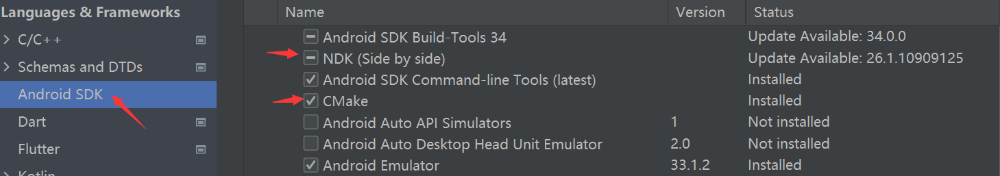
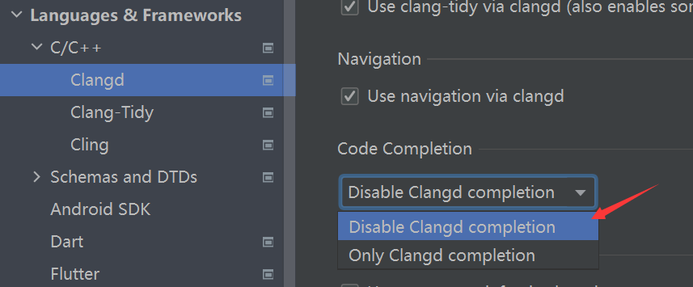

### 配置工程
as中安装工具，包括ndk和cmake



[gradle配置](./android_studio.md#ndk_config)

代码提示功能开启，针对头文件引入后没有代码提示



### 基础知识
上层调用c++方法方式

java：native关键字

kotlin：external关键字

cmake文件中

```cmake
add_library(${CMAKE_PROJECT_NAME} SHARED
    jetpack.cpp)

target_link_libraries(${CMAKE_PROJECT_NAME}
    android
    log)
```
add_library：参数分别是名字，编译类型(SHARED表示编译成so)，编译源文件

target_link_libraries：引用其他库