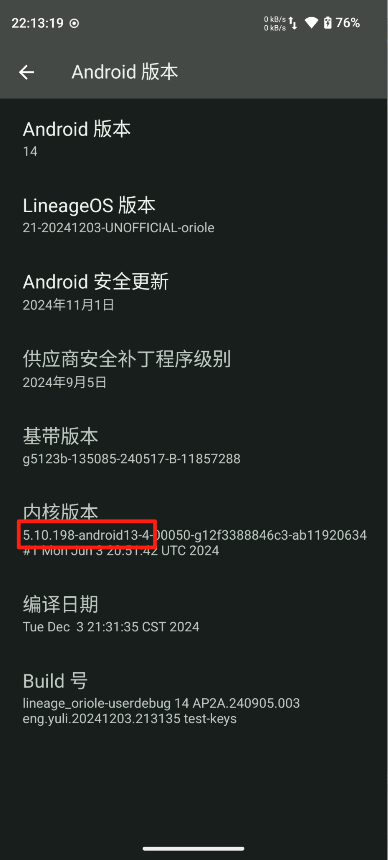

## Root
### Magisk方式
https://github.com/topjohnwu/Magisk/releases
下载最新的Magisk_xxx.apk
```shell
adb install Magisk_xxx.apk
```
获取设备的boot.img，从刷机包或者源码编译中获取，或者直接从手机中提取

从手机中提取

查看boot分区路径
```shell
adb shell "ls -la /dev/block/by-name/ |grep boot"
```


由于手机是双分区的，所以需要确定当前使用的是a分区还是b分区
```shell
adb shell "getprop ro.boot.slot_suffix"
```
输出结果为：_b
```shell
adb root
adb shell "dd if=/dev/block/sda21 of=/sdcard/boot.img"
```
打开Magisk，在Magisk行点安装，选择并修补一个文件，选择boot.img文件开始，完成后根据路径(storage/emulated/0/Download)将生成的magisk_patched-xxx.img导出到电脑
```shell
adb pull /sdcard/Download/magisk_patched-xxx.img boot.img
```
将boot.img刷入到手机
```shell
adb reboot bootloader
fastboot flash boot boot.img
fastboot reboot
```
再次打开Magisk看到以下底部按钮可点击即为成功root

### KernelSU方式
项目官网：https://github.com/tiann/KernelSU

下载最新的Magisk安装包

https://github.com/topjohnwu/Magisk/releases

将 Magisk-*(version).apk 重命名为 Magisk-*.zip 

解压获取Magisk-*/lib/arm64-v8a/libmagiskboot.so文件

使用 adb push 到手机：
```shell
adb push libmagiskboot.so /data/local/tmp/magiskboot
```
提取boot.img，刷机包或者直接提取系统boot

下载AnyKernel3(https://github.com/tiann/KernelSU/releases/tag/v0.9.0) 中的 Image

根据手机设置内核版本



下载对应AnyKernel3-android13-5.10.198_2023-12.zip 

推送到手机
```shell
adb push boot.img /data/local/tmp/
adb push Image /data/local/tmp/
```
打包内核
```shell
adb shell
cd /data/local/tmp/
chmod +x magiskboot
./magiskboot unpack boot.img
//执行后得到kernel文件
mv -f Image kernel
./magiskboot repack boot.img
//得到new-boot.img文件
```
刷内核到手机
```shell
fastboot flash boot new-boot.img
```
安装 KernelSU_xxx-release.apk (https://github.com/tiann/KernelSU/releases/tag/v0.9.0)

### LSPosed
LSPosed框架: 

https://github.com/LSPosed/LSPosed

https://github.com/JingMatrix/LSPosed/

Magisk面具root安装: LSPosed-v1.9.2-7024-riru-release.zip

KernelSu安装: LSPosed-v1.9.2-7024-zygisk-release.zip 

拨号键输入代码 *#*#5776733#*#* 可启动应用

### Riru
https://github.com/RikkaApps/Riru

### Zygisk-Next
https://github.com/tsailin-bit/ZygiskNext/

### Zygisk-on-KernelSU
https://github.com/magiskmodule/Zygisk-on-KernelSU

和Zygisk-Next互斥

### Xposed开发
```kts
maven {
    url "https://api.xposed.info/"
}
compileOnly 'de.robv.android.xposed:api:82'
```
assets文件夹中添加xxx.kt,内容为：包名.类型

xxx.kt以hook类ViewGroup中的dispatchTouchEvent方法为例
```kotlin
class XXXHook : IXposedHookZygoteInit {
    @Throws(Throwable::class)
    override fun initZygote(startupParam: StartupParam) {
        XposedBridge.hookAllMethods(
            ViewGroup::class.java,
            "dispatchTouchEvent",
            object : XC_MethodHook() {
                @Throws(Throwable::class)
                override fun beforeHookedMethod(param: MethodHookParam) {
                    handleTouchEvent(param.thisObject as View, param.args[0] as MotionEvent)
                }
            })
    }
}
```
清单文件中添加
```xml
<meta-data
    android:name="xposedmodule" android:value="true"/>
<meta-data
    android:name="xposedminversion" android:value="93"/>
<meta-data
    android:name="xposeddescription" android:value="hook事件分发"/>
```