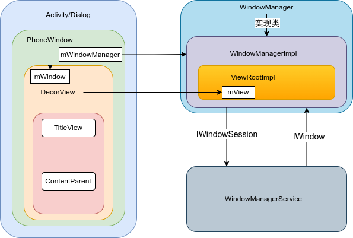

### UI更新相关
#### 子线程更新UI
onCreate、onResume中可以使用子线程更新ui
```xml
<androidx.appcompat.widget.AppCompatTextView
        android:id="@+id/tvShow"
        android:layout_width="match_parent"
        android:text="xml的文字"
        android:textSize="@dimen/sp_25"
        android:gravity="center"
        android:layout_height="wrap_content" />
```
```kotlin
class ThreadCreateUIActivity : AppCompatActivity() {
    private var textView: AppCompatTextView? = null

    override fun onCreate(savedInstanceState: Bundle?) {
        super.onCreate(savedInstanceState)
        setContentView(R.layout.activity_thread_create_uiactivity)
        textView = findViewById(R.id.tvShow)
        Thread {
            textView?.text = "onCreate子线程中修改"
        }.start()
        btnTest?.setOnClickListener {
            thread {
                textView?.text = "click子线程中修改"
            }
        }
    }

    override fun onResume() {
        super.onResume()
        Thread {
            textView?.text = "onResume子线程中修改"
        }.start()
    }
}
```
如果textView的layout_width是wrap_content，click刷新ui会报错

子线程中创建的View可以更新
```kotlin
//配置悬浮窗权限
<uses-permission android:name="android.permission.SYSTEM_ALERT_WINDOW" />
<uses-permission android:name="android.permission.SYSTEM_OVERLAY_WINDOW" />
//判断权限，跳转设置中打开
if (Build.VERSION.SDK_INT >= Build.VERSION_CODES.M) {
    if (!Settings.canDrawOverlays(this)) {
        startActivity(
            Intent(
                Settings.ACTION_MANAGE_OVERLAY_PERMISSION,
                Uri.parse("package:$packageName")
            )
        )
    }
}

private val handlerThread = HandlerThread("thread")
//点击时调用
private fun addFloatView() {
    handlerThread.start()
    val handler = Handler(handlerThread.looper){
        val manager = getSystemService(WINDOW_SERVICE) as WindowManager
        val layoutParams = WindowManager.LayoutParams()
        layoutParams.type = WindowManager.LayoutParams.TYPE_APPLICATION_OVERLAY
        layoutParams.flags = WindowManager.LayoutParams.FLAG_NOT_FOCUSABLE
        layoutParams.format = PixelFormat.RGBA_8888
        layoutParams.gravity = Gravity.TOP or Gravity.LEFT
        layoutParams.width = WindowManager.LayoutParams.WRAP_CONTENT
        layoutParams.height = WindowManager.LayoutParams.WRAP_CONTENT
        layoutParams.x = 50
        layoutParams.y = 50
        manager.addView(it.obj as View, layoutParams)
        false
    }
    Thread {
        TextView(this).apply {
            text = "测试文字"
            textSize = 25.0f
            setTextColor(Color.GRAY)
            val ll = LinearLayout(this@ThreadCreateUIActivity)
            ll.addView(this, LinearLayout.LayoutParams.WRAP_CONTENT, LinearLayout.LayoutParams.WRAP_CONTENT)
            setOnClickListener {
                runOnUiThread {
                    Toast.makeText(this@ThreadCreateUIActivity, "被点击", Toast.LENGTH_LONG).show()
                }
            }
            handler.sendMessage(Message.obtain().let {
                it.obj = ll
                it
            })
        }
    }.start()
}
```
报子线程中不能更新ui的异常是在ViewRootImpl中
```java
ViewRootImpl.java
public void requestLayout() {
    if (!mHandlingLayoutInLayoutRequest) {
        checkThread();
        mLayoutRequested = true;
        scheduleTraversals();
    }
}
void checkThread() {
    if (mThread != Thread.currentThread()) {
        throw new CalledFromWrongThreadException(
                "Only the original thread that created a view hierarchy can touch its views.");
    }
}
```
根据普通[handleLaunchActivity](../android/fws/fws_app_start.md#app_start_launch)可知ViewRootImpl创建是在onResume后，所以在onCreate和onResume中不会检查线程是否是UI线程

总结：
1.onCreate、onResume中可以使用子线程更新UI

2.在ViewRootImpl创建后除了TextView(某些场景下),其他View都不能在子线程更新UI

3.TextView只能在宽度为固定值时可以在子线程更新文本，因为源码中对宽度进行判断如果mLayoutParams.width != LayoutParams.WRAP_CONTENT就不会触发requestLayout

4.只要不触发requestLayout就不会触发主线程检测，所以自定义view可以只调用invalidate随意更新内容

#### 自定义view相关

自定义view一般可重写onMeasure,onLayout,onDraw,onSizeChanged,主要是后面2个

自定义ViewGroup一般重写除了view的还有dispatchDraw,drawChild

如果需要绘制内容则构造方法中调用setWillNotDraw(false)，否则不回调onDraw，如果有背景则不需要调用，ViewGroup默认开启不绘制内容

测量方式

MeasureSpec.getMode()获取测量模式

MeasureSpec.getSize()获取测量大小

mode共有三种情况：

MeasureSpec.UNSPECIFIED(无限大), 

MeasureSpec.EXACTLY(默认模式，精确值模式,具体数值或者match_parent)

MeasureSpec.AT_MOST(wrap_content)

### DecorView、Window、View、ViewRootImpl

#### Window
Android中管理View的工具，装载View的实体，activity和dialog依赖于window，window的唯一实现类是PhoneWindow，在Activity的attach方法中创建，attach方法在[handleLaunchActivity](../android/fws/fws_app_start.md#app_start_launch)调用

#### DecorView

```java
AppCompatActivity中
public void setContentView(View view) {
    initViewTreeOwners();
    getDelegate().setContentView(view);
}
AppCompatDelegateImpl.java
public void setContentView(View v) {
    ensureSubDecor();
    ViewGroup contentParent = mSubDecor.findViewById(android.R.id.content);
    contentParent.removeAllViews();
    contentParent.addView(v);
    //...
}

private void ensureSubDecor() {
    if (!mSubDecorInstalled) {
        mSubDecor = createSubDecor();
    }
    //...
}
```
v是添加到contentParent中，contentParent是通过mSubDecor获取的，而mSubDecor通过createSubDecor创建
```java
private ViewGroup createSubDecor() {
    //...
    ensureWindow();
    mWindow.getDecorView();
    //...
    ViewGroup subDecor = null;
    subDecor = (ViewGroup) LayoutInflater.from(themedContext)
            .inflate(R.layout.abc_screen_toolbar, null);

    mDecorContentParent = (DecorContentParent) subDecor
            .findViewById(R.id.decor_content_parent);
    mDecorContentParent.setWindowCallback(getWindowCallback());
    //...
    mWindow.setContentView(subDecor);
    //...
    return subDecor;
}
```
subDecor最终添加到mWindow，调用PhoneWindow的setContentView
```java
public void setContentView(View view, ViewGroup.LayoutParams params) {
    if (mContentParent == null) {
        installDecor();
    } else if (!hasFeature(FEATURE_CONTENT_TRANSITIONS)) {
        mContentParent.removeAllViews();
    }
    if (hasFeature(FEATURE_CONTENT_TRANSITIONS)) {
        view.setLayoutParams(params);
        final Scene newScene = new Scene(mContentParent, view);
        transitionTo(newScene);
    } else {
        mContentParent.addView(view, params);
    }
    //...
}
```
此处installDecor不会调用，而是在mWindow.getDecorView()中会调用mContentParent就不会为null
```java
private void installDecor() {
    if (mDecor == null) {
        mDecor = generateDecor(-1);
        //...
    } else {
        mDecor.setWindow(this);
    }
    if (mContentParent == null) {
        mContentParent = generateLayout(mDecor);
        //...
    }
}

protected DecorView generateDecor(int featureId) {
    //...
    return new DecorView(context, featureId, this, getAttributes());
}
protected ViewGroup generateLayout(DecorView decor) {
    //...
    //加载布局文件到mDecor
    mDecor.onResourcesLoaded(mLayoutInflater, layoutResource);
    ViewGroup contentParent = (ViewGroup)findViewById(ID_ANDROID_CONTENT);
    //...
    return contentParent;
}
public <T extends View> T findViewById(@IdRes int id) {
    return getDecorView().findViewById(id);
}
```
总结：setContentView的View最终存放到mContentParent中，mContentParent是通过DecorView通过id(com.android.internal.R.id.content)获得

#### ViewRootImpl
桥接View和Wms，内部属性mView就是DecorView，绑定过程看[handleResumeActivity](../android/fws/fws_app_start.md#app_start_resume)过程中WindowManagerGlobal调用addView方法

performTraversals方法中重要的测量、布局、绘制步骤(View的绘制流程)
```java
performMeasure(childWidthMeasureSpec, childHeightMeasureSpec);
performLayout(lp, mWidth, mHeight);
performDraw()
```

View的invalidate()会调用onDraw，大致流程是invalidate会逐层找parent一直到DecorView即ViewRootImpl中的mView中，然后由ViewRootImpl分发给所有View，不会调用ViewRootImpl的invalidate，而是递归调用父View的invalidateChildInParent，然后触发ViewRootImpl的performTraversals，由于mLayoutRequested为false，onMeasure和onLayout不被调用，只调用onDraw，也会调用computeScroll方法

#### 关系总结
1. DecorView中有PhoneWindow的实例对象即mWindow
2. ViewRootImpl中有DecorView的实例对象即mView
3. ViewRootImpl通过IWindowSession与WMS通信
4. wms通过IWidnow与PhoneWindow交互
5. IWindow是通过IWindowSession传递的
6. DecorView包含title和contentParent(android.R.id.content)
7. contentParent是添加app的布局



### View
#### invalidate和postInvalidate
postInvalidate可以在子线程中调用刷新，通过Handler切换线程最终调用invalidate

用于内容变化，如颜色、文本、图形等
#### requesstLayout
会调用onMeasure和nLayout方法，不一定触发onDraw

用于布局变化，如尺寸、位置

#### onResume和view.post
view的测量是在onResume之后执行的，所以无法获取宽高
```java
//Activity.onResume()
public void onResume(){
    super.onResume();
    view.post();
}
//View.post
public boolean post(Runnable action) {
    final AttachInfo attachInfo = mAttachInfo;
    if (attachInfo != null) {
        return attachInfo.mHandler.post(action);
    }
    getRunQueue().post(action);
    return true;
}
//ViewRootImplscheduleTraversals
void scheduleTraversals() {
    if (!mTraversalScheduled) {
        mTraversalScheduled = true;
        mTraversalBarrier = mHandler.getLooper().getQueue().postSyncBarrier();
        mChoreographer.postCallback(
                Choreographer.CALLBACK_TRAVERSAL, mTraversalRunnable, null);
    }
}
//ViewRootImpl.performTraversals
private void performTraversals() {
    if (mFirst) {
        host.dispatchAttachedToWindow(mAttachInfo, 0);
    }
    getRunQueue().executeActions(mAttachInfo.mHandler);
    performMeasure(childWidthMeasureSpec, childHeightMeasureSpec);
}
void dispatchAttachedToWindow(AttachInfo info, int visibility) {
    if (mRunQueue != null) {
        mRunQueue.executeActions(info.mHandler);
        mRunQueue = null;
    }
}
```
1.当view调用post的时候由于mAttachInfo此时为null，初始化是在ViewRootImpl的构造方法中，此时ViewRootImpl还没被创建，因为是在onResume之后才会被创建，则会将post的Runnable添加到getRunQueue中

2.当ViewRootImpl被创建并开始走view绘制流程后到performTraversals，此时会将mAttachInfo赋值给View(host)，正常来说就会让Handler执行executeActions，但是在执行scheduleTraversals时会发送[消息屏障原理](./fws/fws_handler.md#handler_barrier)，导致mTraversalRunnable是最先执行的，post的Runnable需要排队，mTraversalRunnable执行的就是performTraversals整个view绘制流程

#### View的滑动
1. scrollTo和scrollBy
2. 平移动画
3. layoutParams中margin值修改
4. 调用layout修改值
5. Scroller+invalidate+重写computeScroll

### 事件分发机制
1. dispatcchTouchEvent：事件分发逻辑，返回值super和直接true、false效果是不同的
2. onInterceptTouchEvent：事件拦截，viewgroup专属
3. onTouchEvent：处理事件


ViewGroup
    -ViewGroup1
        -View1

触摸v1位置，默认情况
```
down/move/up:vp(dis)->vp(intercept=false)->vp1(dis)->vp1(intercept=false)->v1(dis)->v1(onTouch)
```
触摸v1位置，不同dispatcchTouchEvent情况
```
down/move/up:vp(dis=true)

down:vp(dis=false)

down/move/up:vp(dis=super)->vp(intercept=false)->vp1(dis=true)

```
触摸v1位置，不同onInterceptTouchEvent情况
```
down:vp(dis)->vp(intercept=true)->vp(onTouch)
move:vp(dis)->vp(onTouch)
up:vp(dis)->vp(onTouch)

down:vp(dis)->vp(intercept=false)->vp1(dis)->vp1(intercept=true)->vp1(onTouch)
move:vp(dis)->vp(intercept=false)->vp1(dis)->vp1(onTouch)
up:vp(dis)->vp(intercept=false)->vp1(dis)->vp1(onTouch)
```

总结
1. 调用顺序：dispatcchTouchEvent->onInterceptTouchEvent->onTouchEvent
2. onInterceptTouchEvent返回true直接调用自身onTouchEvent，false或默认继续子view分发(dispatcchTouchEvent)
3. dispatcchTouchEvent返回true/false直接结束，一般需要调用super，ViewGroup里面有逻辑
4. onTouchEvent返回true表示消费事件，false才会继续找下一个view
5. 事件分发是倒序的，后添加的view优先分发事件

#### 事件冲突
1. 内部拦截法

根据条件在子view中的dispatcchTouchEvent请求父容器不拦截事件
```kotlin
parent.requestDisallowInterceptTouchEvent(true)
```

2. 外部拦截法
直接在父容器的onInterceptTouchEvent根据条件拦截事件

#### onTouch、onTouchEvent、onClick
onTouch是通过setOnTouchListener回调，返回boolean

V2上设置setOnTouchListener，则调用如下

v2(dis)->onTouch(false)->v2(onTouchEvent)

v2(dis)->onTouch(true)

V2上设置setOnClickListener，则调用如下

v2(dis)->v2(onTouchEvent = false)

v2(dis)->v2(onTouchEvent = true)

v2(dis)->v2(onTouchEvent = super.onTouchEvent)->onClick

```java
if (li != null && li.mOnTouchListener != null
        && (mViewFlags & ENABLED_MASK) == ENABLED
        && li.mOnTouchListener.onTouch(this, event)) {
    result = true;
}

if (!result && onTouchEvent(event)) {
    result = true;
}

//onClick是在onTouchEvent中处理的
```
总结：
1. onClick是在onTouchEvent中处理的，所以设置setOnTouchListener后onClick可能不会调用，由onTouch的返回值决定，false调用
3. onClick调用前提：setOnTouchListener的返回false，且onTouchEvent调用super.onTouchEvent，触发时机在UP事件后
```java
public boolean onTouchEvent(MotionEvent event) {
    //...
    case MotionEvent.ACTION_UP:
        if (!post(mPerformClick)) {
            performClickInternal();
        }
    //...
}
public boolean performClick() {
    //...
if (li != null && li.mOnClickListener != null) {
        playSoundEffect(SoundEffectConstants.CLICK);
        li.mOnClickListener.onClick(this);
        result = true;
    } else {
        result = false;
    }
    //...
}
```
设计模式：[责任链模式](./design_mode.md#chain)

