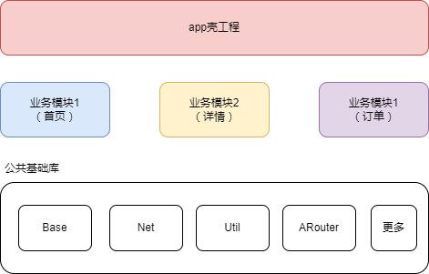
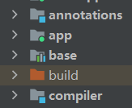

### 意义
不互相依赖，可以互相交互，任意组合，高度解耦，自由拆卸，自由组装，重复利用，分层独立化

### 工程配置


app壳工程和多个独立模块

利用gradle切换application和library达到模块可独立运行

根目录添加config.gradle
```gradle
ext {
    isRelease = false//开关控制，调试时让模块单独运行
    appId = [
            app    : "com.android.kotlinapp",
            module1: "com.module.xx",
            module2: "com.module.xxx",
    ]
}
```
根build.gradle引用
```gradle
apply from: "config.gradle"
```
模块gradle修改
```gradle
def config = rootProject.ext
if (config.isRelease) {
    apply plugin: 'com.android.library'
} else {
    apply plugin: 'com.android.application'
}
android {
    defaultConfig {
        if (!config.isRelease) {//调试时需要id
            applicationId config.appId.module1
        }
        ...
    }
    ...
}
```
app壳gradle修改
```gradle
if (config.isRelease) {
    implementation project(path: ':module1')
    implementation project(path: ':module2')
    implementation project(path: ':module3')
}
```
### APT技术
新建两个java/kotlin模块，annotations和compiler


其中annotations主要是声明注解，compiler用于APT实现

注解部分比较简单
```kotlin
@Target( AnnotationTarget.CLASS)
@Retention(AnnotationRetention.BINARY)
annotation class ARouter(
    val path: String = "",
    val group: String = ""
)
```
APT用于以代码的方式生成代码，首先gradle添加依赖
```gradle
plugins {
    id 'kotlin-kapt'
}
dependencies {
    implementation fileTree(dir: 'libs', include: ['*.jar'])

    // 背后的服务 能够监听 你是否在编译中.....
    // https://github.com/google/auto/tree/master/service
    compileOnly 'com.google.auto.service:auto-service:1.0.1'
    kapt 'com.google.auto.service:auto-service:1.0.1'

    // 帮助我们通过类调用的形式来生成Java代码
    // https://github.com/square/javapoet
    // https://github.com/square/kotlinpoet
    //implementation 'com.squareup:javapoet:1.13.0'
    implementation 'com.squareup:kotlinpoet:1.12.0'

    // 依赖注解
    implementation project(":annotations")
}
```
同步后自定义类监听编译时
```kotlin
@AutoService(Processor::class)// 启用服务
@SupportedSourceVersion(SourceVersion.RELEASE_11) // 环境的版本
@SupportedOptions("moduleName") // 接收 安卓工程传递过来的参数
@SupportedAnnotationTypes("com.hfc.annotations.ARouter")// 注解完整路径
class ARouterProcessor : AbstractProcessor() {
    // 操作Element的工具类（类，函数，属性，其实都是Element）
    private lateinit var mElements: Elements

    // Message用来打印 日志相关信息
    private lateinit var mMessager: Messager

    // 文件生成器， 类资源等，就是最终要生成的文件是需要Filer来完成的
    private lateinit var mFiler: Filer

    // type(类信息)的工具类，包含用于操作TypeMirror的工具方法
    private lateinit var mTypeTool: Types

    override fun init(processingEnv: ProcessingEnvironment) {
        super.init(processingEnv)
        mElements = processingEnv.elementUtils
        mMessager = processingEnv.messager
        mFiler = processingEnv.filer

        val name = processingEnv.options?.get("moduleName")
        mMessager.printMessage(Diagnostic.Kind.NOTE, "===============init $name")
    }

    override fun process(
        annotations: MutableSet<out TypeElement>,
        roundEnv: RoundEnvironment
    ): Boolean {
        mMessager.printMessage(Diagnostic.Kind.NOTE, "------------------process")
        if (annotations.isEmpty()) {
            return false // 由于回调用3次此方法，其中正确的一次annotations有值
        }
        return false
    }
}
```
注：
Diagnostic.Kind.ERROR用于抛异常，可以在代码检查异常时使用

SupportedOptions接收的参数是通过gradle传递，模块中可以这样定义
```gradle
kapt {
    arguments {
        arg("moduleName", project.getName())
    }
}
```
javapoet/kotlinpoet都是以oop思想方式生成代码，还有一种传统方式直接一行行写字符串方式可看EventBus实现

### auto-service

build.gradle中添加注解解释器和auto-service

[见as配置](../android_studio.md#kapt)

#### 使用Auto-Service
```kotlin
object ServiceLoader {
    fun <T> load(service: Class<T>): T? {
        return try {
            ServiceLoader.load(service).iterator().next()
        } catch (e: Exception) {
            null
        }
    }
}
```
主要用来加载接口方法
```kotlin
interface XXX{
    fun xx()
}

@AutoService(XXX::class)
class XXXImpl: XXX {
}

ServiceLoader.load(XXX::class.java)
```
使用案例WebView封装