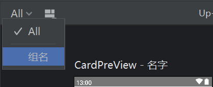

### @Composable
可组合函数，Jetpack Compose 是围绕可组合函数构建的
```kotlin
@Composable
fun MessageCard(name: String) {
    Text(text = "Hello $name!")
}
```
### @Preview
开启预览功能
```kotlin
@Preview(
    showBackground = true,
    showSystemUi = true,
    device = Devices.NEXUS_5
)
@Composable
fun MessageCard(name: String) {
    Text(text = "Hello $name!")
}
```
接口

| 参数名  | 参数类型  | 必填 | 参数描述 | 
|  ----  | ----  |  ----  | ----  |
| name  | String | 否  | 设置预览别名 |
| group  | String | 否  | 设置预览组名 |
| apiLevel  | Int | 否  | 设置api等级，根据as提示范围填写 |
| widthDp  | Int | 否  | 设置预览界面宽度，单位dp |
| heightDp  | Int | 否  | 设置预览界面高度，单位dp |
| locale  | String | 否  | 设置预览语言，如中文，英文等 |
| fontScale  | Float | 否  | 设置预览文字缩放 |
| showSystemUi  | Boolean | 否  | 设置预览状态栏底部栏显示 |
| showBackground  | Boolean | 否  | 设置预览界面背景显示 |
| backgroundColor  | String | 否  | 设置预览界面背景颜色 |
| uiMode  | [UiMode](#uimode) | 否  | 设置预览显示模式，如夜间模式 |
| device  | Device | 否  | 设置预览设备 |
| wallpaper  | Wallpaper | 否  | 设置预览壁纸 |

##### UiMode
| 名称 | 描述 | 
|  ----  | ----  |
| UI_MODE_TYPE_UNDEFINED | 未定义 | 
| UI_MODE_TYPE_NORMAL | 正常模式 |
| UI_MODE_TYPE_DESK | 工作模式 |
| UI_MODE_TYPE_CAR | 汽车模式 |
| UI_MODE_TYPE_TELEVISION | 电视设备 |
| UI_MODE_TYPE_APPLIANCE | 便携设备 |
| UI_MODE_TYPE_WATCH | 手表设备 |
| UI_MODE_TYPE_VR_HEADSET  | VR设备 |
| UI_MODE_NIGHT_MASK | 夜间模式 |
| UI_MODE_NIGHT_UNDEFINED  | 夜间未定义 |
| UI_MODE_NIGHT_NO  | 白天模式 |
| UI_MODE_NIGHT_YES  | 黑夜模式 |

group一般和devices组合使用，如横屏和竖屏
