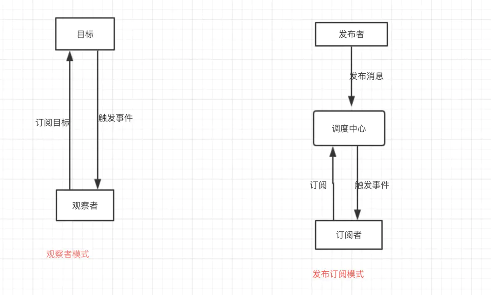

## 观察者模式
### 简介
定义对象间一种一对多的依赖关系，当对象状态改变时，所有依赖于它的对象都会得到通知并被自动更新
### 使用场景
1. 关联行为场景，行为可以拆分不是组合关系
2. 事件多级触发场景
3. 跨系统的消息交换场景，如消息队列事件总线的处理机制
### 案例
```kotlin
//被观察者
interface Observable {
    fun addObserver(observer: Observer)
    fun removeObserver(observer: Observer)
    fun notifyObservers()
    fun pushMsg(msg: String)
}
class ObservableImpl : Observable {
    private val mObservers: ArrayList<Observer> = ArrayList()
    private var mMsg: String = ""
    override fun addObserver(observer: Observer) {
        mObservers += observer
    }
    override fun removeObserver(observer: Observer) {
        mObservers -= observer
    }
    override fun notifyObservers() {
        mObservers.forEach {
            it.update(mMsg)
        }
    }
    override fun pushMsg(msg: String) {
        mMsg = msg
        notifyObservers()
    }
}
//观察者
interface Observer {
    fun update(msg: Any)
}
class ObserverImpl(var name: String) : Observer {
    override fun update(msg: Any) {
        println("${name}接收到通知：$msg")
    }
}
fun main() {
    val wechat = ObservableImpl()
    val user1 = ObserverImpl("用户1")
    val user2 = ObserverImpl("用户2")
    val user3 = ObserverImpl("用户3")
    wechat.addObserver(user1)
    wechat.addObserver(user2)
    wechat.addObserver(user3)
    wechat.pushMsg("微信升级8.5版本")
    wechat.removeObserver(user2)
    wechat.pushMsg("微信升级8.6版本")
}
```

### Android中的应用
1. View设置事件
2. ListView、RecyclerView中的Adapter数据刷新监听
3. Rxjava

## 发布订阅模式
### 简介
其实就是观察者模式的衍生，区别如下


### 案例
```kotlin
//发布者
class Publisher(var type: Any, var msg: Any) {

}
//订阅者
class Subscriber(var type: Any) {
    fun onEvent(msg: Any) {
        println("接收消息: $msg")
    }
}
//调度中心
class EventBus {
    private val mSubscribers: ArrayList<Subscriber> = ArrayList()
    fun register(subscriber: Subscriber) {
        mSubscribers += subscriber
    }
    fun unregister(subscriber: Subscriber) {
        mSubscribers -= subscriber
    }
    fun push(publisher: Publisher) {
        mSubscribers.forEach {
            if (it.type == publisher.type) {
                it.onEvent(publisher.msg)
            }
        }
    }
}
fun main() {
    val eventBus = EventBus()
    eventBus.register(Subscriber(1))
    eventBus.register(Subscriber(true))
    val subscriber = Subscriber("name")
    eventBus.register(subscriber)
    eventBus.push(Publisher(1, "微信更新了1.0"))
    eventBus.push(Publisher(true, "微信更新了2.0"))
    eventBus.unregister(subscriber)
    eventBus.push(Publisher("name", "微信更新了3.0"))
}
```
### Android中的应用
1. BoradcastReceiver调度中心：AMS
2. EventBus调度中心：EventBus单例