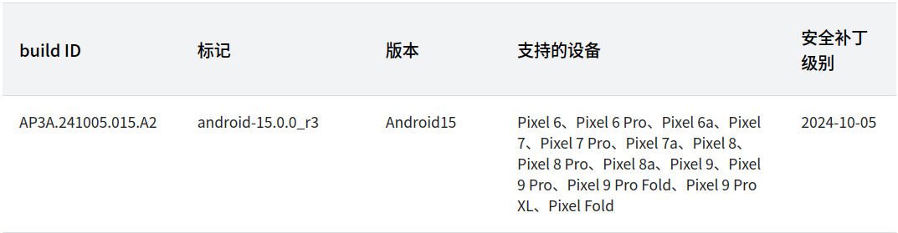
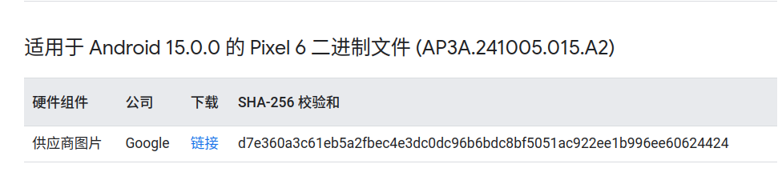
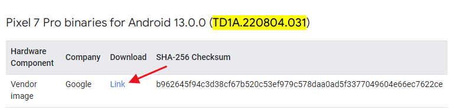

### 1.安装ubuntu系统（22.04）
磁盘大小越大越好，至少500G

|优缺点 \ 方式|[VMWare方式](../../window/window_vmware.md)|[WSL2方式](../../window/window_wsl2.md)|[Windows11安装Ubuntu](../../linux/ubuntu_install.md)|
|--|--|--|--|
|优点|有图形化界面可以直接启动模拟器(需关闭hyper-v)|编译速度快，占用体积小，方便和windows之间操作|编译速度快，独立系统，可使用模拟器，源码在window下也可访问|
|缺点|不流畅，编译速度慢，占用体积大，不能同时使用Android子系统|无图形化界面，网络独立不方便使用vpn，无法使用模拟器|系统占用空间，和window交互不便|

### 2.下载Android源码镜像包
在ubuntu系统中打开终端，执行命令：wget -c 地址如下

https://mirrors.ustc.edu.cn/aosp-monthly/aosp-latest.tar
或者
https://mirrors.tuna.tsinghua.edu.cn/aosp-monthly/aosp-latest.tar

文件大概60GB

校验：md5sum aosp-latest.tar (较慢)

解压：tar xvf aosp-latest.tar (较慢)

解压后得到目录aosp

注：报错尝试使用
```shell
wget -U NoSuchBrowser/1.0 下载地址
```
### 3.安装git和repo
安装git
```shell
sudo apt install git
git config --global user.email 1875287386@qq.com
git config --global user.name "yuli"
```
git配置[git与github](../../git_github.md)

安装repo
```shell
echo "PATH=~/bin:\$PATH" >> ~/.bashrc
source ~/.bashrc
sudo apt install curl
mkdir ~/bin
curl -sSL 'https://gerrit-googlesource.proxy.ustclug.org/git-repo/+/master/repo?format=TEXT' |base64 -d > ~/bin/repo
chmod +x ~/bin/repo
export REPO_URL='https://mirrors.tuna.tsinghua.edu.cn/git/git-repo'
```
对于wsl2可能无法下载repo，使用浏览器下载

python快捷键创建
```shell
sudo ln -s /usr/bin/python3.10 /usr/bin/python
```
### 4.同步Android源码
六种查看Android系统源码的网址

进入目录aosp执行
```shell
repo init -u git://mirrors.ustc.edu.cn/aosp/platform/manifest -b android-13.0.0_r15
```
其中-b查看地址：(挂vpn)
https://source.android.com/setup/start/build-numbers?hl=zh_cn

报错：
error.GitError: manifests rev-list ('^1013d985f70641b2cc05943f57fab5824d9e2ff3', 'HEAD', '--'): fatal: bad revision 'HEAD'

解决：
```shell
cd .repo/manifests
git reset --hard 1013d985f70641b2cc05943f57fab5824d9e2ff3
git pull
```
报错：git config --global --add safe.directory /xxx/xxx

解决：
```shell
git config --global --add safe.directory "*"
```
文件权限被修改

解决：
```shell
repo forall -c git config --add core.filemode false
```
#### 添加虚拟内存
如果已经存在swapfile，先关闭
```shell
sudo swapoff /swapfile
```
在删除
```shell
sudo rm -rf /swapfile
```
最后配置
```shell
sudo dd if=/dev/zero of=/swapfile bs=1G count=20
sudo mkswap /swapfile
sudo swapon /swapfile
```
添加开启自启：/etc/fstab
```shell
/swapfile                                 none      swap    sw          0       0
```
同步代码： (较慢)
```shell
repo sync
```
安装jdk
```shell
sudo apt install openjdk-8-jre-headless
```
其他依赖
```shell
sudo apt-get install git-core gnupg flex bison gperf build-essential zip curl zlib1g-dev gcc-multilib g++-multilib libc6-dev-i386 lib32ncurses5-dev x11proto-core-dev libx11-dev lib32z-dev libgl1-mesa-dev libxml2-utils xsltproc unzip
```
### 5.驱动下载(针对google手机，可跳过)
https://developers.google.com/android/drivers



上面源码下载的是android-13.0.0_r11所以复制build ID(TD1A.220804.031)到驱动网站



下载后放到aosp目录下并解压
```shell
tar -zxvf google_devices-cheetah-td1a.220804.031-d59f7f42.tgz
```
执行
```shell
./extract-google_devices-cheetah.sh
```
按回车后一直按F键直到出现Type "I ACCEPT" if you agree to the terms of the license:
输入I ACCEPT回车即可

### 6.内核下载(可跳过)
https://source.android.google.cn/docs/setup/build/building-kernels?hl=zh-cn#id-version



一般已经包含，可通过路径确认

### 7.源码编译
```shell
export DISABLE_ARTIFACT_PATH_REQUIREMENTS="true"
source build/envsetup.sh
lunch
```
lunch后会列出编译选项

如果是真机代号可以通过驱动界面查找，比如Pixel 7 ("panther")

编译版本介绍

- user:无root权限
- userdebug:有root，需要通过su获取
- eng:有root，adbd超级权限

#### 添加lunch选项
对于模拟器必须sdk开头，比如lunch sdk_phone_x86_64-userdebug

打开build/make/target/product/AndroidProducts.mk
```mk
COMMON_LUNCH_CHOICES := \
...
sdk_x86_64-eng \
sdk_phone_x86_64-eng \
sdk_x86_64-userdebug \
sdk_phone_x86_64-userdebug
```

 选择版本后执行编译命令：make -j(虚拟机配置的cpu核数)

#### 编译镜像命令
|命令|镜像文件|
|--|--|
|make snod|编译System.img |
|make vnod|编译vendor.img |
|make pnod|编译product.img|
|make senod|编译system_ext.img|
|make onod|编译odm.img|

#### 清除命令
|命令|作用|
|--|--|
|m clobber|清除所有编译缓存|
|m clean|清除编译缓存，等价于rm -rf out/|
|m installclean|清除所有二进制文件|

#### 查找命令
|命令|查找范围|
|--|--|
|jgrep|在所有java文件中查找|
|cgrep|在所有c/c++文件中查找|
|resgrep|在所有res/*.xml文件中查找|
|ggrep|在所有Gradle文件中查找|
|mangrep|在所有AndroidManfest.xml文件中查找|
|mgrep|在所有Makefiles和*.bp文件中查找|

#### 其他命令
|命令|作用|
|--|--|
|printconfig|打印当前配置信息|
|allmod|显示aosp所有module|
|pathmod [module name]|显示module所在路径|
|refreshmod|刷新module列表|
|gomod [module name]|定位到指定module目录|
|croot|回到aosp根目录|

模块编译：make [module name]
#### 常见模块编译
|模块名|make方式命令|mmm方式命令|
|--|--|--|
|init|make init|mmm system/core/init|
|zygote|make app_process|mmm frameworks/base/cmds/app_process|
|system_server|make services|mmm frameworks/base/services|
|framework-res|make framework-res|mmm frameworks/base/core/res|
|framework-jni|make libandroid_runtime|mmm frameworks/base/core/jni|
|binder|make libbinder|mmm frameworks/native/libs/binder|

编译framework

make framework(Android12之后使用make framework-minus-apex)
或者直接mmm frameworks/base

#### Car API相关
即编译和CarService通信的接口库

make android.car 可看到所有方法接口，包括具体实现

make android.car-system-stubs 可看到所有方法接口但不含具体实现

make android.car-stubs 仅包含没有被@SystemApi修饰的方法，且不含具体实现

成功后jar在out\soong.intermediates\packages\services\Car\car-lib\android.car\android_common\javac\

### 8.刷机(可跳过)
谷歌原生手机地址：

线刷包：https://developers.google.com/android/images

OTA包：https://developers.google.com/android/ota

### 9.启动模拟器
1.vmware中，源码编译完后直接执行emulator即可

~~2.如果是wsl2中，由于无法启动模拟器，需要借助window中的emulator.exe，前提是已经安装好Android Studio并且创建了一个模拟器名为Pixel5，模拟器处于关闭状态，然后执行命令启动模拟器
emulator.exe -avd Pixel5 -system "\wsl.localhost\Ubuntu-22.04\home\yuli\aosp\out\target\product\emulator_x86_64\system.img" -data "\wsl.localhost\Ubuntu-22.04\home\yuli\aosp\out\target\product\emulator_x86_64\userdata.img"~~

~~-system：指定编译出来的system.img镜像~~

~~-data：指定编译出来的userdata.img镜像~~

3.ubuntu系统中直接执行emulator -writable-system
```
adb root
adb remount
adb reboot
```
即可推送文件到system

### 10.源码导入Android Studio
生成idegen.jar
```bash
source build/envsetup.sh
mmm development/tools/idegen/
development/tools/idegen/idegen.sh
sudo chmod 777 android.iml
sudo chmod 777 android.ipr
```

添加排除名单(android.iml)
```bash
<excludeFolder url="file://$MODULE_DIR$/bionic" />
<excludeFolder url="file://$MODULE_DIR$/bootable" />
<excludeFolder url="file://$MODULE_DIR$/build" />
<excludeFolder url="file://$MODULE_DIR$/cts" />
<excludeFolder url="file://$MODULE_DIR$/dalvik" />
<excludeFolder url="file://$MODULE_DIR$/developers" />
<excludeFolder url="file://$MODULE_DIR$/development" />
<excludeFolder url="file://$MODULE_DIR$/device" />
<excludeFolder url="file://$MODULE_DIR$/docs" />
<excludeFolder url="file://$MODULE_DIR$/external" />
<excludeFolder url="file://$MODULE_DIR$/hardware" />
<excludeFolder url="file://$MODULE_DIR$/kernel" />
<excludeFolder url="file://$MODULE_DIR$/out" />
<excludeFolder url="file://$MODULE_DIR$/pdk" />
<excludeFolder url="file://$MODULE_DIR$/platform_testing" />
<excludeFolder url="file://$MODULE_DIR$/prebuilts" />
<excludeFolder url="file://$MODULE_DIR$/sdk" />
<excludeFolder url="file://$MODULE_DIR$/system" />
<excludeFolder url="file://$MODULE_DIR$/test" />
<excludeFolder url="file://$MODULE_DIR$/toolchain" />
<excludeFolder url="file://$MODULE_DIR$/tools" />
```
AS导入方式：打开android.ipr文件

报异常：

External file changes sync may be slow: The current inotify(7) watch limit is too low.

解决：
```bash
sudo touch /etc/sysctl.d/idea.conf
```
内容填写：
```bash
fs.inotify.max_user_watches = 524288
sudo sysctl -p --system
```
重启as