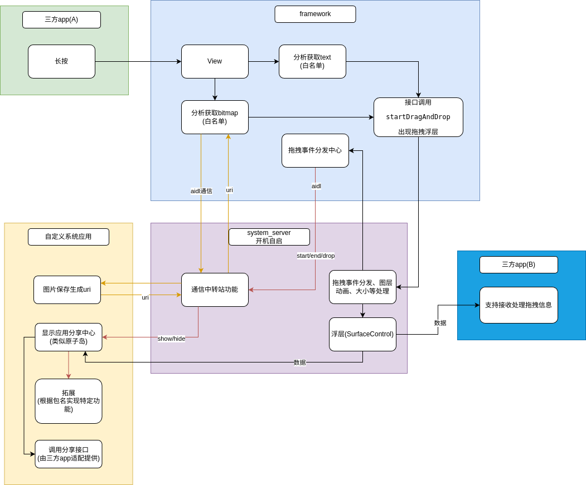

### 项目简介
跨应用拖拽视图，比如文字、图片等元素，具体由应用A长按View触发，将View拖拽到另一个应用B并携带数据

场景：微信图片拖拽到便签、地址拖拽到地图

#### 知识储备
##### Android的触摸事件传递
1. 硬件层：用户手指接触屏幕时，触摸传感器检测到触摸点的位置、压力等信，并将其转化为原始的硬件事件

2. Linux内核：这些原始硬件事件被传递到Linux内核的输入子系统，经过初步处理后，通过/dev/input/eventX设备节点暴露给用户空间

3. InputManagerService：Android系统的System Server进程中的InputManagerService作为中介，监听这些设备节点，并通过Binder机制将触摸事件发送给需要处理的客户端，通常是ActivityManagerService

4. ActivityManagerService：接收到触摸事件后，ActivityManagerService负责确定哪个应用程序（App）应该接收这个事件。它根据当前的焦点（focus）和窗口层级结构，找到最上层且可交互的窗口（Window），进而确定对应的Activity

5. WindowManagerService：ActivityManagerService将触摸事件转发给WindowManagerService，后者负责管理所有窗口的布局和事件分发。WindowManagerService找到与触摸事件相关的顶层窗口，并通知该窗口的Window.Callback对象（通常是Activity的内部类）

6. DecorView：顶层窗口通常是一个DecorView，它是PhoneWindow的一个内部类，继承自FrameLayout。DecorView作为顶级View，接收到触摸事件后，开始按照Android的事件分发机制将事件向下传递

7. ViewRootImpl：DecorView所在的ViewRootImpl负责将触摸事件进一步分发给View层次结构。ViewRootImpl实现了ViewParent接口，其中包含了处理触摸事件的方法，如dispatchTouchEvent()

8. ViewGroup & View：触摸事件最终从ViewRootImpl逐级向下分发到具体的ViewGroup和View对象。事件首先传递到ViewGroup.dispatchTouchEvent()，在这里可能会触发onInterceptTouchEvent()方法决定是否截断事件。如果事件没有被截断，将继续传递给子View的dispatchTouchEvent()，并在适当的时候调用onTouchEvent()。这个过程沿着View树一直向下传播，直到某个View消费了事件或者事件被完全传递到树的底层
##### 系统拖拽api使用和源码理解
[源码分析](./fws_drag.md)

##### Transaction使用结合动画框架

### 实战案例
#### 关键点：触摸事件挂钩

frameworks/base/core/java/android/view/ViewRootImpl.java

在View源码中的processPointerEvent方法挂钩子，接收触摸事件
```java
private int processPointerEvent(QueuedInputEvent q) {
    HfcDragViewHelper.getInstance().dispatchHfcTouchEvent(this, event);
    //...
}
```
添加长按事件
```java
private static final float MOVE_IGNORE_THRESHOLD_DP = 10.0f;
private static final long LONG_PRESS_THRESHOLD_MS = ViewConfiguration.getLongPressTimeout();
private long mDownTime;
private float mDownX;
private float mDownY;
public void dispatchHfcTouchEvent(View view, MotionEvent event) {
    final int action = event.getAction();
    switch (action) {
        case MotionEvent.ACTION_DOWN:
            // 记录按下时间和位置
            view.getLocationInWindow(parentLocation);
            mDownTime = System.currentTimeMillis();
            mDownX = event.getX();
            mDownY = event.getY() + parentLocation[1];
            Log.d(TAG_TOUCH, "down mDownX=" + mDownX + "," + mDownY + ",lx=" +
                        parentLocation[0]+ ",ly=" + parentLocation[1]);
            break;
        case MotionEvent.ACTION_MOVE:
            // 判断是否移动距离超过长按忽略阈值
            float moveDistance = (float) Math.sqrt(Math.pow(event.getX() - mDownX, 2) + Math.pow(event.getY() - mDownY, 2));
            if (moveDistance > MOVE_IGNORE_THRESHOLD_DP * view.mContext.getResources().getDisplayMetrics().density) {
                // 移动距离过大，取消长按检测
                mDownTime = 0L;
                Log.d(TAG_TOUCH, "move mDownTime=" + mDownTime);
            }
            break;
        case MotionEvent.ACTION_UP:
        case MotionEvent.ACTION_CANCEL:
            // 清除长按检测相关数据
            mDownTime = 0L;
            Log.d(TAG_TOUCH, "cancel mDownTime=" + mDownTime);
            break;
    }
    Log.d(TAG_TOUCH, "dispatchTouchEvent mDownTime=" + mDownTime + ",action=" + action + ",view=" + view);
    // 检查是否达到长按阈值
    if (mDownTime > 0 && System.currentTimeMillis() - mDownTime >= LONG_PRESS_THRESHOLD_MS) {
        // 处理长按事件
        Log.d(TAG_TOUCH, "touch point(" + mDownX + "," + mDownY + ")");
        onLongPress(view);
        mDownTime = 0L; // 清除长按检测相关数据
    }
}

private void onLongPress(View view) {
    //拖拽逻辑
    Log.e(TAG_TOUCH, "onLongPress: " + view + "," + view.mContext.getPackageName());
    dragView(view);
}
```
#### 关键点：拖拽视图
1. 判断应用是否设置拖拽startDragAndDrop，通过加hasDrag区分
2. 避免应用不兼容，可以设置白名单PM_WRITE_LIST
3. 对于简单如TextView和Imageview可以直接处理，其他暂时只能具体分析
```java
public void dragView(View view) {
    if (view == null) {
        Log.e(TAG, "drag view is null");
        return;
    }
    if (view.hasDrag) {
        Log.e(TAG, "already has drag view");
        return;
    }
    String packageName = view.mContext.getPackageName();
    if (!PM_WRITE_LIST.contains(packageName)) {
        Log.e(TAG, "drag pkg is not in write list");
        return;
    }
    if (view instanceof TextView) {
        CharSequence content = ((TextView) view).getText();
        drawText(view, content);
    } else if (view instanceof ImageView) {
        drawImage(view);
    } else {
        drawOther(view);
    }
}
```
frameworks/base/core/java/android/view/View.java

在startDragAndDrop方法中处理相关逻辑
```java
public final boolean startDragAndDrop(ClipData data, DragShadowBuilder shadowBuilder,
            Object myLocalState, int flags) {
    //...
    if (HfcDragViewHelper.getInstance().hasDrag(this)) {
        Log.e("HfcDragViewHelper", "already startDragAndDrop: " + this);
        return false;
    }

    if (data != null) {
        data.prepareToLeaveProcess((flags & View.DRAG_FLAG_GLOBAL) != 0);
    }
        // add start
        HfcDragViewHelper.getInstance().dragStart(mContext, data);
    }
    return token != null;
    //...
```
问题：三方应用可能调用updateDragShadow替换拖拽视图后如何恢复视图？

#### 关键点：拖拽中和拖拽结束处理

frameworks/base/core/java/android/view/ViewRootImpl.java

在ViewRootImpl源码中挂钩子handleDragEvent
```java
private void handleDragEvent(DragEvent event) {
    // ...
    HfcDragViewHelper.getInstance().preHandleDragEvent(event, mBasePackageName);
    // Now dispatch the drag/drop event
    boolean result = mView.dispatchDragEvent(event);
    result = HfcDragViewHelper.getInstance()
            .handleDragEvent(event, mBasePackageName, result, mWindowSession, mWindow);
    // ...
}
```
用来处理拖拽结束逻辑
```java
public void preHandleDragEvent(DragEvent event, String basePackageName) {
    if (DragEvent.ACTION_DROP == event.mAction) {
        if (mCurrentDragView != null) {
            event.mClipData = null;//不允许自身应用拖拽接收
        }
    }
}

public boolean handleDragEvent(DragEvent event, String basePackageName,
    boolean oriResult, IWindowSession windowSession,
    ViewRootImpl.W window) {
    //处理拖拽逻辑
    return result;
}
```
frameworks/base/core/java/android/view/View.java

处理event.mClipData = null场景可能导致三方应用异常
```java
final boolean callDragEventHandler(DragEvent event) {
    final boolean result;

    ListenerInfo li = mListenerInfo;
    if (event.mClipData != null) {
        //...
    } else {
        result = false;
    }
    //...
    return result;
}
```
具体源码工具类

[HfcDragViewHelper](./code/fw/HfcDragViewHelper.java)

#### 关键点：拖拽数据传递处理、动画、大小
从framework到service是通过aidl的形式，原生接口(IWindowSession windowSession)具体为performDrag方法

frameworks/base/core/java/android/view/IWindowSession.aidl

添加新接口
```java
//传递拖拽信息相关，拖拽中和拖拽结束等
boolean notifyDropStatus(boolean oriResult, boolean isOtherWindow, IWindow window,
    in DragEvent event, String packageName);

//用于保存拖拽视图
void savaBitmap(in ParcelFileDescriptor pfd, in RemoteCallback callback);

//用于通知分享栏显示隐藏
void shareBarShowOrHide(String action, String targetPackage, in ClipData data);
```
[IHfcDrag](./code/services/IHfcDrag.aidl)

[IHfcDragListener](./code/services/IHfcDragListener.aidl)

##### 图片保存
其中saveBitmap为何不直接保存？

当前拖拽代码是在View中即最终运行进程是当前应用进程，如果此应用没有读写权限就无法保存图片，需要通过aidl绑定某个应用(自定义的系统应用中最好)来保存图片

IWindowSession.aidl具体实现类之一

frameworks/base/services/core/java/com/android/server/wm/Session.java

```java
@Override
public boolean notifyDropStatus(boolean oriResult, boolean isOtherWindow, IWindow window, DragEvent event, String packageName) {
    return this.mDragDropController.notifyDropStatus(oriResult, isOtherWindow, window, event, packageName);
}

@Override
public void savaBitmap(android.os.ParcelFileDescriptor pfd, RemoteCallback callback) {
    this.mDragDropController.saveBitmap(pfd, callback);
}

@Override
public void shareBarShowOrHide(String action, String targetPackage, android.content.ClipData data) {
    this.mDragDropController.shareBarShowOrHide(action, targetPackage, data);
}
```
注：uid为1000的应用不允许调用拖拽(startDragAndDrop)接口，解决在validateAndResolveDragMimeTypeExtras方法中通过包名允许即可

frameworks/base/services/core/java/com/android/server/wm/DragDropController.java


```java
IBinder performDrag(int callerPid, int callerUid, IWindow window, int flags, SurfaceControl surface, int touchSource, float touchX, float touchY, float thumbCenterX, float thumbCenterY, ClipData data) {
    //...
    final SurfaceControl.Transaction transaction = mDragState.mTransaction;
    transaction.setAlpha(surfaceControl, 1); //修改成1
    transaction.show(surfaceControl);
    displayContent.reparentToOverlay(transaction, surfaceControl);
    mDragState.updateDragSurfaceLocked(true, touchX, touchY);
    mDragState.startDragLocked(); //启动动画
    //...
}

boolean notifyDropStatus(boolean oriResult, boolean isOtherWindow, IWindow window, DragEvent event, String packageName) {
    if (this.mDragState == null) {
        return false;
    }
    return mDragState.notifyDropStatus(oriResult, isOtherWindow, window, event, packageName);
}

public void saveBitmap(ParcelFileDescriptor pfd, RemoteCallback callback) {
    HfcDragTransitManager.getInstance().bindShareService(mService.mContext, (isBind, iBinder) -> {
        HfcDragTransitManager.getInstance().saveBitmap(pfd, callback);
    });
}

public void shareBarShowOrHide(String action, String targetPackage, ClipData data) {
    HfcDragTransitManager.getInstance().bindShareService(mService.mContext, (isBind, iBinder) -> {
        HfcDragTransitManager.getInstance().shareBarShowOrHide(action, targetPackage, data);
    });
}
```

[HfcDragTransitManager](./code/services/HfcDragTransitManager.java)

frameworks/base/services/core/java/com/android/server/wm/DragState.java

执行拖拽动画
```java
void startDragLocked() {
    createShowAnimationLocked();
}

private void createShowAnimationLocked() {
    //动画
}
```
修改拖动时视图不居中问题
```java
void updateDragSurfaceLocked(boolean keepHandling, float x, float y) {
    if (mAnimator != null) {
        return;
    }
    //...
    float width = mSurfaceControl.getWidth() / 2;
    float height =  mSurfaceControl.getHeight() / 2;
    mTransaction.setPosition(mSurfaceControl, x - width,
            y - height).apply();
    //...
}
```

具体动画以及拓展功能源码

动画：固定从1.2倍缩放当本身大小

拓展功能：拖拽过程中，如果拖动到接收的应用显示如+图标，不支持显示x图标，应用存在多个分享接收功能显示其他图标

[DragAnim](./code/services/DragAnim.java)

#### app端实现
功能包括：保存图片，显示分享框，查询支持分享的应用，高德地图查询等

[sharebar](./code/sharebar.zip)

#### 流程图

