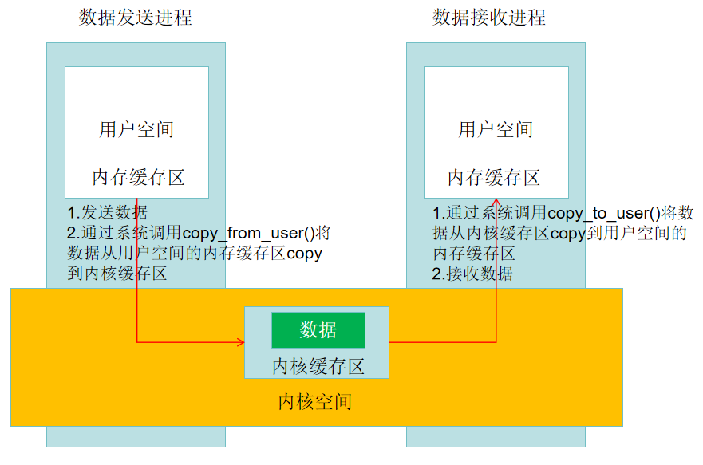
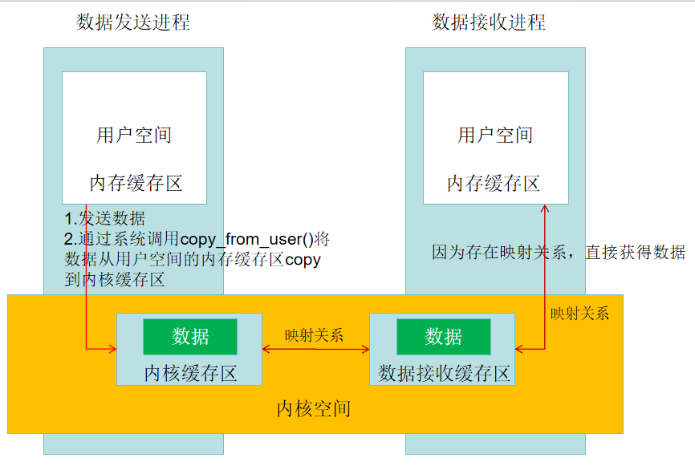

### 进程间通信方案

管道、信号、信号量、内存共享、socket、binder、消息队列

用户空间的跨进程通信基本采用binder

虚拟内存分为用户空间和内核空间，彼此隔离

用户空间：程序代码运行的地方

内核空间：内核代码运行的地方，所有进程共享

### 管道
unix最古老的进程间通信方式，由内核管理一个固定大小的缓冲区，一端连接进程的输出，另一端连接进程的输入

限制

1. 大小限制4k
2. 半双工，同一时刻数据只能流向一个方向，需要建立两个管道
3. 只支持父子和兄弟进程之间通信

### 信号
应用程序可以注册SIGNALQUIT信号实现监听ANR

#### 应用场景
爱奇艺xCrash、友盟+U-APM、腾讯Matrix

### 信号量
计数器，控制多个进程共享资源访问，主要用于进程间以及同一进程内不同线程之间的同步手段

### 共享内存
Android中提供匿名共享内存Ashmem，存在互斥锁，容易出现数据不同步，死锁等问题

步骤

1. 通过MemoryFile开辟内存空间，获得ParcelFileDescriptor
```kotlin
val memoryFile = MemoryFile("test", 1024)
val getFileDescriptor = MemoryFile::class.java.getDeclaredMethod("getFileDescriptor")
val pfd = getFileDescriptor.invoke(memoryFile)?.let {
    ParcelFileDescriptor.dup(it as FileDescriptor)
}
```
2. 将ParcelFileDescriptor传递给其他进程，利用Binder机制
3. A进程往内存共享写数据
```kotlin
memoryFile.outputStream.write(byteArrayOf(1,2,3))
```
4. B进程往内存共享读取数据
```kotlin
pfd?.let {
    val content = byteArrayOf()
    FileInputStream(it.fileDescriptor).read(content)
}
```
#### 应用场景
Android视图数据与SurfaceFlinger的通信、腾讯mmkv、Facebook fresco等

### 消息队列
具有异步能力，解决信号承载信息少问题，具有传输能力，克服管道只能承载无格式字节流以及缓冲区大小受限问题

#### 应用场景
Android中的Handler使用到消息队列

### Socket
传输效率低，开销大
#### 应用场景
Zygote进程使用LocalSocket接收启动应用的通知

### Binder
#### 应用场景
Android中system_server与上层app交互、Intent、ContentProvider、AIDL、Broadcast、Messager等

选择Binder作为应用程序的IPC的原因

1. 性能上，跨进程通信数据拷贝，内存共享(0次)>Binder(1次)>管道、消息队列、Socket(2次)
2. Binder拥有可靠的身份标记策略，传统IPC是由用户填写UID/PID容易被恶意程序利用，Binder为每个app分配UID，通过UID鉴别身份
3. Binder基于C/S架构，职责明确、架构清晰，稳定性更好

#### 传统IPC原理


#### Binder原理
Binder不是内核的一部分，需要通过Linux的动态加载模块机制加载一个叫Binder驱动的内核模块，然后各进程可通过次模块进程通信

内存映射：通过mmap()实现，简单说就是用户空间的一块内存区域映射到内核空间，之后双方修改的内容都能及时被感知



数据接收缓存区通过Binder驱动建立

### Android中的进程
空进程、前台进程(应用界面显示)、后台进程(HOME之后的)、可见进程(被弹窗(Activity)遮挡)、服务进程(启动service)