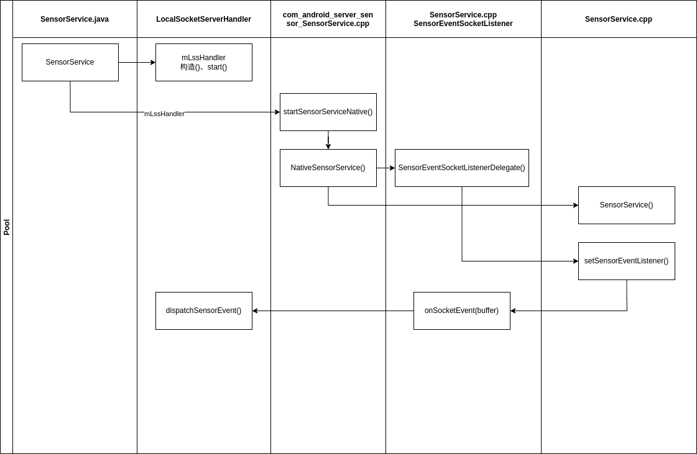
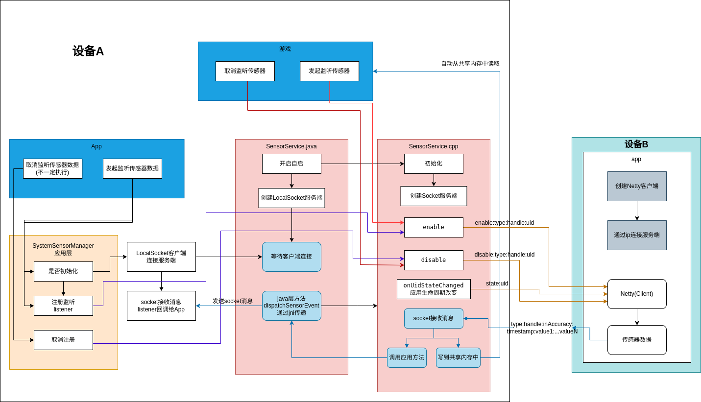

#### 项目简介
设备A没有传感器硬件，设备B正常手机，实现设备A数据从设备B中获取

需要用的的库

[LocalSocket](../im/localsocket.md)

[Socket(cpp版)](../network/net_socket.md)

[Netty](../im/netty.md)

#### 设备A
##### framework层修改点

1. frameworks/base/core/java/android/hardware/SystemSensorManager.java

主要添加LocalSocket客户端逻辑，用来接收传感器数据

```java
private Handler mMainHandler;
public SystemSensorManager(Context context, Looper mainLooper) {
    // ...
    mMainHandler = new Handler(Looper.getMainLooper(), message -> {
        try {
            //数据形式type:handle:inAccuracy:timestamp:value1...valuen
            String msg = (String) message.obj;
            String[] split = msg.split(":");
            int type = Integer.parseInt(split[0]);
            int handle = Integer.parseInt(split[1]);
            int inAccuracy = Integer.parseInt(split[2]);
            long timestamp = Long.parseLong(split[3]);
            int valueSize = split.length - 4;
            float[] values = new float[valueSize];
            for (int i = 0; i < valueSize; i++) {
                values[i] = Float.parseFloat(split[i + 4]);
            }
            for (SensorEventQueue value : mSensorListeners.values()) {
                if (value != null) {
                    Sensor sensor = mHandleToSensor.get(handle);
                    if (sensor != null) {
                        int registerType = sensor.getType();
                        if (type == registerType) {
                            value.dispatchSensorEvent(sensor.getHandle(), values, inAccuracy, timestamp);
                        }
                    }
                }
            }
        } catch (NumberFormatException e) {
            e.printStackTrace();
        }
        return true;
    });
    LocalSocketClientHandler lscHandler = new LocalSocketClientHandler();
    lscHandler.setMsgListener(msgListener);
    lscHandler.start("sensor_socket");
}

private android.hardware.LocalSocketClientHandler.MsgListener msgListener = new LocalSocketClientHandler.MsgListener() {
    @Override
    public void onMsgReceive(String msg) {
        Message message = mMainHandler.obtainMessage();
        message.obj = msg;
        mMainHandler.sendMessage(message);
    }
};
```

编译模块framework.jar

编译命令make framework-minus-apex

2. frameworks/base/services/core/java/com/android/server/sensors/SensorService.java

主要添加LocalSocket服务端逻辑以及注册jni回调类，当cpp层有传感器数据时会调用LocalSocketServerHandler中的dispatchSensorEvent方法来传递数据

```java
private static native long startSensorServiceNative(ProximityActiveListener listener, LocalSocketServerHandler lls);

public SensorService(Context ctx) {
    //...
    LocalSocketServerHandler mLssHandler = new LocalSocketServerHandler();
    mLssHandler.start("sensor_socket");
    synchronized (mLock) {
        //...
        long ptr = startSensorServiceNative(new ProximityListenerDelegate(), mLssHandler);
        //...
    }
}
```

同目录添加LocalSocketServerHandler.java和Client.java辅助类，功能是封装LocalSocket的使用，LocalSocketServerHandler中额外添加方法dispatchSensorEvent
```java
// Called from native code.
public void dispatchSensorEvent(String msg) {
    send(msg);
}
```

编译模块services.jar

编译命令make services

##### native层修改点

1. frameworks/base/core/jni/android_hardware_SensorManager.cpp

主要是屏蔽直接从底层共享内存中读取逻辑，统一在Java层SystemSensorManager的数据处理

```java
 void destroy() {
//        没注册就不需要注销
//        mMessageQueue->getLooper()->removeFd( mSensorQueue->getFd() );
    }
virtual void onFirstRef() {
        LooperCallback::onFirstRef();
//        应用层传感器回调不要从这里回调，而是从LocalSocket回调数据
//        mMessageQueue->getLooper()->addFd(mSensorQueue->getFd(), 0,
//                ALOOPER_EVENT_INPUT, this, mSensorQueue.get());
    }

```

编译模块libandroid_runtime.so

编译命令make libandroid_runtime

2. frameworks/native/services/sensorservice/SensorService.cpp、SensorService.h和Android.bp
主要是创建socket去接收手机端数据

Android.bp
```mk
cc_library_shared {
    name: "libsensorservice",

    srcs: [
        //...
        "ThreadPool.cpp",
    ],
    //...
}
```
SensorService.h声明一些属性和函数
```java
class ProximityActiveListener : public virtual RefBase {
    //...
};

// add start
class SensorEventSocketListener : public virtual RefBase {
public:
    virtual void onSocketEvent(char buffer[]) = 0;
};
// add end
//...原生
void uncapRates(userid_t userId);

// add
void startServer(int port);
void receiveClient();
void analysisResponse(char buffer[]);
void sendMsg(const std::string& message);
sp<SensorEventSocketListener> mSensorEventSocketListener;
void SensorService::setSensorEventListener(const sp<SensorEventSocketListener>& callback);
//...
```
SensorService.cpp实现具体函数
```java
//SensorService.cpp
void SensorService::startServer(int port){
    //具体见ServerSocket.cpp
}
void SensorService::sendMsg(const std::string& message){
    //具体见ServerSocket.cpp
}
void SensorService::receiveClient(){
    //具体见ServerSocket.cpp
}
void SensorService::setSensorEventListener(const sp<SensorEventSocketListener>& callback) {
        mSensorEventSocketListener = callback;
}

//解析数据写到BitTube中
void SensorService::analysisResponse(char buffer[]){
    if (mSensorEventSocketListener != nullptr) {
        // 应用层回调
        mSensorEventSocketListener->onSocketEvent(buffer);
    }
    ConnectionSafeAutolock connLock = mConnectionHolder.lock(mLock);
    char* token = strtok(buffer, ":");
    if (token == nullptr) {
        return;
    }
    int32_t type = std::strtol(token, nullptr, 10);
    token = strtok(nullptr, ":");
    if (token == nullptr) {
        return;
    }
    int32_t handle = std::strtol(token, nullptr, 10);
    token = strtok(nullptr, ":");
    if (token == nullptr) {
        return;
    }
    int8_t accuracy;
    char* endptr;
    long long tmpAccuracy = std::strtol(token, &endptr, 10);
    if (*endptr == '\0' && tmpAccuracy >= std::numeric_limits<int8_t>::min() && tmpAccuracy <= std::numeric_limits<int8_t>::max()) {
        accuracy = static_cast<int8_t>(tmpAccuracy);
    } else {
        accuracy = 0;
        ALOGE("Error converting string to int8_t: invalid input or out of range.");
    }
    token = strtok(nullptr, ":");
    if (token == nullptr) {
        return;
    }
    int64_t timestamp = std::strtoll(token, nullptr, 10);
    token = strtok(nullptr, ":");
    if (token == nullptr) {
        return;
    }
    size_t arraySize = sizeof(mSensorEventBuffer->data) / sizeof(mSensorEventBuffer->data[0]);
    for (size_t i = 0; i < arraySize; ++i) {
        if (token == nullptr) {
            break;
        }
        mSensorEventTemp->data[i] = std::strtof(token, nullptr);
        token = strtok(nullptr, ":");
    }

    mSensorEventBuffer->type = type;
    mSensorEventBuffer->sensor = handle;
    sp<SensorInterface> sensor = getSensorInterfaceFromHandle(handle);
    mSensorEventBuffer->version = sensor->getSensor().getVersion();
    mSensorEventBuffer->timestamp = timestamp;

    switch (type) {
        case ASENSOR_TYPE_ACCELEROMETER:
            mSensorEventBuffer->orientation.x = mSensorEventTemp->data[0];
            mSensorEventBuffer->orientation.y = mSensorEventTemp->data[1];
            mSensorEventBuffer->orientation.z = mSensorEventTemp->data[2];
            mSensorEventBuffer->orientation.status = accuracy;
            break;
        case ASENSOR_TYPE_MAGNETIC_FIELD:
            mSensorEventBuffer->magnetic.x = mSensorEventTemp->data[0];
            mSensorEventBuffer->magnetic.y = mSensorEventTemp->data[1];
            mSensorEventBuffer->magnetic.z = mSensorEventTemp->data[2];
            mSensorEventBuffer->magnetic.status = accuracy;
            break;
        case SENSOR_TYPE_ORIENTATION:
            mSensorEventBuffer->acceleration.x = mSensorEventTemp->data[0];
            mSensorEventBuffer->acceleration.y = mSensorEventTemp->data[1];
            mSensorEventBuffer->acceleration.z = mSensorEventTemp->data[2];
            mSensorEventBuffer->acceleration.status = accuracy;
            break;
        case ASENSOR_TYPE_GYROSCOPE:
            mSensorEventBuffer->gyro.x = mSensorEventTemp->data[0];
            mSensorEventBuffer->gyro.y = mSensorEventTemp->data[1];
            mSensorEventBuffer->gyro.z = mSensorEventTemp->data[2];
            mSensorEventBuffer->gyro.status = accuracy;
            break;
        case SENSOR_TYPE_LIGHT:
            mSensorEventBuffer->light = mSensorEventTemp->data[0];
            break;
        case SENSOR_TYPE_PRESSURE:
            mSensorEventBuffer->pressure = mSensorEventTemp->data[0];
            break;
        case SENSOR_TYPE_TEMPERATURE:
            mSensorEventBuffer->temperature = mSensorEventTemp->data[0];
            break;
        case SENSOR_TYPE_PROXIMITY:
            mSensorEventBuffer->distance = mSensorEventTemp->data[0];
            break;
        case ASENSOR_TYPE_GRAVITY:
            mSensorEventBuffer->orientation.x = mSensorEventTemp->data[0];
            mSensorEventBuffer->orientation.y = mSensorEventTemp->data[1];
            mSensorEventBuffer->orientation.z = mSensorEventTemp->data[2];
            mSensorEventBuffer->orientation.status = accuracy;
            break;
        case ASENSOR_TYPE_LINEAR_ACCELERATION:
            mSensorEventBuffer->acceleration.azimuth = mSensorEventTemp->data[0];
            mSensorEventBuffer->acceleration.pitch = mSensorEventTemp->data[1];
            mSensorEventBuffer->acceleration.roll = mSensorEventTemp->data[2];
            mSensorEventBuffer->acceleration.status = accuracy;
            break;
        case SENSOR_TYPE_ROTATION_VECTOR:
        case SENSOR_TYPE_GEOMAGNETIC_ROTATION_VECTOR:
            mSensorEventBuffer->data[0] = mSensorEventTemp->data[0];
            mSensorEventBuffer->data[1] = mSensorEventTemp->data[1];
            mSensorEventBuffer->data[2] = mSensorEventTemp->data[2];
            mSensorEventBuffer->data[3] = mSensorEventTemp->data[3];
            mSensorEventBuffer->data[4] = mSensorEventTemp->data[4];
            break;
        case SENSOR_TYPE_RELATIVE_HUMIDITY:
            mSensorEventBuffer->relative_humidity = mSensorEventTemp->data[0];
            break;
        case SENSOR_TYPE_GAME_ROTATION_VECTOR: {
            mSensorEventBuffer->data[0] = mSensorEventTemp->data[0];
            mSensorEventBuffer->data[1] = mSensorEventTemp->data[1];
            mSensorEventBuffer->data[2] = mSensorEventTemp->data[2];
            mSensorEventBuffer->data[3] = mSensorEventTemp->data[3];
            break;
        }
        case SENSOR_TYPE_GYROSCOPE_UNCALIBRATED:
            mSensorEventBuffer->uncalibrated_gyro.x_bias = mSensorEventTemp->data[0];
            mSensorEventBuffer->uncalibrated_gyro.y_bias = mSensorEventTemp->data[1];
            mSensorEventBuffer->uncalibrated_gyro.z_bias = mSensorEventTemp->data[2];;
            mSensorEventBuffer->uncalibrated_gyro.x_uncalib = mSensorEventTemp->data[0];
            mSensorEventBuffer->uncalibrated_gyro.y_uncalib = mSensorEventTemp->data[1];
            mSensorEventBuffer->uncalibrated_gyro.z_uncalib = mSensorEventTemp->data[2];
            break;
        case SENSOR_TYPE_MAGNETIC_FIELD_UNCALIBRATED:
            mSensorEventBuffer->uncalibrated_magnetic.x_bias = mSensorEventTemp->data[0];
            mSensorEventBuffer->uncalibrated_magnetic.y_bias = mSensorEventTemp->data[1];
            mSensorEventBuffer->uncalibrated_magnetic.z_bias = mSensorEventTemp->data[2];;
            mSensorEventBuffer->uncalibrated_magnetic.x_uncalib = mSensorEventTemp->data[0];
            mSensorEventBuffer->uncalibrated_magnetic.y_uncalib = mSensorEventTemp->data[1];
            mSensorEventBuffer->uncalibrated_magnetic.z_uncalib = mSensorEventTemp->data[2];
            break;
        case SENSOR_TYPE_ACCELEROMETER_UNCALIBRATED:
            mSensorEventBuffer->uncalibrated_accelerometer.x_bias = mSensorEventTemp->data[0];
            mSensorEventBuffer->uncalibrated_accelerometer.y_bias = mSensorEventTemp->data[1];
            mSensorEventBuffer->uncalibrated_accelerometer.z_bias = mSensorEventTemp->data[2];;
            mSensorEventBuffer->uncalibrated_accelerometer.x_uncalib = mSensorEventTemp->data[0];
            mSensorEventBuffer->uncalibrated_accelerometer.y_uncalib = mSensorEventTemp->data[1];
            mSensorEventBuffer->uncalibrated_accelerometer.z_uncalib = mSensorEventTemp->data[2];
            break;
        default:
            memcpy(mSensorEventBuffer->data,mSensorEventTemp->data,16);
            break;
    }

    const std::vector<sp<SensorEventConnection>> activeConnections = connLock.getActiveConnections();
    for (const sp<SensorEventConnection>& connection : activeConnections) {
        SensorEventQueue::write(connection->mChannel,
                                reinterpret_cast<ASensorEvent const*>(mSensorEventBuffer), 1);
    }
}

//程序进程存活状态监听回调，发送到手机端，数据形式state:uid:active(idle)
void SensorService::onUidStateChanged(uid_t uid, UidState state) {
    std::string result = "state:" + std::to_string(uid) + ":" + (state == UID_STATE_ACTIVE ? "active" : "idle") + "\n";
    sendMsg(result);
    //...
}

// 监听某个传感器时会调用
status_t SensorService::enable(const sp<SensorEventConnection>& connection,
        int handle, nsecs_t samplingPeriodNs, nsecs_t maxBatchReportLatencyNs, int reservedFlags,
        const String16& opPackageName) {
    //...
    sp<SensorInterface> sensor = getSensorInterfaceFromHandle(handle);
    if (sensor == nullptr ||
        !canAccessSensor(sensor->getSensor(), "Tried enabling", opPackageName)) {
        return BAD_VALUE;
    }
    //add start
    std::string result = "enable:" + std::to_string(sensor->getSensor().getType())
            + ":" + std::to_string(handle) + ":" + std::to_string(connection->getUid()) + "\n";
    sendMsg(result);
    //add end
    //...
    //add start
    if (client_sockfd != -1) {
        return NO_ERROR;
    }
    //add end
    status_t err = sensor->batch(connection.get(), handle, 0, samplingPeriodNs,
                                 maxBatchReportLatencyNs);
    //...
}

status_t SensorService::disable(const sp<SensorEventConnection>& connection, int handle) {
    //...
    Mutex::Autolock _l(mLock);
    status_t err = cleanupWithoutDisableLocked(connection, handle);
    if (err == NO_ERROR) {
        sp<SensorInterface> sensor = getSensorInterfaceFromHandle(handle);
        //add start
        std::string result = "disable:" + std::to_string(sensor->getSensor().getType())
                             + ":" + std::to_string(connection->getUid()) + "\n";
        sendMsg(result);
        if (client_sockfd != -1) {
            return NO_ERROR;
        }
        //add end
        err = sensor != nullptr ? sensor->activate(connection.get(), false) : status_t(BAD_VALUE);
    }
    //...
}
```

编译模块libsensorservice.so

编译命令make libsensorservice

3. frameworks/base/services/core/jni/com_android_server_sensor_SensorService.cpp

主要是建立SensorService.java和SensorService.cpp的通路

```java
#define LOCAL_SOCKET_CLASS \
    "com/android/server/sensors/LocalSocketServerHandler"
namespace android {

//...
static jmethodID sMethodIdDispatchSensorEvent;

class NativeSensorService {
    //modify
    NativeSensorService(JNIEnv* env, jobject listener, jobject ssl);
    //...
    sp<ProximityActiveListenerDelegate> mProximityActiveListenerDelegate;
    //add start
    class SensorEventSocketListenerDelegate : public SensorService::SensorEventSocketListener {
    public:
        SensorEventSocketListenerDelegate(JNIEnv* env, jobject ssl);
        ~SensorEventSocketListenerDelegate();
        void onSocketEvent(char buffer[]) override;
    private:
        jobject mHandle;
    };
    sp<SensorEventSocketListenerDelegate> mSensorEventSocketListenerDelegate;
    //add end
};

NativeSensorService::SensorEventSocketListenerDelegate::SensorEventSocketListenerDelegate(
    JNIEnv *env, jobject ssl): mHandle(env->NewGlobalRef(ssl)) {}

NativeSensorService::SensorEventSocketListenerDelegate::~SensorEventSocketListenerDelegate() {
    AndroidRuntime::getJNIEnv()->DeleteGlobalRef(mHandle);
}

//调用java层的LocalServerHandler中的dispatchSensorEvent方法
void NativeSensorService::SensorEventSocketListenerDelegate::onSocketEvent(char *buffer) {
    auto jniEnv = GetOrAttachJNIEnvironment(sJvm);
    if (sMethodIdDispatchSensorEvent != nullptr) {
        jstring jMsg = jniEnv->NewStringUTF(buffer);
        jniEnv->CallVoidMethod(mHandle, sMethodIdDispatchSensorEvent, jMsg);
        jniEnv->DeleteLocalRef(jMsg);
    }
}

NativeSensorService::NativeSensorService(JNIEnv* env, jobject listener, jobject ssl)
    : mProximityActiveListenerDelegate(new ProximityActiveListenerDelegate(env, listener)),
    mSensorEventSocketListenerDelegate(new SensorEventSocketListenerDelegate(env, ssl)) {
    //...
    mService = new SensorService();
    //add
    mService->setSensorEventListener(mSensorEventSocketListenerDelegate);
    //...
}

//modify
static jlong startSensorServiceNative(JNIEnv* env, jclass, jobject listener, jobject ssl) {
    NativeSensorService* service = new NativeSensorService(env, listener, ssl);
    return reinterpret_cast<jlong>(service);
}


static const JNINativeMethod methods[] = {
    {
        // modify
        "startSensorServiceNative", "(L" PROXIMITY_ACTIVE_CLASS ";L" LOCAL_SOCKET_CLASS ";)J",
        reinterpret_cast<void*>(startSensorServiceNative)
    },
    //...
};

int register_android_server_sensor_SensorService(JavaVM* vm, JNIEnv* env) {
    //...
    jclass sensorServiceClass = FindClassOrDie(env, LOCAL_SOCKET_CLASS);
    sMethodIdDispatchSensorEvent = GetMethodIDOrDie(env, sensorServiceClass, "dispatchSensorEvent", "(Ljava/lang/String;)V");
    //...
}
}; // namespace android

```



编译模块libandroid_servers.so

编译命令make libandroid_servers

#### 设备B

app层: netty_client项目，主要是通过netty将传感器数据传递到native层SensorService.cpp

处理收到的指令
```kotlin
override fun messageReceived(msg: String) {
    lifecycleScope.launch {
        val cmd = msg.split(":")
        try {
            val flag = cmd[0]
            if ("enable" == flag) {
                val type = cmd[1].toInt()
                val uid = cmd[3].toInt()
                val handle = cmd[2]
                val listener = typeToListener(type, handle)
                registerSensorListener(type, listener)
                sensorCacheManager.enable(type, uid)
            } else if ("disable" == flag) {
                val type = cmd[1].toInt()
                val uid = cmd[2].toInt()
                sensorCacheManager.disable(type, uid)
            } else if ("state" == flag) {
                val active = cmd[2] == "active"
                if (!active) {
                    val uid = cmd[1].toInt()
                    sensorCacheManager.state(uid)
                }
            }
        } catch (e: Exception) {
            e.printStackTrace()
        }
    }
}
```
通过type找到指定Sensor，typeToListener
```kotlin
private fun typeToListener(type: Int, handle: String) = when (type) {
    Sensor.TYPE_ACCELEROMETER -> {
        accelerometerListener.apply { this.handle = handle }
    }

    Sensor.TYPE_MAGNETIC_FIELD -> {
        magneticFieldListener.apply { this.handle = handle }
    }

    Sensor.TYPE_ORIENTATION -> {
        orientationListener.apply { this.handle = handle }
    }

    Sensor.TYPE_GYROSCOPE -> {
        gyroscopeListener.apply { this.handle = handle }
    }

    Sensor.TYPE_LIGHT -> {
        lightListener.apply { this.handle = handle }
    }

    Sensor.TYPE_PRESSURE -> {
        pressureListener.apply { this.handle = handle }
    }

    Sensor.TYPE_TEMPERATURE -> {
        temperatureListener.apply { this.handle = handle }
    }

    Sensor.TYPE_PROXIMITY -> {
        proximityListener.apply { this.handle = handle }
    }

    Sensor.TYPE_GRAVITY -> {
        gravityListener.apply { this.handle = handle }
    }

    Sensor.TYPE_LINEAR_ACCELERATION -> {
        linearAccelerationListener.apply { this.handle = handle }
    }

    Sensor.TYPE_ROTATION_VECTOR -> {
        rotationVectorListener.apply { this.handle = handle }
    }

    Sensor.TYPE_GAME_ROTATION_VECTOR -> {
        gameRotationVectorListener.apply { this.handle = handle }
    }

    Sensor.TYPE_GEOMAGNETIC_ROTATION_VECTOR -> {
        geomagneticRotationVectorListener.apply { this.handle = handle }
    }

    else -> null
}
```
其中accelerometerListener等这些listener，如下(其他类似名字不同而已)
```kotlin
 private val accelerometerListener by lazy {
    object : SensorEventListener {
        var handle: String = ""
        override fun onSensorChanged(event: SensorEvent) {
            sendSensorData(event, handle)
        }

        override fun onAccuracyChanged(sensor: Sensor, accuracy: Int) {
            Log.d(TAG, "onAccuracyChanged: type ${sensor.type},accuracy $accuracy")
        }
    }
}
```
注册或反注册Sensor
```kotlin
private fun registerSensorListener(type: Int, listener: SensorEventListener?) {
    if (listener == null) {
        Log.e(TAG, "sensor listener is null")
        return
    }
    if (sensorCacheManager.hasEnable(type)) {
        Log.e(TAG, "sensor has register")
        return
    }
    sensorManager.registerListener(
        listener,
        sensorManager.getDefaultSensor(type),
        SensorManager.SENSOR_DELAY_NORMAL
    )
    Log.e(TAG, "sensor register: $type")
}

private fun unRegisterSensorListener(type: Int, listener: SensorEventListener?) {
    if (listener == null) {
        Log.e(TAG, "sensor listener is null")
        return
    }
    if (sensorCacheManager.hasEnable(type)) {
        Log.e(TAG, "sensor has no register")
        return
    }
    sensorManager.unregisterListener(listener)
    Log.e(TAG, "sensor unregister: $type")
}
```
监听到数据后发送给设备B sendSensorData
```kotlin
 private fun sendSensorData(event: SensorEvent, handle: String) {
    if (handle.isEmpty()) {
        Log.d(TAG, "sendSensorData: handle is null")
        return
    }
    val builder = StringBuilder()
    builder.append(event.sensor.type).append(":")
        .append(handle).append(":")
        .append(event.accuracy).append(":")
        .append(event.timestamp)
    event.values.forEach {
        builder.append(":").append(it)
    }
    SensorClientHandler.sendMsg(builder.toString())
}
```

### 整体流程
1. 设备A开机启动SensorService系统服务开启(原生逻辑)
2. 手机端启动Netty客户端并连接
3. 设备A三方应用或者游戏监听传感器
4. 设备A如果是应用fw(SystemSensorManager)被创建并通过LocalSocket连接到SensorService中的服务端，等待消息
5. 设备A上触发传感器无论是应用还是游戏都会调用到SensorService中的enable/disable函数，通过Socket向手机端发送消息，携带传感器类型信息
6. SensorService收到手机的数据，解析后将数据传回应用和游戏
7. 如果应用或游戏退出onUidStateChanged，向手机发送uid的程序消息，手机关闭对应传感器数据

### 方案整体流程图

