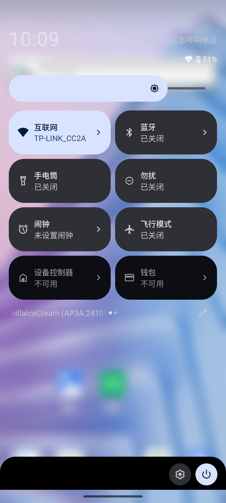

### 下拉栏修改


底部设置和关机按钮背景修改

frameworks/base/packages/SystemUI/compose/features/src/com/android/systemui/qs/footer/ui/compose/FooterActions.kt
```kotlin
val backgroundColor = /*colorAttr(R.attr.underSurface)*/Color.Transparent
val contentColor = LocalAndroidColorScheme.current.onSurface
val backgroundTopRadius = /*dimensionResource(R.dimen.qs_corner_radius)*/0F
```
#### 下拉烂监听
frameworks/base/packages/SystemUI/src/com/android/systemui/statusbar/phone/StatusBar.java
```java
mScrimController.setScrimVisibleListener(scrimsVisible -> {
//            mNotificationShadeWindowController.setScrimsVisibility(scrimsVisible);
    if (scrimsVisible == ScrimController.OPAQUE) {
        // 下拉栏展开
        SystemUIPluginManager.getInstance().onStatusBarExpand(true);
    } else if (scrimsVisible == ScrimController.TRANSPARENT) {
        // 下拉栏收起、锁屏
        SystemUIPluginManager.getInstance().onStatusBarExpand(false);
    } else if (scrimsVisible == ScrimController.SEMI_TRANSPARENT) {
        // 锁屏亮屏
        if (mStatusBarStateController.isDreaming())
            SystemUIPluginManager.getInstance().onStatusBarExpand(true);
    }
});
```
#### 下拉栏高斯模糊

frameworks/base/packages/SystemUI/src/com/android/systemui/scrim/ScrimView.java

禁止绘制，屏蔽onDraw代码即可，不然会绘制圆角背景

修改最大模糊值

frameworks/base/packages/SystemUI/res/values/dimens.xml
```xml
<dimen name="max_window_blur_radius">50px</dimen>
```

frameworks/base/packages/SystemUI/src/com/android/systemui/statusbar/BlurUtils.kt

高斯模糊处理的地方
```kotlin
fun applyBlur(viewRootImpl: ViewRootImpl?, radius: Int, opaque: Boolean) {
    //...
    createTransaction().use {
        if (supportsBlursOnWindows()) {
            it.setBackgroundBlurRadius(viewRootImpl.surfaceControl, radius)
            //...
        }
        it.setOpaque(viewRootImpl.surfaceControl, opaque)
        it.apply()
    }
}
```
frameworks/base/packages/SystemUI/src/com/android/systemui/statusbar/phone/StatusBar.java

屏蔽对ScrimView显示隐藏监听
```kotlin
mScrimController.setScrimVisibleListener(scrimsVisible -> {
//   mNotificationShadeWindowController.setScrimsVisibility(scrimsVisible);
});
```
下拉添加背景

frameworks/base/packages/SystemUI/res/layout/status_bar_expanded.xml
```xml
<com.android.systemui.shade.NotificationPanelView
    xmlns:android="http://schemas.android.com/apk/res/android"
    xmlns:systemui="http://schemas.android.com/apk/res-auto"
    android:id="@+id/notification_panel"
    android:layout_width="match_parent"
    android:layout_height="match_parent"
    android:background="@android:color/transparent">
    <View
        android:id="@+id/status_bar_expanded_bg"
        android:layout_width="match_parent"
        android:background="#80000000"
        android:visibility="gone"
        android:layout_height="match_parent"/>
    //...
</com.android.systemui.shade.NotificationPanelView>
```
frameworks/base/packages/SystemUI/src/com/android/systemui/shade/NotificationPanelViewController.java
```java
private View mStatusBarExpandBg;

void onFinishInflate() {
    //...
    mStatusBarExpandBg = mView.findViewById(R.id.status_bar_expanded_bg);
    //...
}

void notifyExpandingStarted() {
    if (!mExpanding) {
        //...
        if (!isFullyExpanded() && mStatusBarExpandBg.getVisibility() == View.GONE) {
            mStatusBarExpandBg.setVisibility(VISIBLE);
        }
    }
}

void notifyExpandingFinished() {
    endClosing();
    if (mExpanding) {
        //...
        if (mKeyguardStateController.isShowing() ||
                (!isFullyExpanded() && mStatusBarExpandBg.getVisibility() == VISIBLE)) {
            mStatusBarExpandBg.setVisibility(View.GONE);
        }
    }
}
```