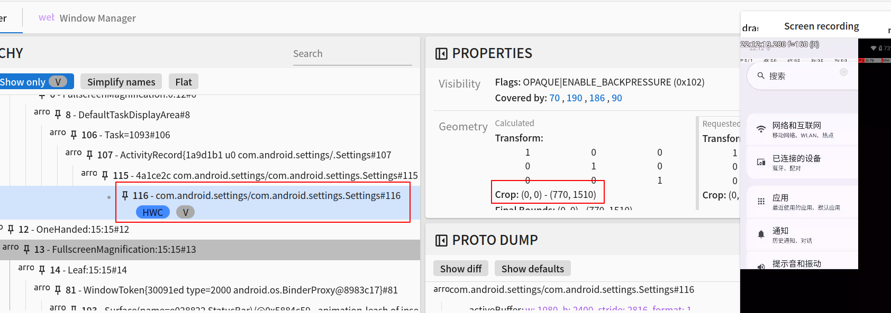

#### aosp15无法开启自由窗口

设置-开发者选项-启用可自由调整的窗口，开启(对应下面DEVELOPMENT_ENABLE_FREEFORM_WINDOWS_SUPPORT)

packages/apps/Launcher3/quickstep/src/com/android/quickstep/TaskShortcutFactory.java
```java
private boolean isAvailable(RecentsViewContainer container) {
    return Settings.Global.getInt(
            container.asContext().getContentResolver(),
            Settings.Global.DEVELOPMENT_ENABLE_FREEFORM_WINDOWS_SUPPORT, 0) != 0
            && !enableDesktopWindowingMode();
}
```
将!enableDesktopWindowingMode()改成enableDesktopWindowingMode()

#### 自由窗口黑屏
##### 复现方式
切换成自由窗口，进行拖拽，再点击全屏

##### 定位过程

1.打印堆栈，窗口裁剪最终调用SurfaceControl的nativeSetWindowCrop

frameworks/base/core/java/android/view/SurfaceControl.java

鼠标右键--Find Usages，找到所有调用出添加打印，编译push后使用adb logcat -c;adb logcat > xx.txt方式抓取日志文件
```java
if (sc.toString().contains("Setting")) {
    android.util.Log.e("yuli", sc + " setWindowCrop " + crop, new Exception());
}
```
2.使用winscope抓trace定位到是裁剪WindowState的问题，点击全屏时裁剪没有被重置



##### 解决方案
frameworks/base/libs/WindowManager/Shell/src/com/android/wm/shell/windowdecor/TaskOperations.java

点击全屏按钮实现方法
```java
void maximizeTask(RunningTaskInfo taskInfo, int containerWindowingMode) {
    WindowContainerTransaction wct = new WindowContainerTransaction();
    int targetWindowingMode = taskInfo.getWindowingMode() != WINDOWING_MODE_FULLSCREEN
            ? WINDOWING_MODE_FULLSCREEN : WINDOWING_MODE_FREEFORM;
    wct.setWindowingMode(taskInfo.token,
            targetWindowingMode == containerWindowingMode
                    ? WINDOWING_MODE_UNDEFINED : targetWindowingMode);
    if (targetWindowingMode == WINDOWING_MODE_FULLSCREEN) {
        wct.setBounds(taskInfo.token, null);
    }
    if (Transitions.ENABLE_SHELL_TRANSITIONS) {
        mTransitionStarter.startWindowingModeTransition(targetWindowingMode, wct);
    } else {
        mSyncQueue.queue(wct);
    }
}
```

frameworks/base/services/core/java/com/android/server/wm/WindowState.java
```java
void prepareSurfaces() {
    //...
    mWinAnimator.prepareSurfaceLocked(getSyncTransaction());
    //...
}
```
frameworks/base/services/core/java/com/android/server/wm/WindowStateAnimator.java
```java
void prepareSurfaceLocked(SurfaceControl.Transaction t) {
    final WindowState w = mWin;
    //...
    //添加还原操作
    if (w.getWindowingMode() == WindowConfiguration.WINDOWING_MODE_FULLSCREEN) {
        t.setWindowCrop(getSurfaceControl(), 0, 0);
    }
}
```