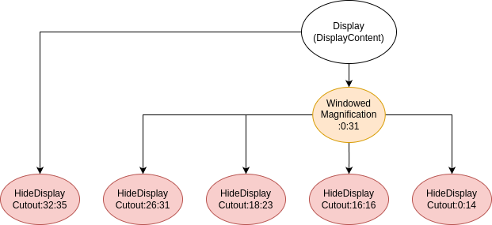
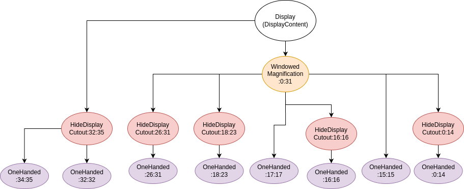
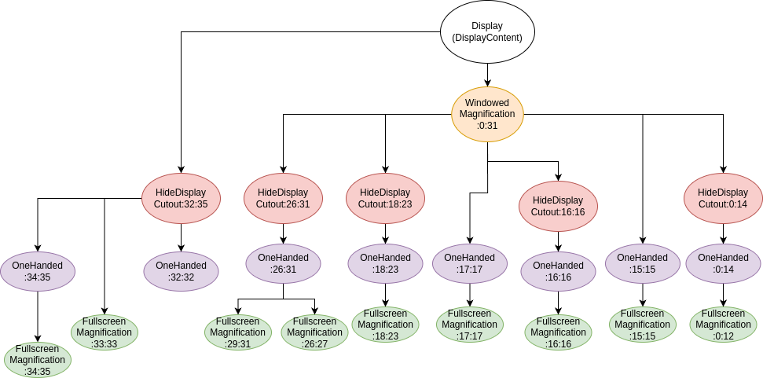
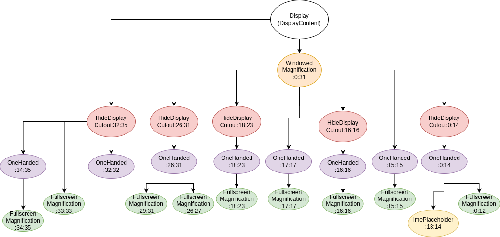
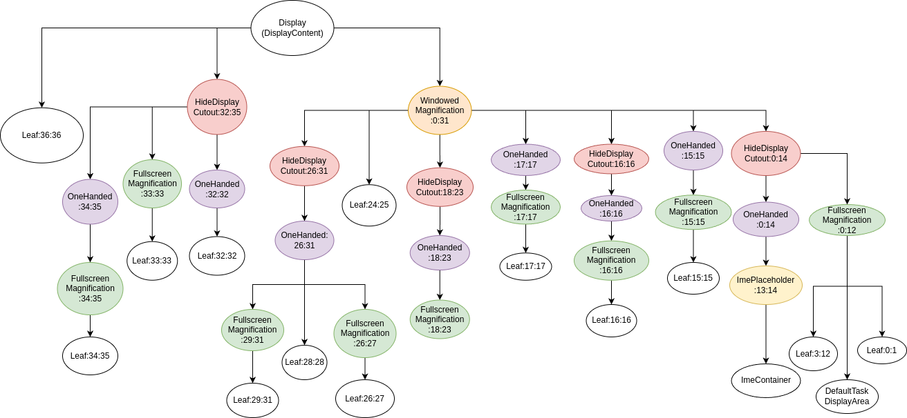
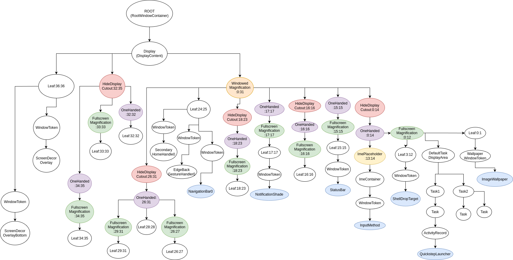

### Window层级数
0-36共37层

https://juejin.cn/post/7301955975338131495

https://blog.csdn.net/q1165328963/article/details/127746382

https://blog.csdn.net/CJohn1994/article/details/132794066

https://blog.csdn.net/learnframework/article/details/129132667

### 命令分析层级
```shell
adb shell dumpsys activity containers > wms.txt
```
### 源码分析
#### 添加主要层级
frameworks/base/services/core/java/com/android/server/wm/DisplayContent.java
```java
DisplayContent(Display display, RootWindowContainer root,
            @NonNull DeviceStateController deviceStateController) {
    //...
    configureSurfaces(pendingTransaction);
    //...            
}

private void configureSurfaces(Transaction transaction) {
    //...  
    mDisplayAreaPolicy = mWmService.getDisplayAreaPolicyProvider().instantiate(
                    mWmService, this /* content */, this /* root */,
                    mImeWindowsContainer);
    //... 
}
```
frameworks/base/services/core/java/com/android/server/wm/DisplayAreaPolicy.java
```java
public DisplayAreaPolicy instantiate(WindowManagerService wmService,
                DisplayContent content, RootDisplayArea root,
                DisplayArea.Tokens imeContainer) {
    //... 
    configureTrustedHierarchyBuilder(rootHierarchy, wmService, content);
    //... 
}
private void configureTrustedHierarchyBuilder(HierarchyBuilder rootHierarchy,WindowManagerService wmService, DisplayContent content) {
rootHierarchy.addFeature(new Feature.Builder(wmService.mPolicy, "WindowedMagnification",
    FEATURE_WINDOWED_MAGNIFICATION)
    .upTo(TYPE_ACCESSIBILITY_MAGNIFICATION_OVERLAY)
    .except(TYPE_ACCESSIBILITY_MAGNIFICATION_OVERLAY)
    .setNewDisplayAreaSupplier(DisplayArea.Dimmable::new)
    .build());
if (content.isDefaultDisplay) {
rootHierarchy.addFeature(new Feature.Builder(wmService.mPolicy, "HideDisplayCutout",
    FEATURE_HIDE_DISPLAY_CUTOUT)
    .all()
    .except(TYPE_NAVIGATION_BAR, TYPE_NAVIGATION_BAR_PANEL, TYPE_STATUS_BAR,
            TYPE_NOTIFICATION_SHADE)
    .build())
    .addFeature(new Feature.Builder(wmService.mPolicy, "OneHanded",FEATURE_ONE_HANDED)
    .all()
    .except(TYPE_NAVIGATION_BAR, TYPE_NAVIGATION_BAR_PANEL,TYPE_SECURE_SYSTEM_OVERLAY)
    .build());
    }
rootHierarchy
.addFeature(new Feature.Builder(wmService.mPolicy, "FullscreenMagnification",
FEATURE_FULLSCREEN_MAGNIFICATION)
    .all()
    .except(TYPE_ACCESSIBILITY_MAGNIFICATION_OVERLAY, TYPE_INPUT_METHOD,
            TYPE_INPUT_METHOD_DIALOG, TYPE_MAGNIFICATION_OVERLAY,
            TYPE_NAVIGATION_BAR, TYPE_NAVIGATION_BAR_PANEL)
    .build())
.addFeature(new Feature.Builder(wmService.mPolicy, "ImePlaceholder",
    FEATURE_IME_PLACEHOLDER)
    .and(TYPE_INPUT_METHOD, TYPE_INPUT_METHOD_DIALOG)
    .build());
    }
}
```
upTo：用来设置图层层级

except：用来排除层级

如"WindowedMagnification", 窗口类型FEATURE_WINDOWED_MAGNIFICATION

upTo(TYPE_ACCESSIBILITY_MAGNIFICATION_OVERLAY)，TYPE_ACCESSIBILITY_MAGNIFICATION_OVERLAY对应层级是32

对应查询源码位置：

frameworks/base/services/core/java/com/android/server/policy/WindowManagerPolicy.java

即0-32

except(TYPE_ACCESSIBILITY_MAGNIFICATION_OVERLAY),即排除32，则为0-31

build的时候默认会排除36
```java
private boolean mExcludeRoundedCorner = true;
Feature build() {
    if (mExcludeRoundedCorner) {
        mLayers[mPolicy.getMaxWindowLayer()] = false;
    }
    //...
}
```
同理其他图层

"HideDisplayCutout": all()即0-36

except(TYPE_NAVIGATION_BAR(24), TYPE_NAVIGATION_BAR_PANEL(25), TYPE_STATUS_BAR(15),TYPE_NOTIFICATION_SHADE(17))

0-14,16,18-23,26-35(build排除36)

"OneHanded": all()即0-36

except(TYPE_NAVIGATION_BAR(24), TYPE_NAVIGATION_BAR_PANEL(25),TYPE_SECURE_SYSTEM_OVERLAY(33))

0-23,26-32,34-35(build排除36)

"FullscreenMagnification": all()即0-36

except(TYPE_ACCESSIBILITY_MAGNIFICATION_OVERLAY(32), TYPE_INPUT_METHOD(13),TYPE_INPUT_METHOD_DIALOG(14), TYPE_MAGNIFICATION_OVERLAY(28),TYPE_NAVIGATION_BAR(24), TYPE_NAVIGATION_BAR_PANEL(25))

0-12,15-23,26-27,29-31,33-35(build排除36)

"ImePlaceholder": 0

and(TYPE_INPUT_METHOD(13), TYPE_INPUT_METHOD_DIALOG(14))

13-14

#### 开始构建层级
```java
public DisplayAreaPolicy instantiate(WindowManagerService wmService,
                DisplayContent content, RootDisplayArea root,
                DisplayArea.Tokens imeContainer) {
    //... 
    return new DisplayAreaPolicyBuilder().setRootHierarchy(rootHierarchy).build(wmService);
}
Result build(WindowManagerService wmService) {
    //... 
    mRootHierarchyBuilder.build(mDisplayAreaGroupHierarchyBuilders);
    //... 
}

private void build(@Nullable List<HierarchyBuilder> displayAreaGroupHierarchyBuilders) {
    //... 
    //根据算法建立数结构
    final int size = mFeatures.size();
    for (int i = 0; i < size; i++) {
        if (featureArea == null || featureArea.mParent != areaForLayer[layer]) {
            featureArea = new PendingArea(feature, layer, areaForLayer[layer]);
            areaForLayer[layer].mChildren.add(featureArea);
        }
        areaForLayer[layer] = featureArea;
        } else {
            featureArea = null;
        }
    }
    //... 
}
```
WindowedMagnification: 0-31，直接是在Display下挂载

HideDisplayCutout：0-14,16,18-23,26-35



- 其中32:35是由于parent只能到31所以需要在Display下挂32:35

OneHanded：0-23,26-32,34-35



FullscreenMagnification：0-12,15-23,26-27,29-31,33-35



ImePlaceholder：13-14



图层显示总结

Feature名称|层级|窗口类型|
:-|:-:|:-:|
WindowedMagnification|0-31|FEATURE_WINDOWED_MAGNIFICATION
HideDisplayCutout|0-14,16-16,18-23,26-31,32-35|FEATURE_HIDE_DISPLAY_CUTOUT
OneHanded|0-14,15-15,16-16,17-17,18-23,26-31,32-32,34-35|FEATURE_ONE_HANDED
FullscreenMagnification|0-12,15-15,16-16,17-17,18-23,26-27,29-31,33-33,34-35|FEATURE_FULLSCREEN_MAGNIFICATION
ImePlaceholder|13-14|FEATURE_IME_PLACEHOLDER

#### 构建Leaf层级
```java
//... 
PendingArea leafArea = null;
int leafType = LEAF_TYPE_TOKENS;
for (int layer = 0; layer < maxWindowLayerCount; layer++) {
    int type = typeOfLayer(policy, layer);
    if (leafArea == null || leafArea.mParent != areaForLayer[layer]
            || type != leafType) {
        leafArea = new PendingArea(null /* feature */, layer, areaForLayer[layer]);
        areaForLayer[layer].mChildren.add(leafArea);
        leafType = type;
        if (leafType == LEAF_TYPE_TASK_CONTAINERS) {
            addTaskDisplayAreasToApplicationLayer(areaForLayer[layer]);
            addDisplayAreaGroupsToApplicationLayer(areaForLayer[layer],
                    displayAreaGroupHierarchyBuilders);
            leafArea.mSkipTokens = true;
        } else if (leafType == LEAF_TYPE_IME_CONTAINERS) {
            leafArea.mExisting = mImeContainer;
            leafArea.mSkipTokens = true;
        }
    }
    leafArea.mMaxLayer = layer;
}
root.computeMaxLayer();
root.instantiateChildren(mRoot, displayAreaForLayer, 0, featureAreas);
mRoot.onHierarchyBuilt(mFeatures, displayAreaForLayer, featureAreas);
```
其中对两种类型进行特殊处理，在typeOfLayer中
```java
private static int typeOfLayer(WindowManagerPolicy policy, int layer) {
    if (layer == APPLICATION_LAYER) {
        return LEAF_TYPE_TASK_CONTAINERS;
    } else if (layer == policy.getWindowLayerFromTypeLw(TYPE_INPUT_METHOD)
            || layer == policy.getWindowLayerFromTypeLw(TYPE_INPUT_METHOD_DIALOG)) {
        return LEAF_TYPE_IME_CONTAINERS;
    } else {
        return LEAF_TYPE_TOKENS;
    }
}
```
APPLICATION_LAYER为2, TYPE_INPUT_METHOD为13, TYPE_INPUT_METHOD_DIALOG为14，其他都用PendingArea处理，这两种分别使用APPLICATION_LAYER是
```java
leafArea.mExisting = mTaskDisplayAreas.get(i);
leafArea.mSkipTokens = true;
```
INPUT是
```java
leafArea.mExisting = mImeContainer;
leafArea.mSkipTokens = true;
```
PendingArea在instantiateChildren中转成DisplayArea
```java
void instantiateChildren(DisplayArea<DisplayArea> parent, DisplayArea.Tokens[] areaForLayer,
        int level, Map<Feature, List<DisplayArea<WindowContainer>>> areas) {
    //... 
    for (int i = 0; i < mChildren.size(); i++) {
        final PendingArea child = mChildren.get(i);
        final DisplayArea area = child.createArea(parent, areaForLayer);
        if (area == null) {
            continue;
        }
        //... 
    }
}
private DisplayArea createArea(DisplayArea<DisplayArea> parent,
        DisplayArea.Tokens[] areaForLayer) {
    //... 
    if (mFeature == null) {
        final DisplayArea.Tokens leaf = new DisplayArea.Tokens(parent.mWmService, type, "Leaf:" + mMinLayer + ":" + mMaxLayer);//Leaf名称
        fillAreaForLayers(leaf, areaForLayer);
        return leaf;
    } else {
        return mFeature.mNewDisplayAreaSupplier.create(parent.mWmService, type, mFeature.mName + ":" + mMinLayer + ":" + mMaxLayer, mFeature.mId);
    }
}
```
除了APPLICATION和INPUT都是Leaf\:x\:x

APPLICATION名字为DefaultTaskDisplayArea

INPUT名字为ImeContainer

相关代码如下
```java
mImeWindowsContainer = ImeContainer(WindowManagerService wms) {
    super(wms, Type.ABOVE_TASKS, "ImeContainer", FEATURE_IME);
}
//mImeWindowsContainer传递给imeContainer
final TaskDisplayArea defaultTaskDisplayArea = new TaskDisplayArea(content, wmService, "DefaultTaskDisplayArea", FEATURE_DEFAULT_TASK_CONTAINER);
tdaList.add(defaultTaskDisplayArea);
rootHierarchy.setImeContainer(imeContainer).setTaskDisplayAreas(tdaList);
```


#### 构建WindowToken/Task/ActivityRecord/WindowState

https://juejin.cn/post/7229587772217491511




### WindowState
```java
WindowState(WindowManagerService service, Session s, IWindow c, WindowToken token,
            WindowState parentWindow, int appOp, WindowManager.LayoutParams a, int viewVisibility,
            int ownerId, int showUserId, boolean ownerCanAddInternalSystemWindow) {
    super(service);
    mTmpTransaction = service.mTransactionFactory.get();
    mSession = s;
    mClient = c;
    mAppOp = appOp;
    mToken = token;
    mDisplayContent = token.mDisplayContent;
    mActivityRecord = mToken.asActivityRecord();
    mOwnerUid = ownerId;
    mShowUserId = showUserId;
    mOwnerCanAddInternalSystemWindow = ownerCanAddInternalSystemWindow;
    mWindowId = new WindowId(this);
    mAttrs.copyFrom(a);
    mLastSurfaceInsets.set(mAttrs.surfaceInsets);
    mViewVisibility = viewVisibility;
    mPolicy = mWmService.mPolicy;
    mContext = mWmService.mContext;
    mForceSeamlesslyRotate = token.mRoundedCornerOverlay;
    mLastReportedActivityWindowInfo = Flags.activityWindowInfoFlag() && mActivityRecord != null
            ? new ActivityWindowInfo()
            : null;
    mInputWindowHandle = new InputWindowHandleWrapper(new InputWindowHandle(
            mActivityRecord != null
                    ? mActivityRecord.getInputApplicationHandle(false /* update */) : null,
            getDisplayId()));
    mInputWindowHandle.setFocusable(false);
    mInputWindowHandle.setOwnerPid(s.mPid);
    mInputWindowHandle.setOwnerUid(s.mUid);
    mInputWindowHandle.setName(getName());
    mInputWindowHandle.setPackageName(mAttrs.packageName);
    mInputWindowHandle.setLayoutParamsType(mAttrs.type);
    if (!surfaceTrustedOverlay()) {
        mInputWindowHandle.setTrustedOverlay(isWindowTrustedOverlay());
    }
    //子窗口处理：1000-1999
    if (mAttrs.type >= FIRST_SUB_WINDOW && mAttrs.type <= LAST_SUB_WINDOW) {
        mBaseLayer = mPolicy.getWindowLayerLw(parentWindow)
                * TYPE_LAYER_MULTIPLIER + TYPE_LAYER_OFFSET;
        mSubLayer = mPolicy.getSubWindowLayerFromTypeLw(a.type);
        mIsChildWindow = true;

        mLayoutAttached = mAttrs.type !=
                WindowManager.LayoutParams.TYPE_APPLICATION_ATTACHED_DIALOG;
        mIsImWindow = parentWindow.mAttrs.type == TYPE_INPUT_METHOD
                || parentWindow.mAttrs.type == TYPE_INPUT_METHOD_DIALOG;
        mIsWallpaper = parentWindow.mAttrs.type == TYPE_WALLPAPER;
    } else {
        mBaseLayer = mPolicy.getWindowLayerLw(this)
                * TYPE_LAYER_MULTIPLIER + TYPE_LAYER_OFFSET;
        mSubLayer = 0;
        mIsChildWindow = false;
        mLayoutAttached = false;
        mIsImWindow = mAttrs.type == TYPE_INPUT_METHOD
                || mAttrs.type == TYPE_INPUT_METHOD_DIALOG;
        mIsWallpaper = mAttrs.type == TYPE_WALLPAPER;
    }
    mIsFloatingLayer = mIsImWindow || mIsWallpaper;
    //...
    mWinAnimator = new WindowStateAnimator(this);
    //...
    if (mIsChildWindow) {
        ProtoLog.v(WM_DEBUG_ADD_REMOVE, "Adding %s to %s", this, parentWindow);
        parentWindow.addChild(this, sWindowSubLayerComparator);
    }
}
```
getWindowLayerLw最终调用的是getWindowLayerFromTypeLw
```java
default int getWindowLayerFromTypeLw(int type, boolean canAddInternalSystemWindow,
            boolean roundedCornerOverlay) {
    // 第36层
    if (roundedCornerOverlay && canAddInternalSystemWindow) {
        return getMaxWindowLayer();
    }
    // 1-99：属于第2层
    if (type >= FIRST_APPLICATION_WINDOW && type <= LAST_APPLICATION_WINDOW) {
        return APPLICATION_LAYER;
    }
    // 2000-2999：返回不同层
    switch (type) {
        case TYPE_WALLPAPER:
            // wallpaper is at the bottom, though the window manager may move it.
            return  1;
        case TYPE_PRESENTATION:
        case TYPE_PRIVATE_PRESENTATION:
        case TYPE_DOCK_DIVIDER:
        case TYPE_QS_DIALOG:
        case TYPE_PHONE:
            return  3;
        case TYPE_SEARCH_BAR:
            return  4;
        case TYPE_INPUT_CONSUMER:
            return  5;
        case TYPE_SYSTEM_DIALOG:
            return  6;
        case TYPE_TOAST:
            // toasts and the plugged-in battery thing
            return  7;
        case TYPE_PRIORITY_PHONE:
            // SIM errors and unlock.  Not sure if this really should be in a high layer.
            return  8;
        case TYPE_SYSTEM_ALERT:
            // like the ANR / app crashed dialogs
            // Type is deprecated for non-system apps. For system apps, this type should be
            // in a higher layer than TYPE_APPLICATION_OVERLAY.
            return  canAddInternalSystemWindow ? 12 : 9;
        case TYPE_APPLICATION_OVERLAY:
            return  11;
        case TYPE_INPUT_METHOD:
            // on-screen keyboards and other such input method user interfaces go here.
            return  13;
        case TYPE_INPUT_METHOD_DIALOG:
            // on-screen keyboards and other such input method user interfaces go here.
            return  14;
        case TYPE_STATUS_BAR:
            return  15;
        case TYPE_STATUS_BAR_ADDITIONAL:
            return  16;
        case TYPE_NOTIFICATION_SHADE:
            return  17;
        case TYPE_STATUS_BAR_SUB_PANEL:
            return  18;
        case TYPE_KEYGUARD_DIALOG:
            return  19;
        case TYPE_VOICE_INTERACTION_STARTING:
            return  20;
        case TYPE_VOICE_INTERACTION:
            // voice interaction layer should show above the lock screen.
            return  21;
        case TYPE_VOLUME_OVERLAY:
            // the on-screen volume indicator and controller shown when the user
            // changes the device volume
            return  22;
        case TYPE_SYSTEM_OVERLAY:
            // the on-screen volume indicator and controller shown when the user
            // changes the device volume
            return  canAddInternalSystemWindow ? 23 : 10;
        case TYPE_NAVIGATION_BAR:
            // the navigation bar, if available, shows atop most things
            return  24;
        case TYPE_NAVIGATION_BAR_PANEL:
            // some panels (e.g. search) need to show on top of the navigation bar
            return  25;
        case TYPE_SCREENSHOT:
            // screenshot selection layer shouldn't go above system error, but it should cover
            // navigation bars at the very least.
            return  26;
        case TYPE_SYSTEM_ERROR:
            // system-level error dialogs
            return  canAddInternalSystemWindow ? 27 : 9;
        case TYPE_MAGNIFICATION_OVERLAY:
            // used to highlight the magnified portion of a display
            return  28;
        case TYPE_DISPLAY_OVERLAY:
            // used to simulate secondary display devices
            return  29;
        case TYPE_DRAG:
            // the drag layer: input for drag-and-drop is associated with this window,
            // which sits above all other focusable windows
            return  30;
        case TYPE_ACCESSIBILITY_OVERLAY:
            // overlay put by accessibility services to intercept user interaction
            return  31;
        case TYPE_ACCESSIBILITY_MAGNIFICATION_OVERLAY:
            return 32;
        case TYPE_SECURE_SYSTEM_OVERLAY:
            return  33;
        case TYPE_BOOT_PROGRESS:
            return  34;
        case TYPE_POINTER:
            // the (mouse) pointer layer
            return  35;
        default:
            Slog.e("WindowManager", "Unknown window type: " + type);
            return 3;
    }
}
```