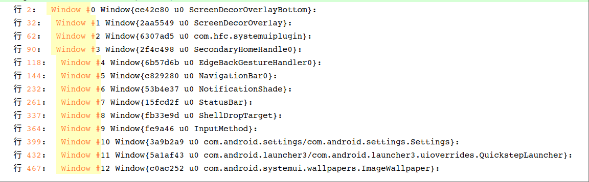

### 常用命令
#### 分析层级
```shell
adb shell dumpsys activity containers > wms.txt
```
#### 分析SurfaceFlinger
```shell
adb shell dumpsys SurfaceFlinger > surface.txt
```
#### 分析窗口
```shell
adb shell dumpsys window windows > window.txt
```
### Winscope
官方介绍：https://source.android.google.cn/docs/core/graphics/tracing-win-transitions?hl=zh-cn#capture-traces-adb
#### aosp14之前
1.开发者选项-快捷设置开发者-Winscope跟踪

2.问题复现操作

3.保存位置: /data/misc/wmtrace/

SurfaceFlinger相关: layers_trace.wincope

4.打开prebuilts/misc/common/winscope/winscope.html

5.导入wincope

##### 启动跟踪
```shell
adb shell su root service call SurfaceFlinger 1025 i32 1
```
##### 停止跟踪
```shell
adb shell su root service call SurfaceFlinger 1025 i32 0
```
##### 提取文件
```shell
adb pull /data/misc/wmtrace/layers_trace.winscope layers_trace.winscope
```
#### aosp14/lineageos21/aosp15
##### 下载特定版本源码
```shell
repo init -u https://mirrors.tuna.tsinghua.edu.cn/git/AOSP/platform/manifest -b android-14.0.0_r21
```
下载某些模块即可
```shell
repo sync prebuilts/misc development frameworks/base frameworks/native frameworks/proto_logging frameworks/libs/systemui platform_testing external/protobuf
```
##### 安装npm
```shell
sudo apt install npm
```
查看node版本

如果版本低于10.15.0，则采用以下方式
```shell
curl -o- https://raw.githubusercontent.com/nvm-sh/nvm/v0.39.1/install.sh | bash

source ~/.bashrc

nvm install node
```
##### 进入目录
```shell
cd development/tools/winscope
```
##### 安装依赖(挂vpn)
```shell
npm install
```
##### 构建
```shell
npm run build:all //aosp15没有这个

npm run build:prod
```

下载超时如
```shell
INFO:root:Downloading /aosp14/external/perfetto/buildtools/linux64/clang.tgz from https://commondatastorage.googleapis.com/chromium-browser-clang/Linux_x64/clang-llvmorg-18-init-17730-gf670112a-5.tgz
```
手动下载并重命名放到/aosp14/external/perfetto/buildtools/linux64/clang.tgz中，重新执行npm run build:prod

连接超时问题：[终端无法连接vpn](../../../linux/linux_software.md#linux_terminal)

##### 启动winscore
```shell
npm run start
```
##### 捕获跟踪记录
打开设置-开发者选项-系统跟踪中的Winscore开关，这个是最完整的方式
```shell
python3 development/tools/winscope/src/adb/winscope_proxy.py
```

##### 找不到Winscore开关
使用eng版本，主要是确保packages/apps/Traceur/被编译进去，具体引用在build/make/target/product/handheld_system.mk

参考博客：https://blog.csdn.net/ukynho/article/details/143023774

### 实战
#### 窗口显示分析
只保留Settings应用，并打开然后执行命令
```shell
adb shell dumpsys window windows > window.txt
```
使用notepad--软件打开, 搜索Window #



查看Settings窗口显示情况
```
WindowStateAnimator{81637df com.android.settings/com.android.settings.Settings}:
      mSurface=Surface(name=com.android.settings/com.android.settings.Settings)/@0xbf5ec2c
      Surface: shown=true      mDrawState=HAS_DRAWN       mLastHidden=false
```
先看mDrawState是否为HAS_DRAWN，在看shown是否为true，依据是[窗口显示源码分析](fws_window_add.md#window_layout)

再看看壁纸
```
WindowStateAnimator{64f8b87 com.android.systemui.wallpapers.ImageWallpaper}:
      mSurface=Surface(name=com.android.systemui.wallpapers.ImageWallpaper)/@0xdcbbab4
      Surface: shown=false      mDrawState=HAS_DRAWN       mLastHidden=true
```
壁纸虽然mDrawState为HAS_DRAWN，但shown为false，所以是已绘制没显示状态

桌面是没有绘制
```
WindowStateAnimator{bb326f5 com.android.launcher3/com.android.launcher3.uioverrides.QuickstepLauncher}:
      mDrawState=NO_SURFACE       mLastHidden=true
```