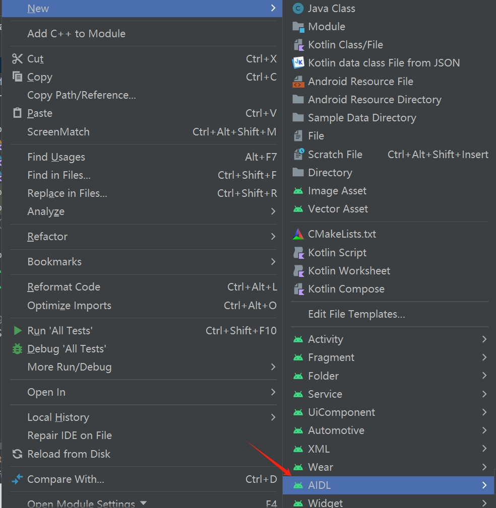

### 支持数据类型
java的基本数据类型：int、long、boolean、float、double、char、byte

对象类型：String、CharSequence、ArrayList、HashMap

自定义类型：Parcelable

### 方向标记
kotlin数据类
```kotlin
data class Person(var name: String, var age: Int)
```
aidl数据类
```aidl
package xxx;
parcelable Person;
```
数据接口
```aidl
package xxx;
import xxx.Person;
interface IRemote {
    void sendPerson(in Person person);
    void sendPerson(out Person person);
    void sendPerson(inout Person person);
    oneway void sendPerson(in Person person);
}
```
in：不写默认此值，由cilent端流向server端，如client端发送Person("A", 20)，server修改后client不会受到影响

out：由server端流向client端，如client端发送Person("A", 20)，server得到的是Person(null, 0)，server修改后client同步修改

inout：对象可以双向流动

oneway: 异步

### 进程间通信
#### 不同应用

##### server端
在aidl目录下package目录下创建两个aidl文件
```aidl
package xxx;
interface IRemoteCallback {
    void onMessageReceived(String message);
}

package xxx;
import xxx.IRemoteCallback;
interface IRemote {
    void sendMsg(String msg);
    void registerCallback(in IRemoteCallback callback);
    void unregisterCallback(in IRemoteCallback callback);
}
```
创建管理类
```kotlin
object AidlManager {
    private val TAG = "AidlManager"

    private val callbackList by lazy { RemoteCallbackList<IRemoteCallback>() }

    val binder: IRemote.Stub = object : IRemote.Stub() {
        override fun sendMsg(msg: String) {
            val callbackCount = callbackList.beginBroadcast()
            for (i in 0 until callbackCount) {
                try {
                    callbackList.getBroadcastItem(i).onMessageReceived(msg)
                } catch (e: RemoteException) {
                    Log.e(TAG, "sendMsg: ${e.message}")
                }
            }
            callbackList.finishBroadcast()
        }

        override fun registerCallback(callback: IRemoteCallback) {
            callbackList.register(callback)
        }

        override fun unregisterCallback(callback: IRemoteCallback) {
            callbackList.unregister(callback)
        }
    }
}
```
创建服务
```kotlin
class AidlServerService : Service() {

    override fun onBind(intent: Intent): IBinder = AidlManager.binder

    override fun onStartCommand(intent: Intent, flags: Int, startId: Int): Int {
        super.onStartCommand(intent, flags, startId)
        return START_STICKY
    }
}
```
清单文件配置
```xml
<service android:name="xxx"
    android:enabled="true"
    android:exported="true">
    <intent-filter>
        <action android:name="service.aidlserver" />
    </intent-filter>
</service>
```
##### client端
复制整个server端的aidl目录，package必须和server保持一致
```kotlin
private var mIRemote: IRemote? = null
private val iRemoteCallback: IRemoteCallback = MyCallback()

inner class MyCallback : IRemoteCallback.Stub() {
    override fun onMessageReceived(message: String) {
        MainScope().launch {
            // 处理server端返回消息
        }
    }
}
private val serviceConnection: ServiceConnection = object : ServiceConnection {
    override fun onServiceConnected(name: ComponentName, service: IBinder) {
        mIRemote = IRemote.Stub.asInterface(service)
        try {
            mIRemote!!.registerCallback(iRemoteCallback)
        } catch (e: RemoteException) {
            Log.e(TAG, "onServiceConnected: ${e.message}")
        }
    }

    override fun onServiceDisconnected(name: ComponentName) {
        try {
            mIRemote!!.unregisterCallback(iRemoteCallback)
            mIRemote = null
        } catch (e: RemoteException) {
            Log.e(TAG, "onServiceDisconnected: ${e.message}")
        }
    }
}
//绑定服务
val intent = Intent(IRemote::class.java.name)
intent.action = "service.aidlserver"//保持和server配置一致
intent.setPackage("server包名")
bindService(intent, serviceConnection, BIND_AUTO_CREATE)
```
配置清单文件，manifest标签下添加应用感知能力
```xml
<queries>
    <package android:name="server包名" />
</queries>
```
注：

1. registerCallback的意义在于server也可主动sendMsg给client(也可使用异步)，否则直接利用返回值即可
2. 获取server或者client标记可通过getCallingPid()确认
#### 同应用不同进程
和不同应用类似，不需要复制aidl文件夹和配置queries
### 其他
android studio不能创建aidl[无法新建AIDL文件](../android_studio.md#aidl-create)