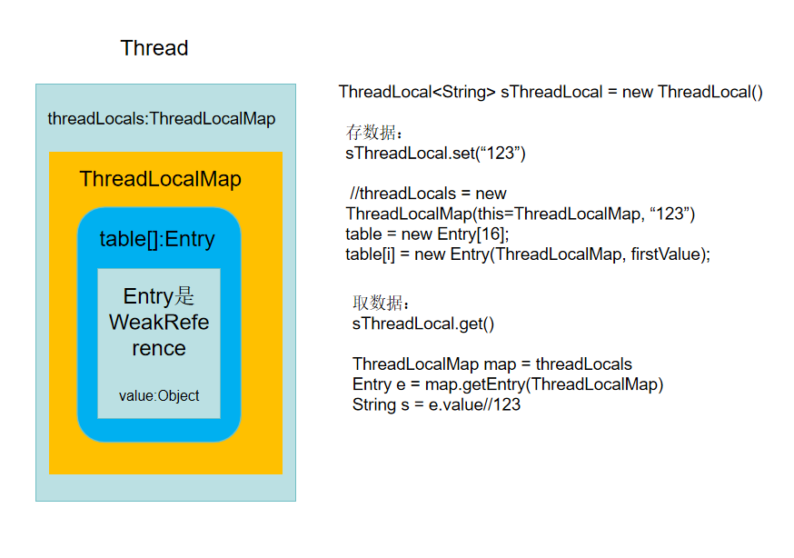
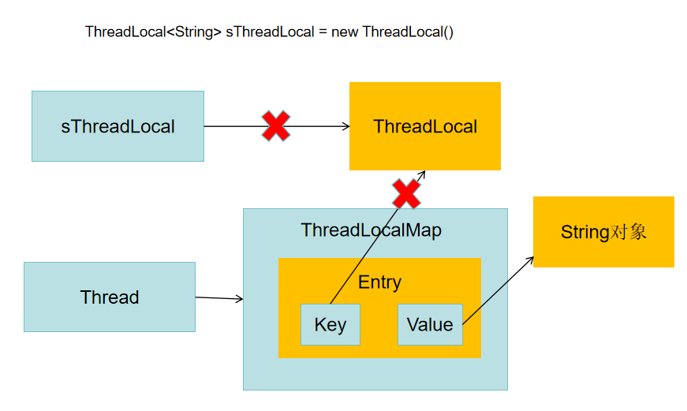

### 进程和线程
进程：程序运行资源分配的最小单位

资源：CPU、内存空间、磁盘IO等

进程和进程之间独立，进程中由多条线程共享全部资源

线程：CPU调度的最小单位，依赖于进程而存在

### CPU时间片轮转机制
一种算法，又称RR调度，每个进程被分配一个时间段(时间片)，是进程允许运行的时间

### 并行和并发
并行：同时执行不同的任务，如边吃饭边打电话

并发：交替执行不同的任务

### 高并发编程优势

1. 充分利用CPU资源
2. 加快响应用户的时间，如百度云下载多个文件
3. 代码模块化、异步化、简单化

OS限制

Linux每个进程最多1000个线程，Window最多2000个线程

### <a id="threadlocal">ThreadLocal</a>

线程级别变量，并发模式下是绝对安全的变量



获取当前线程：Thread t = Thread.currentThread();

能保证每一个thread中有独立一份
```kotlin
object : ThreadLocal<String>(){
    override fun initialValue(): String? {
        return "123"
    }
}
```
内存泄漏原因



sThreadLocal如果设置null即第一个x可以断开，Key是弱引用即第二个x可以断开，如果Thread一直执行则Value是强引用不会被gc回收，所以及时remove防止内存泄漏

### 同步、异步、阻塞、非阻塞

同步和异步、阻塞和非阻塞本质上是一对相对的概念。

在进程通信这个层面，同步和异步针对的是发送方而言，取决于将数据写到内核缓冲区进程的行为，继续等待发送则为同步，反之即为异步。

在进程通信这个层面，阻塞非阻塞针对的是接收方而言，取决于将内核中的数据能否立即拷贝到用户空间，如果不能直接拷贝则为阻塞，反之则为非阻塞

同步异步是输入到结果需不需要等待决定，阻塞和非阻塞是一种状态由等待结果时是否可以做其他事情决定

### <a id="block_queue">阻塞队列</a>

一般用来解决生产消费者问题

BlockingQueue

add和remove不阻塞，但add时满了或者remove时没数据时会抛出异常

offer和poll不阻塞，offer时满了返回值为false，poll时没数据会返回null

put和take会阻塞

#### 常用阻塞队列

ArrayBlockingQueue：数据结构，有界

LinkedBlockingQueue：链表结构，有界

PriorityBlockingQueue：优先级排列，无界

DelayQueue：优先级队列，无界

SynchronousQueue：不存储元素

LinkedTransferQueue：链表结构，无界

LinkedBlockingDeque：链表结构，双向

有界：容量有限，即满了后会被阻塞

无界：容量无限，即不会被阻塞