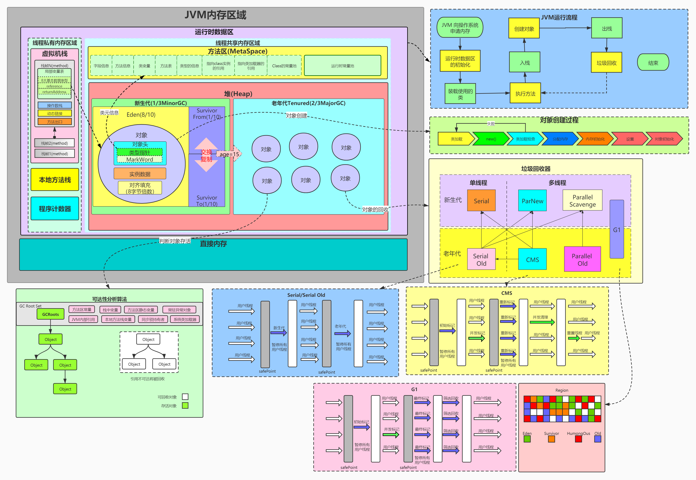

### JDK、JRE、JVM


jdk包含jre和jvm

jdk提供工具：java、javac、javap等工具

jre包含java类库和jvm

jvm是一种规范，Classloader用来加载class，然后使用解析器翻译代码

jvm是用c++语言编写

解释执行：用c++解释器去解析class中的代码，所以经过翻译速度会慢一点

JIT执行：class代码翻译成汇编码(codecache)，速度相对比较快

jvm只接收字节码(class)和开发语言无关性(kotlin,groovy等最终转成字节码即可)，跨平台(不同操作系统有对应JDK)

只要符合jvm规范可以自行开发jvm

### Jvm的内存区域

执行java程序时会把内存分为五个区域：虚拟机栈、本地方法栈、方法区、堆、程序计数器


运行时数据区根据线程划分：线程共享区和线程私有区


线程共享区(被所有线程共享，有且只有一份)：方法区和堆

线程私有区：多个线程

除了运行时数据区还有直接内存(没有被虚拟化的内存，比如系统内存8G，jvm虚拟化了5G，剩余3G被称为直接内存)

方法区：运行时常量

线程：虚拟机栈、本地方法栈和程序计数器

---

#### 虚拟机栈

1.大小取决于平台，查询链接

https://docs.oracle.com/javase/8/docs/technotes/tools/unix/java.html

-Xsssize

64位系统都是1M

即每个线程至少1M大小，可通过以下方式减小大小优化系统内存紧张

-Xss1m

-Xss1024k

-Xss1048576

2.用来存放当前线程运行方法所有的数据、指令、返回地址，由于是栈结构，所以先进后出，调用时入栈，完成时出栈

比如方法main调用A，即A在main上面，每个方法会产生一个栈帧

栈溢出：调用方法数量总大小超过1M导致抛出的异常，常见死递归

栈帧：局部变量表，操作数栈，动态连接，完成出口

局部变量表：存放局部变量(java的八大基本数据类型、对象引用、returnAddress类型)

操作数栈：存放方法执行的操作数，操作的元素可以是任意java数据类型，会复用

动态连接：java语言特性多态相关

完成出口(返回地址)：调用程序计数器的地址作为返回

- 正常返回：恢复上层方法的局部变量表和操作数栈；把返回值(如果有)压入调用着栈帧的操作数栈中；调整程序计数器的值指向方法调用指令后的一条指令
- 异常返回：由异常处理表<非栈帧中的>来确定

#### 程序计数器

指向当前线程正在执行的字节码行号(指令地址)，占用很少内存，唯一不会造成OOM的内存区域

**运行流程**
```java
public class JvmTest {
    public int work() {
        int x = 3;
        int y = 6;
        int z = (x + y) * 14;
        return z;
    }

    public static void main(String[] args) {
        JvmTest test = new JvmTest();
        test.work();
    }
}
```
执行javap -v JvmTest.class后得到字节码(work方法部分)


重点总结：

- 执行main方法时会执行main线程
- 主要展示虚拟机栈和程序计数器
- iconst_3：3对应的是数值3
- istore_1：1对应的是偏移值
- iload_1：1对应的是偏移值
- bipush: int值超过5以后使用，会占用更大空间，所有偏移量占用了2个(图中没有3和9的原因)
- 程序计数器和栈帧并不是一一对应，只有一个，程序计数器对每个栈帧计数时都是从0开始，但虚拟机栈只会执行顶部栈帧，所以程序计数器不会重复混乱现象
- 每次使用数据都需要经过操作数栈，存入变量表、计算操作、返回数据等
- 如果是static方法则没有this(0位置)

具体演示流程如动图


更多指令可通过以下网站查看说明

https://cloud.tencent.com/developer/article/1333540

#### 本地方法
java中无法直接操作线程，通过本地方法栈(native方法)，结构类似于虚拟机栈，但程序计数器无法记录

#### 堆
存放所有new出来的东⻄，是GC管理的主要区域

堆内存分三代，新⽣代，⽼年代，持久代

#### ⽅法区
被虚拟机加载的类信息、常量、静态变量等

#### <a id="d_mem">直接内存</a>
NIO中的DirectByteBuffer，会自己释放

**unsafe类**

直接申请内存相关，需要手动管理，跳过JVM的垃圾回收(不会自动释放)

ByteBuffer.allocateDirect()方式申请内存会自动释放

### 深入理解JVM内存

无非就是虚拟化

jps查看进程号，jinfo -flags 进程号查看信息


```java
public class JavaTest {
    public final static String TYPE = "type";
    public static String TAG = "tag";
    public static void main(String[] args) throws Exception {
        Fruit fruit1 = new Fruit();
        fruit1.setName(TYPE + "-apple");
        fruit1.setPrice(15.3);
        Thread.sleep(Integer.MAX_VALUE);
        for (int i = 0; i < 1; i++) {
            System.gc();//15次后进入老年代
        }
        Fruit fruit2 = new Fruit();
        fruit2.setName(TAG + "-watermelon");
        fruit2.setPrice(28.5);
        Thread.sleep(Integer.MAX_VALUE);
    }
}

class Fruit {
    String name;
    double price;
    public void setName(String name) {
        this.name = name;
    }

    public void setPrice(double price) {
        this.price = price;
    }
}
```
1. JVM申请内存
2. 初始化运行时数据区
3. 类加载


4. 执行方法
5. 创建对象


6. 不断执行方法

#### JHSDB

查看内存工具

步骤

1. 运行程序
2. 获取进程号：jps

22176 JavaTest

3. 启动内存工具

旧版本：
```
java -cp .\sa-jdi.jar sun.jvm.hostspot.HSDB
```
新版本：(jdk11以后)
```
jhsdb hsdb
```
其他内容补充(jre文件夹生成)
```
bin\jlink.exe --module-path jmods --add-modules java.desktop --output jre
```
4. attach进程


#### 查看堆情况

Tools-Heap Parameters


分配地址起始值和结束值：0x0000000604800000, 0x0000000800000000

#### 查看对象情况

Tools-Object Histogram

过滤：com.yigai.lib.Fruit

#### 查看栈情况


#### 查看方法区

Tools-Class Browser

内存溢出

java.lang.OutOfMemory: Metaspace 方法区

java.lang.OutOfMemory: Java heap space 堆

java.lang.OutOfMemory: Direct buffer memory 直接内存

java.lang.StackOverflowError: StackOverflow 栈

#### 垃圾回收为啥是15次
对象经历一次垃圾回收，如果没有被回收，age会+1，达到老年代，而底层记录年龄的字段是4位二进制(1111=15)

### JVM创建对象过程
类加载-检查加载-分配空间-内存空间初始化-设置-对象初始化

#### 分配空间
划分内存方式：指针碰撞和空闲列表(取决于堆空间是否规整，即不碎片化)，前者效率高后者需要查表

并发问题解决方式：TLABs和CAS

默认采用在新生代的Eden中开辟空间方式(TLABs)来解决多线程申请内存，禁用(-XX:-UseTLAB)后采用CAS方式

#### CAS
CPU指令，无锁化，乐观机制，具有原子性，即保证了线程安全

### 内存空间初始化
"零"值，如int默认为0，boolean默认为false

### 设置
对象头

组成：类型指针、mark word(哈希码、GC分代年龄、锁状态标识、线程持有的锁、偏向线程ID、偏向时间戳)、记录数组长度的数据(如果是对象数组)

#### 对象
由对象头、实例数据、对齐填充(非必须)组成

#### 对象初始化
构造方法执行

### 对象的访问定位
句柄方式访问对象、直接指针方式访问对象(快，主流虚拟机采用方案)

### <a id="obj_live">判断对象存活</a>
引用计数算法：在对象头标记被引用次数，无法解决循环引用(python通过另启线程解决)

根可达性分析：GC roots(RootSet)，目前JVM实现方式，从GC roots作为起点向下搜索路径成为引用链，存在即可达

常见GC roots：静态变量、线程栈变量(局部变量)、常量池、JNI指针

额外：内部引用(class对象、异常对象、类加载器)、同步锁(synchronized对象)、内部对象(JVXBean)、临时对象(跨代引用)

#### class对象回收条件
1. new出的所有对象被回收，即Java堆中不存在该类及其任何派生子类的实例
2. 对应的类加载器被回收
3. 该类对应的 java.lang.Class 对象没有在任何地方被引用，无法在任何地方通过反射访问该类的方法
5. 参数控制：-Xnoclassgc参数禁用类的垃圾收集，如果禁用满足以上3点也无法回收

可达即不可回收
```java
Fruit fruit1 = new Fruit();
```
可达就是引用指向，Fruit对象与局部变量fruit1存在一个可达性关系

垃圾回收打印：-Xlog:gc(-XX:+PrintGC过时，jdk8以下使用)


演示案例
```java
public class JavaTest {
    public JavaTest instance;
    private byte[] bytes = new byte[10 * 1024 * 1024];

    public static void main(String[] args) {
        JavaTest test1 = new JavaTest();
        JavaTest test2 = new JavaTest();
        test1.instance = test2;// 引用循环
        test2.instance = test1;
        test1 = null;//为了能立马触发gc
        test2 = null;
        System.gc();
    }
}
日志：
[0.006s][info][gc] Using G1
[0.067s][info][gc] GC(0) Pause Full (System.gc()) 25M->0M(16M) 2.411ms
```
可以看到内存从25M(包含了两个bytes数组大小，每个10M)变成0M，表明已回收

#### finalize
用来在对象被回收之前做清理工作，但执行级别较低(需要调用Thread.sleep休眠)，只执行一次，不推荐使用

FinalizeGC，其实是多线程进行，JVM内部使用会new Finalizer对象，完全可以使用try finally代替

#### 各种引用
```java
public class JavaTest {
    public String name;

    public JavaTest(String name) {
        this.name = name;
    }

    @Override
    public String toString() {
        return "JavaTest{" +
                "name='" + name + '\'' +
                '}';
    }
}
```
##### 强引用

 = (身边重要的人，亲人)

##### 软引用SoftReference

(老婆，可离婚)：系统内存不足时如即将发生OOM时会被回收
```java
先配置堆内存和最大内存为20m：-Xms20m -Xmx20m
public static void main(String[] args) {
    JavaTest test1 = new JavaTest("name");
    SoftReference<JavaTest> sr = new SoftReference<>(test1);
    test1 = null; //强引用先回收
    System.out.println(sr.get());  // JavaTest{name='name'}
    System.gc();
    System.out.println("gc");
    LinkedList<byte[]> list = new LinkedList<>();
    for (int i = 0; i < 20; i++) {
        try {
            list.add(new byte[1 * 1024 * 1024]);
        } catch (Throwable e) {
            System.out.println("error:" + sr.get()); // null
        }
    }
}
```
##### 弱引用WeakReference
(女朋友，想分就分)：只要gc就会被回收
```java
 public static void main(String[] args) {
    JavaTest test1 = new JavaTest("name");
    WeakReference<JavaTest> sr = new WeakReference<>(test1);
    test1 = null;
    System.out.println(sr.get());
    System.gc();
    System.out.println("gc");
    System.out.println(sr.get()); // null
}
```
##### 虚引用PhantomReference

(技师，一不小心就找不到了)：[直接内存](#d_mem)中有Cleaner类继承虚引用，主要用来跟踪对象垃圾回收的活动

### 对象分配策略
几乎所有对象都是在堆中分配，并不是100%

#### 虚拟机优化技术
逃逸分析+触发JIT(热点数据)，本地线程分配缓存

HotSpot(java虚拟机实现)

方法循环万次触发JIT(热点数据)，jvm会进行逃逸分析(栈上分配)

逃逸分析默认开启只支持HotSpot实现的虚拟机，关闭-XX:+DoEscapeAnalysis，禁用后分配到堆空间会触发gc

#### 分配原则
* 对象优先在Eden分配
* 空间分配担保：内部会统计老年代平均分配的对象空间大小，如10M，此时如果新生代晋级的对象是8M，即无需触发晋级回收
* 大对象进入老年代(Tenured)：serial、parnew两款垃圾回收期生效
* 长期存活的对象进入老年代(15次，可通过-XX:MaxTenuringThreshold=10修改)
* 动态对象年龄判定

from->to age+1反之也+1

### 垃圾回收基础知识
GC：垃圾回收

堆空间：新生代(Eden、from、to 8：1：1)和老年代

垃圾回收器

回收新生代：Minor GC/Young GC
回收老年代：Major GC/Old GC，一般都会触发Full GC

#### 复制算法(Copying)
找到可达引用链，将内存分为两份，将可达对象复制到另一边


特点：
1. 实现简单、运行高效
2. 没有内存碎片
3. 空间利用率只有一半

#### Appel式复制回收算法
Eden区的来源，提高空间利用率和空间分配担保，只适用于新生代


S1是from，S0是to

#### 标记清除算法(Mark-Sweep)

找到可达链然后清除垃圾

特点
1. 位置不连续，产生碎片
2. 可以不暂停(优势，因为没有对象移动)


#### 标记整理算法(Mark-Compact)

标记->整理->清除

特点
1. 没有内存碎片
2. 指针需要移动


### 常见垃圾回收器
单线程：Serial、Serial Old

多线程：Parallel Scavenga、Parallel Old、ParNew、CMS、G1

PS组合：Parallel Scavenga、Parallel Old会自动扩容，伴随GC，不需要指定Eden、from、to的比例是动态的，吞吐量最高

|回收器|回收对象和算法|回收器类型|
|--|--|--|
|Serial|新生代、复制算法|单线程|
|Serial Old|老年代、标记整理算法|单线程|
|Parallel Scavenga|新生代、复制算法|多线程|
|Parallel  Old|老年代、标记整理算法|多线程|
|ParNew|新生代、复制算法|单线程|
|CMS|老年代、标记清除算法|多线程|
|G1|跨新生代和老年代、标记整理+化整为零|多线程|

响应优先的原因

比如游戏服务器，GC会导致业务线程暂停触发stop the world

#### CMS

Concurrent Mark Sweep，只针对老年代，java14后被移除

ParNew为CMS定制，用来回收新生代

初始标记、并发标记、重新标记、并发清理、重置线程

初始标记：暂停所有用户线程(时间短)

并发标记：时间长，用户和GC同时运行

重新标记：时间短，暂停所有用户线程

并发清理：时间长，用户和GC同时运行，会产生浮动垃圾，需要下一次才会回收，因此需要预留一部分空间

问题：CPU敏感、浮动垃圾、内存碎片(分配大对象时可能会让jvm会切换成Serial Old，称退化，堆越大耗时越长)

服务器维护：重启后CMS就没有内存碎片

VM参数：-Xlog:gc*(--XX:+PrintGCDetails) --XX:UseConcMarkSweepGC

G1：堆空间8G以上推荐，<6G用CMS，jdk1.8以上默认采用G1

### JVM调优
#### 扩容新生代

为何能提高GC效率吗？

新生代采用复制算法，即先进行扫描(可达性分析算法判断对象是否存活，耗时较少假设为T1)，然后进行对象复制从Eden到From到To(耗时较大假设为T2)

假设新生代容量R，对象A存活时间750ms，MinorGC间隔500ms
扩容后为2R，A的存活时间不会变，MinorGC间隔变成1000ms(由于空间扩大一倍)，则扩容前总耗时为T1+T2，扩容后为2T1，因为扩容后对象已经没存活，所以一般是能提高GC效率，除非都是老年代对象

#### 避免跨代扫面
老年代引用了新生代，导致出现整堆扫描，内部优化方案卡表

卡表(card table)：当出现跨代引用时，会在卡表上进行标记，这样扫描只需要扫新生代和被标记的数据

常量池(方法区)
Class常量池、字符串常量池、运行时常量池
```java
new String("a") == new String("a");// false
new String("a").intern() == new String("a").intern();// true从常量池获取
```

### 总结图
