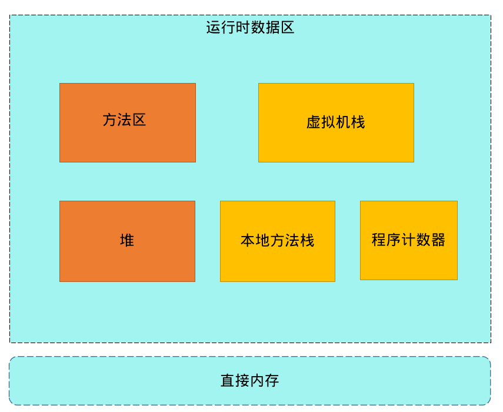
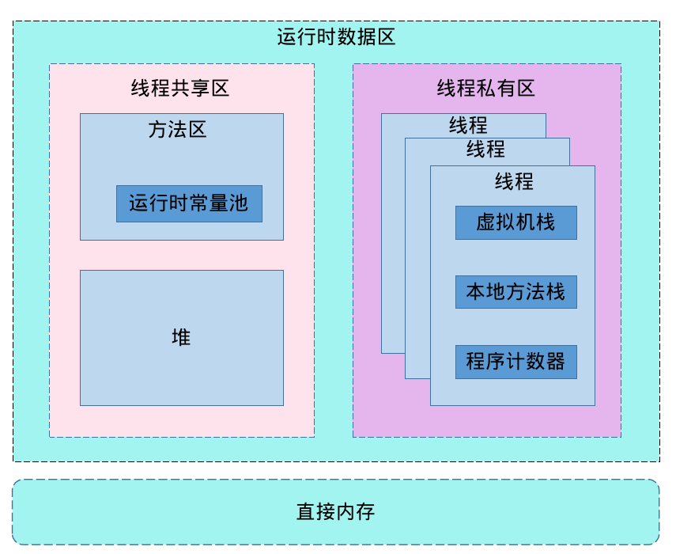

### JDK、JRE、JVM


jdk包含jre和jvm

jdk提供工具：java、javac、javap等工具

jre包含java类库和jvm

jvm是一种规范，Classloader用来加载class，然后使用解析器翻译代码

jvm是用c++语言编写

解释执行：用c++解释器去解析class中的代码，所以经过翻译速度会慢一点

JIT执行：class代码翻译成汇编码(codecache)，速度相对比较快

jvm只接收字节码(class)和开发语言无关性(kotlin,groovy等最终转成字节码即可)，跨平台(不同操作系统有对应JDK)

只要符合jvm规范可以自行开发jvm

### Jvm的内存区域

执行java程序时会把内存分为五个区域：虚拟机栈、本地方法栈、方法区、堆、程序计数器



运行时数据区根据线程划分：线程共享区和线程私有区



线程共享区(被所有线程共享，有且只有一份)：方法区和堆

线程私有区：多个线程

除了运行时数据区还有直接内存(没有被虚拟化的内存，比如系统内存8G，jvm虚拟化了5G，剩余3G被称为直接内存)

方法区：运行时常量

线程：虚拟机栈、本地方法栈和程序计数器

---

#### 虚拟机栈

1.大小取决于平台，查询链接

https://docs.oracle.com/javase/8/docs/technotes/tools/unix/java.html

-Xsssize

64位系统都是1M

即每个线程至少1M大小，可通过以下方式减小大小优化系统内存紧张

-Xss1m

-Xss1024k

-Xss1048576

2.用来存放当前线程运行方法所有的数据、指令、返回地址，由于是栈结构，所以先进后出，调用时入栈，完成时出栈

比如方法main调用A，即A在main上面，每个方法会产生一个栈帧

栈溢出：调用方法数量总大小超过1M导致抛出的异常，常见死递归

栈帧：局部变量表，操作数栈，动态连接，完成出口

局部变量表：存放局部变量(java的八大基本数据类型、对象引用、returnAddress类型)

操作数栈：存放方法执行的操作数，操作的元素可以是任意java数据类型

动态连接：java语言特性多态相关

完成出口(返回地址)：调用程序计数器的地址作为返回

- 正常返回：恢复上层方法的局部变量表和操作数栈；把返回值(如果有)压入调用着栈帧的操作数栈中；调整程序计数器的值指向方法调用指令后的一条指令
- 异常返回：由异常处理表<非栈帧中的>来确定

#### 程序计数器

指向当前线程正在执行的字节码行号(指令地址)，占用很少内存，唯一不会造成OOM的内存区域

**运行流程**
```java
public class JvmTest {
    public int work() {
        int x = 3;
        int y = 6;
        int z = (x + y) * 14;
        return z;
    }

    public static void main(String[] args) {
        JvmTest test = new JvmTest();
        test.work();
    }
}
```
执行javap -v JvmTest.class后得到字节码(work方法部分)


重点总结：

- 执行main方法时会执行main线程
- 主要展示虚拟机栈和程序计数器
- iconst_3：3对应的是数值3
- istore_1：1对应的是偏移值
- iload_1：1对应的是偏移值
- bipush: int值超过5以后使用，会占用更大空间，所有偏移量占用了2个(图中没有3和9的原因)
- 程序计数器和栈帧并不是一一对应，只有一个，程序计数器对每个栈帧计数时都是从0开始，但虚拟机栈只会执行顶部栈帧，所以程序计数器不会重复混乱现象
- 每次使用数据都需要经过操作数栈，存入变量表、计算操作、返回数据等
- 如果是static方法则没有this(0位置)

具体演示流程如动图


更多指令可通过以下网站查看说明

https://cloud.tencent.com/developer/article/1333540

#### 本地方法
java中无法直接操作线程，通过本地方法栈(native方法)，结构类似于虚拟机栈，但程序计数器无法记录

**unsafe类**

直接申请内存相关，需要手动管理，跳过JVM的垃圾回收

ByteBuffer.allocateDirect()方式申请内存会自动释放

### 深入理解JVM内存

