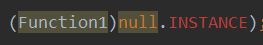

## 函数简介
默认是public，可以写在类外

函数参数允许有默认值
```kotlin
fun main() {
    method01(50)
}
fun method01(age: Int, name: String = "xxx") {
}
```
具名函数：允许参数顺序修改
```kotlin
fun main() {
    method02(name = "xxx", age = 25)
}
fun method02(age: Int, name: String) {

}
```
Unit是无参返回，是个类，可以忽略
```kotlin
fun method() {
    return println()
}
fun method1() : Unit {
    return println()
}
```
Nothing类型：TODO("xx")

和java不同，会报异常可以作为抛出异常来处理
```kotlin
fun method(bool: Boolean) {
    if (bool) TODO("有问题")
}
```
反引号
```kotlin
fun method() {
//    Utils.in() 报错 in在kotlin中是关键字
    Utils.`in`() //使用反引号解决
}

java类
public class Utils {
   public static final void in() {}
}
```
### 匿名函数
```kotlin
val len = "String".count {
    it == 'r'
}
```
cout是返回字符串的个数<font color="#dd0000">{}部分就是匿名函数</font>

<font color="#dd0000">注：只要是匿名函数，函数的最后一行一般就是返回值，apply除外</font>

### 函数拆解
1.声明
```kotlin
val method : () -> String
```
2.实现
```kotlin
method = {
        "XXX"//最后一行是返回值 不能有return
    }
}
```
3.调用
```kotlin
println(method())
println(method.invoke())
```
只有单个输入默认有个it(关键字)参数，如果是多个参数
```kotlin
val method : (Int, Boolean) -> String //具体名可省略
method = {age, sex-> //具体类型可省略
    "age: $age , sex: $sex"
}
println(method.invoke(20, true))
```
简化函数一步到位
```kotlin
val method : (Int, Boolean) -> String= {age, sex->
    "age: $age , sex: $sex"
}
```
以上函数形式：
<font color="#dd0000">方法名：入参类型 -> 返回类型 = ｛｝</font>

另一种形式：
<font color="#dd0000">方法名 = ｛入参类型 -> 最后一行自动推断返回类型｝</font>

其中返回类型为自动推断，如
```kotlin
val method = {age Int, sex Boolean ->
    "age: $age , sex: $sex" //此时返回类型为String
}
```
匿名函数 ==(等价，属于) lambda表达式

函数参数也是函数
```kotlin
fun main() {
    //调用方式一(不推荐)
    method(4, "me", {
        println(it)//相当于实现
    }) 
    //调用方式二
    method(4, "me", method2 = {
        println(it)//相当于实现
    }) 
    //最终方式
    method(4, "me") {
        println(it)//相当于实现
    }
}

fun method(age: Int, name: String, method2: (Int) -> Unit){//相当于声明
    if (age > 2 && name == "me") {
        method2(100)//相当于调用
    } else {
        method2(40)
    }
}
```
功能和java接口回调相同

### 内联函数inline
由于上面实现在编译生成时会出现Functionx对象来完成lambda的调用，存在性能损耗



使用inline后相当于c++中的#define 宏替换将代码直接替换到调用处，<font color="#dd0000">原函数依然存在没被调用</font>

所以使用场景：函数存在参数是lambda(匿名函数)时

总结：函数内容直插到调用处
### noinline
作用于函数参数，不进行优化

AS会提示，如lambda作为对象返回时

总结：局部关闭优化，解决不能把函数类型的参数当对象使用问题

### crossinline
调用inline函数，且在lambda使用return时，也用在参数上

总结：局部加强，让内联函数的函数类型参数可以被间接调用，不能在lambda使用return

### 函数引用
method2是函数而lambda是函数的类型，可以将lambda改成方法再使用::引用
```kotlin
fun main() {
    method(4, "xx", ::method2)
}

private fun method2(code: Int){
    println(code)
}
```
<font color="#dd0000">注：此处::method是具名函数</font>

### 函数返回函数
```kotlin
fun main() {
    println(method("有消息")("张三"))
}

private fun method(info: String): (name: String) -> String {
    return {
        "it: $it, info: $info"
    }
}
```
返回类型是(name: String) -> String函数类型，即声明

具体实现是 {
        "it: $it, info: $info"
    }

调用是method("有消息")("张三")，此处已缩写
```kotlin
val m = method("有消息")
println(m("张三"))
```
## 常用内置函数
### let，apply，run区别
let，run返回值可以Any，apply永远调用者本身

let内部持有it，run和apply内部持有this

<font color="#dd0000">run是let和apply结合体，接近let</font>
```kotlin
const val NAME: String = "张三,李四,王五"
fun main() {
    NAME.run(::isLong)
        .run(::showText)
        .run(::mapText)
        .run(::println)
    NAME.let(::isLong)
        .let(::showText)
        .let(::mapText)
        .let(::print)
}
fun isLong(str: String) = str.length > 5
fun showText(isLong: Boolean) = if (isLong) "good字符串" else "bad字符串"
fun mapText(text: String) = "【$text】"
```
### with
和run功能一样，使用方式不同

with(with(with(with(NAME, ::isLong), ::showText), :: mapText), ::println)

### also
和apply类似，内部持有it，返回永远是调用者本身

<font color="#dd0000">also也是let和apply结合体，接近apply</font>

run和let：区别this和it
apply和also：区别this和it
with和run：区别结构，with在非null对象时使用

### takeIf
如果是true返回调用者本身，否则返回null，可以结合空合并处理，如下
```kotlin
println(NAME.takeIf {
    isLong(it)
} ?: "名字太短了")
```
### takeUnless
和takeIf相反