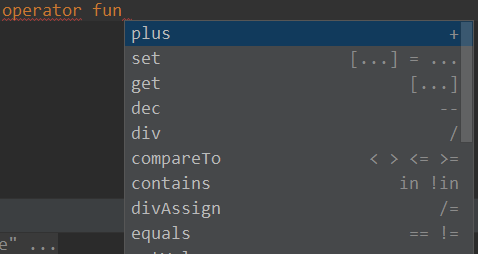

[官方文档](https://www.kotlincn.net/docs/reference/keyword-reference.html)

## 常用操作符
### ？
如果对象是null则不执行后续代码，常结合let使用，如
```kotlin
var name: String? = null
name?.length
name?.let {
    it.length
}
```
### !!
表示强制执行，如果是null就和java一样报异常
```kotlin
var name: String? = null
name!!.length
```
### ?:
表示如果null之执行代码，结果输出xxx，一般可用于自定义异常
```kotlin
var name: String? = null
println(name?.length ?: "xxx")
```
### \==和\===
==相当于java的equals，比较内容

===相当于java的==，比较引用值

## String相关
### until
用法：直到哪里，输出Hell
```kotlin
const val NAME: String = "Hello world!"
fun main() {
    print(NAME.substring(0 until NAME.indexOf('o')))
}
```
### split和解构(c++中的特点)
```kotlin
const val NAME: String = "张三,李四,王五"
fun main() {
    val list = NAME.split(",")
    val (v1, v2, v3) = list
    println("v1: $v1, v2: $v2, v3: $v3")
}
```
### replace
```kotlin
const val NAME: String = "张三l,李四l,王五l"
println(NAME.replace(Regex("[l]")) {
    when (it.value) {
        "l" -> ""
        else -> "x"
    }
})
```
去除l效果，Regex正则的使用

## 常用关键字
### lateinit
延迟加载属性，需要手动加载
```kotlin
class MyClass {
    lateinit var name: String

    fun loadName() {
        name = "wiki"
    }

    fun showName() {
        if (::name.isInitialized) {
            println("name: $name")
        } else {
            println("你还没取名呢")
        }
    }
}
```
以上name未初始化前是不能使用，即使判空也不行，只能通过::name.isInitialized判断

[实战案例](../kotlin/kotlin_code.md#lateinit应用)

### by
委托关键字
```kotlin
class MyClass {
    var name: String by Delegate()
}
class Delegate {
    operator fun getValue(thisRef: Any?, property: KProperty<*>): String {
        return ""
    }

    operator fun setValue(thisRef: Any?, property: KProperty<*>, value: String) {

    }
}
```
实现必要因素：get/setValue方法和operator关键字

技巧：直接在Delegate使用Alt+Enter快速重写

#### by lazy
惰性加载，会自动加载
```kotlin
fun main() {
    val p = MyClass()
    println("先睡会再加载")
    Thread.sleep(2000)
    p.showName()
}
class MyClass {
    private val name = loadName()
    private fun loadName(): String {
        println("loadName")
        return "wiki"
    }
    fun showName() {
        println("name: $name")
    }
}
```
执行结果：

loadName

先睡会再加载

name: wiki

期望结果：

先睡会再加载

loadName

name: wiki

使用by lazy改造后即可
```kotlin
private val name by lazy {
    loadName()
}
```

#### by Delegates.observable

可用来监听属性变化
```kotlin
fun main() {
    MyClass().name = "new"
}
class MyClass {
    var name: String by Delegates.observable("old"){property, oldValue, newValue ->
        println("property: ${property.name} from $oldValue to $newValue")
    }
}
```

#### by map
```kotlin
fun main() {
    val delegate = MyClass(hashMapOf("age" to 5, "name" to "fff"))
    println(delegate.age)
    println(delegate.name)
}
class MyClass(map: HashMap<String, Any>) {
    val name: String by map
    val age: Int by map
}
```
#### by类(委托类)
```kotlin
fun main() {
    DelegateB(B()).jump()
}

interface A {
    fun jump()
}

class B : A {
    override fun jump() {
        println("jump")
    }
}

class DelegateB(private val b: B): A {
    override fun jump() {
        b.jump()
    }
}
```
简化
```kotlin
class DelegateB(private val b: B): A by b
```

### vararg关键字
表示多个参数
```kotlin
class MyClass<T>(vararg objects: T) {
    //out表示T是只读
    private val list: Array<out T> = objects

    fun showObj(index: Int): T? = list[index].takeIf { true }
}
```
### in和out
in表示逆变，泛型能被修改，不能读取，功能包含java中的? super T
```kotlin
interface B<in T> {
    fun getT(): T //报错
    fun setT(item: T)
}
var string: ArrayList<in String> = ArrayList<CharSequence>()
```
out表示协变，泛型不能被修改，能读取，功能包含java中的? extends T
```kotlin
interface A<out T> {
    fun getT(): T
    fun setT(item: T) //报错
}
var charSequence: ArrayList<out CharSequence> = ArrayList<String>()
```
默认能读取和修改
```kotlin
interface C<T> {
    fun getT(): T
    fun setT(item: T)
}
```
### reified
在使用泛型类型判断时使用，如it is T，使用时需要结合inline
```kotlin
fun main() {
    println(MyClass().randomObj { A("A") })
}

data class A(val name: String)
data class B(val name: String)
class MyClass {
    inline fun <reified T> randomObj(defaultObj: () -> T): T? {
        val list = listOf(A("a"), B("b"))
        val random = list.shuffled().first()
        println("随机对象：$random")
        return random.takeIf { it is T } as T? ?: defaultObj()
    }
}
```
案例设定T就是A类型，返回T?原因是当随机对象是B类型时，takeIf返回null无法转成T

### 运算符重载
```kotlin
fun main() {
    println(A("name:") + A("Andy"))
}

class A(var name: String) {
    operator fun plus(a1: A): String {
        return "$name ${a1.name}"
    }
}
```
使用operator关键字，plus是可以通过快捷键(Ctrl+空格)提示出对应关系



### infix
模仿系统的x to x
```kotlin
infix fun <T, R> T.go(r: R) {
    println("$this - $r")
}
"who" go "you"
"who".go("you")
```