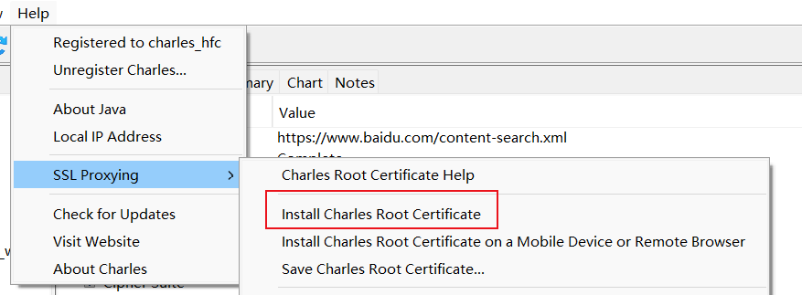
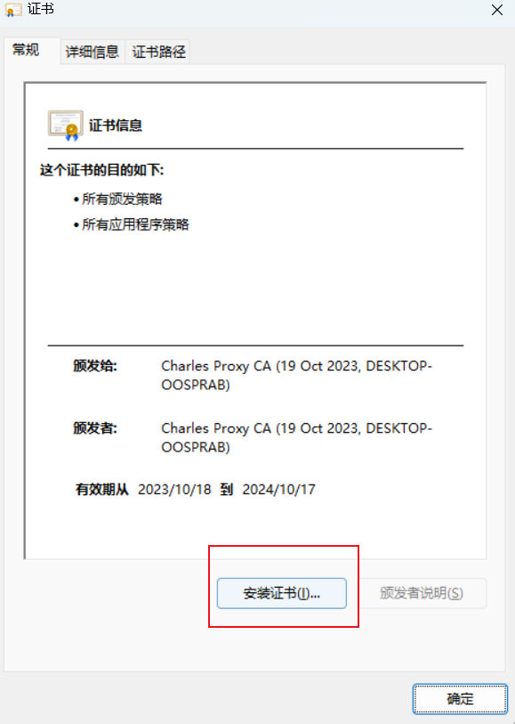
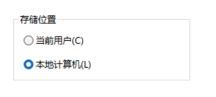
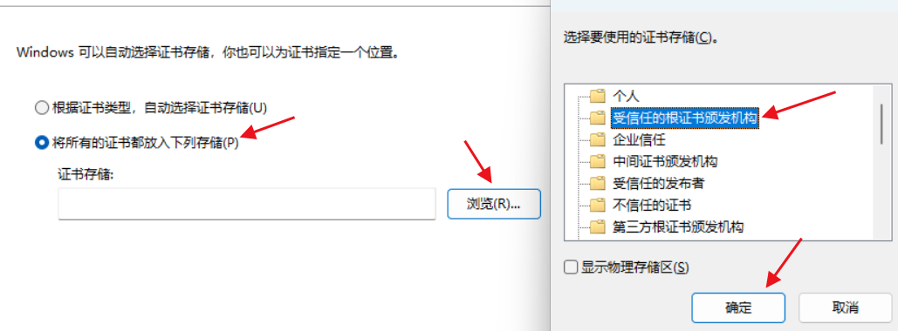
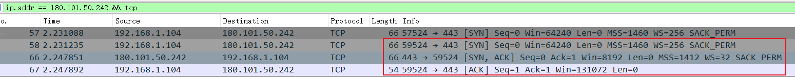
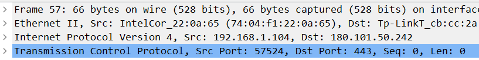
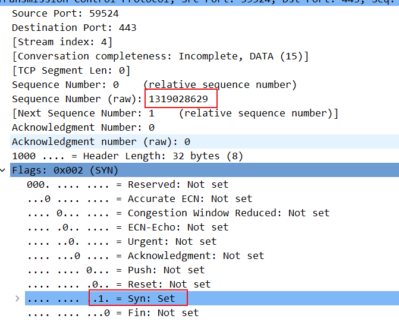
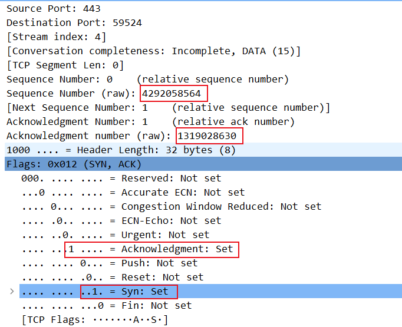
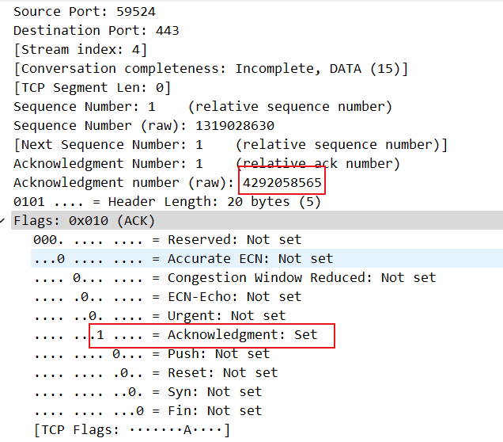

## 抓包工具charles
下载地址：https://www.charlesproxy.com/download/

注册：https://www.zzzmode.com/mytools/charles/

### 代理配置

#### window

Help->SSL Proxying->Install Charles Root Certificate

选择安装证书(I)...

选择本地计算机

选择受信任的根证书颁发机构

### 基本使用

## Wireshark

下载地址：https://www.wireshark.org/

BPF语法：https://www.wireshark.org/docs/dfref/

### 抓包百度案例

TCP三次握手分析

使用过滤器过滤ip和tcp

Frame：物理层

Ethernet：链路层

Internet：网络层

Transmission：传输层，TCP所在

第一次握手：客户端发起请求，SYN=1，Seq=1319028629

第二次握手：服务端应答，并请求建立连接，ACK=1,ack=1319028629+1,SYN=1,seq=4292058564

第三次握手：客户端应答，ACK=1,ack=4292058564+1
