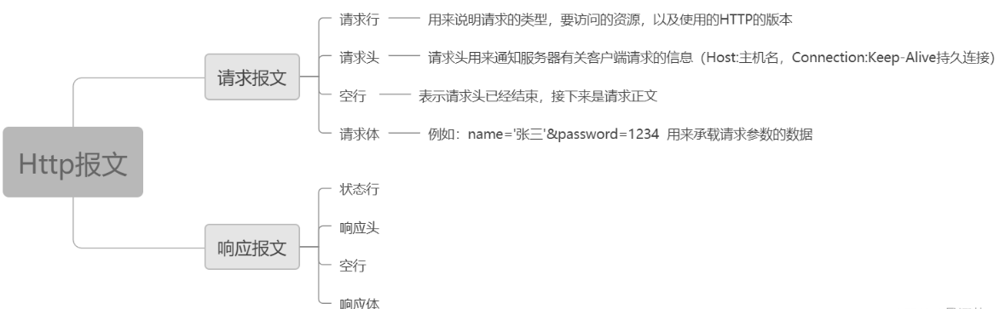

### HTTP
HTTP协议：用于从万维网服务器传输超文本到本地浏览器的传输协议，基于TCP/IP协议来传递数据，属于应用层面向对象的协议
#### http1.0
无连接，限制每次只处理一个请求，服务器处理完请求并收到客户端应答后断开连接

无状态，不对请求和响应之间的状态进行保存

http报文

#### http1.1
默认使用Connection:keep-alive，通过Content-Length字段来判断当前请求数据是否已经全部接受
### HTTP和HTTPS
HTTPS=HTTP+SSL/TLS

||HTTP|HTTPS|
|--|--|--|
|端口|80|443|
|内容|明文，不安全|加密，安全|
|证书|无|需要CA颁发的证书|
|响应速度|相对快，只需要握手的3个包|相对慢，额外需要SSL握手的9个包共12个包|

明文传输缺陷

1. 窃听风险：第三方可以获得通信内容
2. 篡改风险：第三方可以修改通信内容
3. 冒充风险：第三方可以冒充身份参与通信

#### SSL和TLS协议
解决明文传输缺陷

1. 加密传播，防止窃听
2. 校验机制，一旦被篡改，通信双方立刻发现
3. 身份证书，防止被冒充

基本思路：公钥加密法，客户端拿到服务器的公钥对信息加密，服务器使用私钥解密

TLS是SSL3.0的后续版本

SSL握手

1. ClientHello：客户端向服务器发出加密通信请求(提供支持的协议版本、随机数用于生成对话密钥、支持的加密算法如RSA、支持的压缩方法)
2. ServerHello：服务器收到请求后响应(回应确认使用的加密通信协议版本、随机数用于生成对话密钥、确认加密算法、服务器证书)
3. 客户端回应：校验证书取出公钥(回应用公钥加密的随机数、编码更改通知、握手结束通知)
4. 服务端回应：计算生成会话密钥(发送编码改变通知、服务器握手结束通知)

#### get和post
||GET|POST|
|--|--|--|
|在浏览器回退|无害|再次提交请求|
|URL地址|可以书签收藏|不行|
|cache|主动缓存|默认不缓存，需要手动设置|
|编码|url编码|多种编码方式|
|历史记录|保留|不保留|
|参数长度|限制|不限制|
|参数数据类型|ASCII字符|无限制|
|安全|参数暴露在URL上|被加密|
|传递形式|直接在URL后面|请求体中|

本质没有区别，都是基于TCP/IP，由HTTP的规定和服务器的限制造成不同体现

#### URL加载原理
一次完整HTTP请求
1. DNS域名解析
2. TCP连接，SSL握手
3. 发送HTTP/HTTPS请求
4. 服务端处理请求并返回报文
5. 浏览器解析并渲染页面
6. HTTP连接断开

http2.0出现keep-alive可以使第6步不关闭

#### 断点续传原理
利用HTTP请求中的Range字段

retrofit中可以直接使用@Header("Range")，对应数据"bytes=xxx-xxx"，从第xxx字节开始到xxx字节结束，结束可省略即"bytes=xxx"

也可以利用okhttp拦截器，addHeader("RANGE","bytes=${start}")

写入文件时利用FileOutputStream(file, true)的append模式即可

#### 请求方式
幂等：多次请求相同的URL会得到相同的结果

GET请求：
获取数据，参数附加在URL中，是幂等的

适用于读取资源和查询数据，但不应用于提交敏感信息或产生副作用的操作。

POST请求：提交数据。参数包含在请求主体中，不是幂等的

适合用于创建新资源、提交表单数据或执行某些操作

适用于处理敏感信息，如用户登录、注册等。

PUT请求：更新资源，是幂等的

适用于对资源进行全面替换的情况，例如更新用户信息、修改文章内容等。

DELETE请求：删除资源，是幂等的

适用于删除资源的操作，例如删除用户、删除文章等。

PATCH请求：对资源进行局部更新。与PUT请求类似，只更新资源的一部分内容

适用于只需要更新资源的某些属性或字段的情况，而不需要替换整个资源。

OPTIONS请求：获取服务器支持的HTTP方法和资源的相关信息

通常用于客户端与服务器之间的握手过程，以便确定可用的交互选项。

HEAD请求：类似于GET请求，但只返回响应头，不返回实体内容。通过发送HEAD请求，可以获取资源的元信息，如文件大小、修改日期等。

通常用于检查资源是否存在、获取资源的基本信息等场景。

TRACE请求：用于回显服务器收到的请求。通过发送TRACE请求，可以在请求-响应链路上跟踪请求的处理过程，并检查代理或服务器对请求的修改情况。

主要用于测试和诊断，以便了解请求在服务器端的处理情况。

CONNECT请求：用于建立与代理服务器的隧道连接，通常用于进行安全的SSL/TLS加密通信。

主要用于代理服务器与目标服务器之间的握手过程，以确保安全连接的建立。