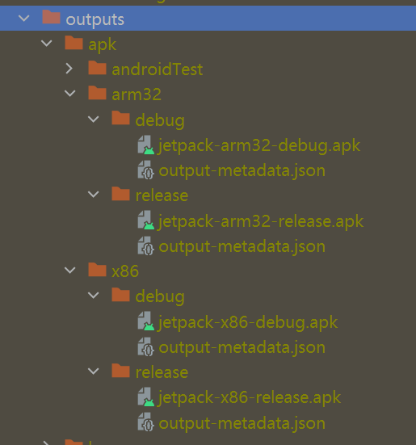
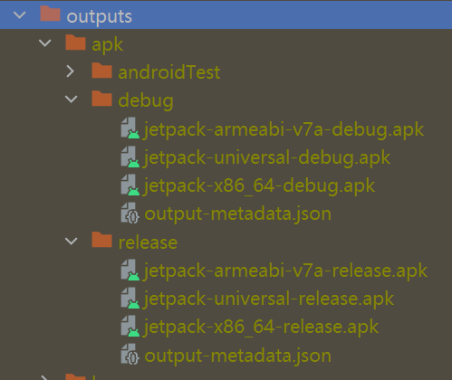

### 开启资源优化
```gradle
buildTypes {
    signingConfigs {
        release {
            storeFile file('E:\\Software\\AndroidStudio\\default.jks')
            storePassword '112233'
            keyAlias 'key0'
            keyPassword '123456'
        }
    }
    release {
        minifyEnabled true
        shrinkResources true
        signingConfig signingConfigs.release
        proguardFiles getDefaultProguardFile('proguard-android-optimize.txt'), 'proguard-rules.pro'
    }
}
```
#### 自定义保留资源
路径：res/raw/keep.xml
```xml
<?xml version="1.0" encoding="utf-8"?>
<resources xmlns:tools="http://schemas.android.com/tools" 
    tools:discard="@layout/unused" 
    tools:keep="@layout/used*_a,@layout/used_b" />
```
keep：指定保留的资源

discard：指定要舍弃的资源

都是用，分割，可用通配符*

### 国际化精简
```gradle
defaultConfig {
    //...
    resConfigs("zh-rCN")
}
```

### 动态库配置
```gradle
defaultConfig {
    //...
    ndk {
        abiFilters 'armeabi-v7a'
    }
}
```
总共支持4种：armeabi-v7a，arm64-v8a，x86，x86_64，一般手机都是arm架构

#### 分包打包
方式一(过时)
```gradle
flavorDimensions "default"
productFlavors {
    arm32 {
        dimension "default"
        ndk {
            abiFilters 'armeabi-v7a'
        }
    }
    x86 {
        dimension "default"
        ndk {
            abiFilters 'x86_64'
        }
    }
}
```
打包完在output目录



方式二(推荐)
```gradle
splits {
    abi{
        enable true
        reset()
        include 'armeabi-v7a', 'x86_64'
        universalApk true // 包含全部架构
    }
}
```
打包完在output目录



### 图片资源处理
1. png、jpeg转webp，最好使用网络图片
2. 矢量图(小图标使用)，ImageView结合使用tint属性修改图标颜色
3. mipmap-x，drawable-x目录配合屏幕适配可精简

### 代码混淆
res混淆：https://github.com/shwenzhang/AndResGuard

java混淆：minifyEnabled 置为 true

-keep class androidx.lifecycle.** { *; }