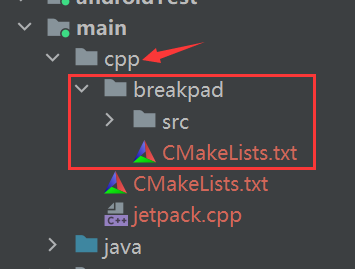

### java crash监控
#### 线下
直接通过logcat定位

#### 线上
实现原理：注册自己的监听，系统提供捕获异常监听接口

默认在RuntimeInit中设置(KillApplicationHandler)
```java
Thread.setDefaultUncaughtExceptionHandler(new KillApplicationHandler(loggingHandler))
```

自定义处理
```kotlin
class CrashHandler : UncaughtExceptionHandler {
    private var defaultUncaughtExceptionHandler: UncaughtExceptionHandler? = null

    init {
        defaultUncaughtExceptionHandler = Thread.getDefaultUncaughtExceptionHandler()
        Thread.setDefaultUncaughtExceptionHandler(this)//替换掉默认KillApplicationHandler
    }

    override fun uncaughtException(t: Thread, e: Throwable) {
        val dir = File(BaseApplication.instance.externalCacheDir, "crash_info")
        if (!dir.exists()) {
            dir.mkdirs()
        }
        try {
            //存到本地也可以上传到服务器
            val logFile = File(dir,  "${System.currentTimeMillis()}.txt")
            val pw = PrintWriter(FileWriter(logFile))
            pw.println("thread: ${t.name}")
            e.printStackTrace(pw)
            pw.flush()
            pw.close()
        } catch (e: Exception) {
            e.printStackTrace()
        } finally {
            defaultUncaughtExceptionHandler?.uncaughtException(t, e)
        }
    }
}
```
crash文件会在/sdcard/Android/cache/crash_info/下生成

### native crash监控
#### 线下
通过墓碑文件定位

native crash日志存放点，路径为/data/tombstones/，一般不允许直接读取，可通过adb bugreport导出

#### 线上
实现原理：和java层类似，通过注册监听linux信号，需要在c++层实现

常见崩溃信号
|信号|描述|
|--|--|
|SIGSEGV|内存引用无效，如空指针|
|SIGBUS|访问内存对象的未定义部分|
|SIGFPE|算术运算错误，如除以0|
|SIGILL|非法指令，如执行垃圾或特权指令|
|SIGSYS|糟糕的系统调用|
|SIGXCPU|超过CPU时间限制|
|SIGXFSZ|文件大小限制|

[ndk工程配置](../android_studio.md#ndk_config)

借助google的[breakpad](https://github.com/google/breakpad)添加自定义监听

大致配置流程

复制源码到cpp目录



添加cmake配置文件，其实是将breakpad源码中的/android/google_breakpad/Android.mk进行转化，最终代码
```cmake
cmake_minimum_required(VERSION 3.22.1)
#对于mk文件中的LOCAL_C_INCLUDES
include_directories(src src/common/android/include)
#开启arm汇编支持，.s属于汇编源码
enable_language(ASM)

#生成libbreakpad.a 指定源码，对于mk中的LOCAL_SRC_FILES和LOCAL_MODULE
add_library(breakpad STATIC
        src/client/linux/crash_generation/crash_generation_client.cc
        src/client/linux/dump_writer_common/thread_info.cc
        src/client/linux/dump_writer_common/ucontext_reader.cc
        src/client/linux/handler/exception_handler.cc
        src/client/linux/handler/minidump_descriptor.cc
        src/client/linux/log/log.cc
        src/client/linux/microdump_writer/microdump_writer.cc
        src/client/linux/minidump_writer/linux_dumper.cc
        src/client/linux/minidump_writer/linux_ptrace_dumper.cc
        src/client/linux/minidump_writer/minidump_writer.cc
        src/client/minidump_file_writer.cc
        src/common/convert_UTF.cc
        src/common/md5.cc
        src/common/string_conversion.cc
        src/common/linux/breakpad_getcontext.S
        src/common/linux/elfutils.cc
        src/common/linux/file_id.cc
        src/common/linux/guid_creator.cc
        src/common/linux/linux_libc_support.cc
        src/common/linux/memory_mapped_file.cc
        src/common/linux/safe_readlink.cc)

#链接log库对应mk中的LOCAL_EXPORT_LDLIBS
target_link_libraries(breakpad log)
```
在自己的cmake文件中引入breakpad
```cmake
cmake_minimum_required(VERSION 3.22.1)

project("jetpack")

#引入breakpad头文件
include_directories(breakpad/src breakpad/src/common/android/include)

add_library(${CMAKE_PROJECT_NAME} SHARED jetpack.cpp)

#引入breakpad的cmake文件，执行并生成libbreakpad.a
add_subdirectory(breakpad)

target_link_libraries(${CMAKE_PROJECT_NAME} android breakpad log)
```
cpp实现
```cpp
#include "jni.h"
#include "android/log.h"
#include "client/linux/handler/minidump_descriptor.h"
#include "client/linux/handler/exception_handler.h"

extern "C"
JNIEXPORT void JNICALL
Java_com_hfc_jetpack_NativeCrash_testNativeCrash(JNIEnv *env, jobject thiz) {
    int *p = NULL;
    *p = 10;//报空指针
}

//回调接口函数
bool DumpCallback(const google_breakpad::MinidumpDescriptor &descriptor,
                  void *context,
                  bool succeeded) {
    __android_log_print(ANDROID_LOG_ERROR, "native", "native crash:%s", descriptor.path());
    return false;
}

//注册crash监听函数
extern "C"
JNIEXPORT void JNICALL
Java_com_hfc_jetpack_NativeCrash_initNativeCrash(JNIEnv *env, jobject thiz, jstring path_) {
    const char *path = env->GetStringUTFChars(path_, 0);

    __android_log_print(ANDROID_LOG_INFO, "native", "===> %s", path);
    google_breakpad::MinidumpDescriptor descriptor(path);
    static google_breakpad::ExceptionHandler eh(descriptor, NULL, DumpCallback,
                                                NULL, true, -1);

    env->ReleaseStringUTFChars(path_, path);
}
```

测试代码
```kotlin
object NativeCrash {
    init {
        System.loadLibrary("jetpack")
    }
    external fun testNativeCrash()

    external fun initNativeCrash(path: String)
}

val dir = File(BaseApplication.instance.externalCacheDir, "native_crash")
if (!dir.exists()) {
    dir.mkdirs()
}
NativeCrash.initNativeCrash(dir.absolutePath)
NativeCrash.testNativeCrash()
```
墓碑文件会在/sdcard/Android/cache/native_crash/下生成xxx.dmp

#### 配置分析工具
环境变量添加：

AndroidStudio\plugins\android-ndk\resources\lldb\bin

AndroidSDK\ndk\25.1.8937393\toolchains\llvm\prebuilt\windows-x86_64\bin

minidump_stackwalk.exe分析BreakPad中dump出来的dmp文件
```cmd
minidump_stackwalk xxx.dump >crash.txt
```
llvm-addr2line.exe定位so报错位置
```cmd
llvm-addr2line -f -C -e xxx.so 0xaaaa(crash.txt有记录)
```
也可以使用IDA工具分析(arm貌似无法反汇编，即看不到伪代码)

### XCrash
爱奇艺 https://github.com/iqiyi/xCrash