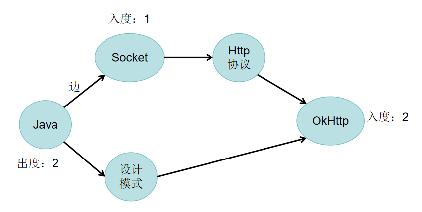

准备知识：app启动流程、DAG、拓步排序、线程相关

黑白屏： splashscreen PhoneWindow中解析

context：装饰者模式

优化部分：

Application attachBaseContext 字节优化

attach-onCreate-onStart-onResume

attach: 创建上下文，创建window

activity管理window，window管理view

onWindowFocusChanged是真正显示

setContentView比自定义view慢？因为通过解析xml 反射 转成view
优化方式：无，只能减少xml中的布局层级，根本解决方案compose

onResume可优化

Looper.myQueue().addIdleHandler {
    false
}

### 有向无环图DAG
表示事件之间的依赖关系，管理任务之间的调度

顶点：图中的一个点，比如顶点Java，顶点Socket

边：连接两个顶点的线段叫做边

入度：代表当前有多少边指向它，如Java入度为0，Socket入度为1

出度：代表当前指向其他的边数，如Java出度为2

### 拓扑排序
对一个有向图构造拓扑序列的过程

两种算法：入度表法(BFS法即广度优先搜索)和DFS法(深度优先搜索)

#### 入度表法

1. 找到图中入度为0的顶点
2. 反复删除顶点再找入度为0的顶点，完成排序

上图中结果：

Java-Socket-设计模式-Http协议-OkHttp

拓扑排序不唯一：Java后可以是Socket也可以是设计模式

#### DFS

1. 深度搜索
2. 找到图中出度为0的顶点

Java-Socket-Http协议-Okhttp

Okhttp-Http协议-Socket后设计模式的出度为0，所以是设计模式-Java

最终结果是拿逆序：

Java-设计模式-Socket-Http协议-Okhttp

CountDownLatch完成线程执行顺序 三方sdk通过字节码插桩 gradle修改内部子线程启动等