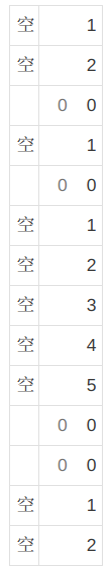

#### 常用符号
符号|作用|
:-|:-:|
~|转义字符|
?|通配符|
*|表示一个或一串字符|
<>|不等于|
$|表示绝对引用，如$A1则A固定1是可变|

### 函数
#### if函数
* 基本使用
```
IF(测试条件, "真","假")
```
如：=IF(B2=-1,"不显示",B2))
        如果B2等于-1，则单元格显示内容为“不显示”，否则显示B2具体内容

* 嵌套使用

如：=IF(B2=-1,"不显示",IF(B2>5,"不合适",B2))
如果B2等于-1，则单元格显示内容为“不显示”，否则再判断B2是否大于5，大于则显示B2具体内容，否则单元格显示内容为“不合适”

* 多个条件同时使用

如：=IF(B2=-1,"-",IF(AND(I3="对",L3="对"),"中","不中"))

如果B2不为-1，判断I3和L3是否同时为“对”，显示不同的结果
类似的=IF(B2=-1,"-",IF(OR(I3="对",L3="对"),"中","不中"))

这里I3和L3只要一个满足条件即为真
AND可以使用*代替，=IF(B2=-1,"-",IF((I3="对")*(L3="对"),"中","不中"))

OR可以使用+代替，=IF(B2=-1,"-",IF((I3="对")+(L3="对"),"中","不中"))

#### COUNTIF函数
* 基本使用
```
COUNTIF(统计范围, 条件)
```
如：=COUNTIF(B3:D3,H3)
统计B3到D3区域里和H3内容相同的数量，显示到单元格中

* 和IF嵌套使用

如：=IF(B2=-1,"无效",IF(COUNTIF(B3:D3,H3),"错","对"))
B2不是无效时，统计B3到D3存在多少个H3值，如果为0则显示对，否则显示错

* 其他使用

=COUNTIF(E2:E12,">=90") ，">=90" 也可以这样写：">="&90

=COUNTIF(B2:B12,"粉红*")

=COUNTIF(F2:F12,">"&AVERAGE(F2:F12))

* 数组组合多重条件

如统计>=350以及<=750的计数和
=SUM(COUNTIF(F2:F12,{">=350",">750"})*{1,-1})

如果条件填写<=750会把<350的也统计进来
如果不和(*)上{1,-1}，默认结果是将两个条件结果相加，理想结果是相减，所以需要将后面的结果变成负数
或者直接改成=COUNTIF(F2:F12,">350"）- COUNTIF(F2:F12,">750"）

#### MOD函数
```
MOD(数值,除数)
```
如：=MOD(1000,10)
       结果是0，除数是10则保留个位，相当于除余操作
#### ROWS函数
```
ROWS(数组)
```
如：=ROWS(I3:I13)
结果是11，返回的是区域的总行数
#### CHOOSE函数
#### VLOOKUP函数
#### MATCH函数
#### LOOKUP函数
```
三个参数(keys1, keys2, values)
keys1:表示要查找的key，可以是多个
keys2:表示定义好的集合中的key
values:表示集合中的key对应的value
```
#### SEARCH和FIND函数
两个参数(要查找的字符串，被查找的字符串，开始位置)
其中开始位置可以不填，默认从第一个位置开始
*search不区分大小写，find区分大小写，都返回第一个匹配的位置

#### IFERROR函数
两个参数(值，错误值)
可以配合search函数，search函数如果找不到会返回错误值(#VALUE!)，IFERROR函数可以将错误值重新设置成自己想要的值
IFERROR(错误值，自行指定值)

#### 案例
* 统计最大连续出现"A"的次数
```
MAX(FREQUENCY(IF($V2:$V1441="A",ROW(V2:V1441)),IF($V2:$V1441="B",ROW(V2:V1441))))
```
* 统计连续出现(1,2,3,...,N)次的次数
```
SUM(N(FREQUENCY(IF($O1:$O1419="A",ROW(O1:O1419)),IF($O1:$O1419="B",ROW(O1:O1419)))=COLUMN(A1)))
```
COLUMN(A1)用来确定N的值，A1即出现连续1次的A的次数
以上都需要shift+ctrl+回车

* 自动加0公式：
```
IF(B2<10,"0000"&B2,IF(B2<100,"000"&B2,
IF(B2<1000,"00"&B2,IF(B2<10000,"0"&B2,B2))))
```
* 如图效果


```
处理第一个空的位置(A1)：=IF(A1="空",1,0)
后面的直接=IF(A2="空",B1+1,IF(A2=0,0,"--"))
```
* 把内容15894分割
```
=MID($A1,COLUMN(B1)-1,1)
```
MID(分割的内容，开始位置，分割个数)
如果内容存在特点符号如45122-4578，可以使用工具分割
选择需要分割的区域，数据--分列--分割符号(或者固定宽度)--选择符号(标记分割线)--完成