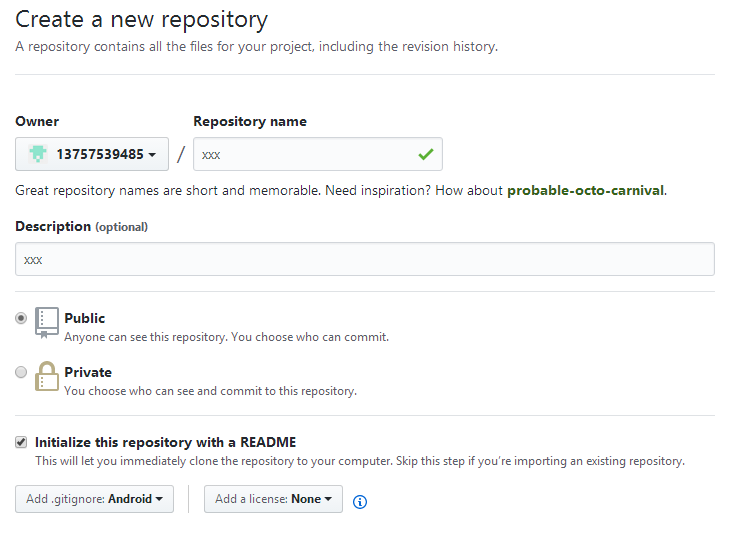
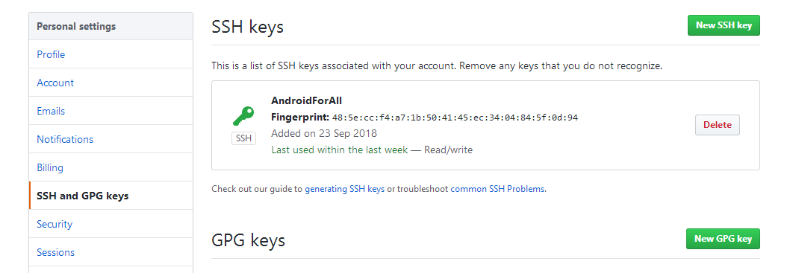
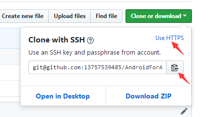

#### git安装

window:

[https://gitforwindows.org/](https://gitforwindows.org/)

linux/mac:
```
sudo apt install git
brew install git
```
#### 配置用户信息
```
git config --global user.name "xxx"
git config --global user.email "xxx"
```
#### 创建代码仓库
```
git init
```
#### 提交代码
```
git add xxx
git commit -m "xxx"
```
#### 分支处理
```
git branch查看本地所有分支
git branch -a查看远程所有分支
git branch -D xxx 删除某个分支
git checkout xxx切换到某个分支
git branch xxx新建xxx本地分支
```
合并修改到主分支：
```
git checkout 主分支
git merge 本地分支
```
解决冲突

#### 提交代码到github

1)github上新建项目(New repository)


2)本地生成SSH

适当位置下执行：
```
git init
```
然后执行：
```
ssh-keygen -t rsa -C "邮箱"
```
密码可不填直接回车

生成完毕后到生成目录(C:\Users\window\.ssh)复制id_rsa.pub里的内容到github上

位置：Settings--SSH and GPG keys


添加新的key(New SSH key)

3)添加远程地址



git remote add origin git@github.com:13757539485/AndroidForAll.git

4)提交本地代码

Android Studio新建项目
```
git branch -a

复制远程分支 remotes/origin/master

git reset --mixed remotes/origin/master

git add .

git commit -m "project init"

git push  (remotes/origin/master master)
```
5)创建远程分支
```
git checkout -b xxx

git push origin xxx:xxx
```
6)删除远程分支
```
git push origin --delete xxx
```
#### 其他命令
```
git fetch

git diff --cached

git format-patch打补丁

git tag

git config --global commit.template  [模板文件名]

git config --global core.editor  [编辑器名字] 如C:/windows/notepad.exe
```
#### 查看配置信息

查看系统config
```
git config --system --list（一般没有）
```
查看当前用户（global）配置，相当于全局
```
git config --global --list
```
查看当前仓库配置信息，相当于作用于这个仓库
```
git config --local --list
```
#### 配置别名

如设置status简写st
```
git config --global alias.st status
git config --global alias.ch checkout
git config --global alias.co commit
git config --global alias.br branch
git config --global alias.sh stash

git config --global alias.lg "log --color --graph --pretty=format:'%Cred%h%Creset -%C(yellow)%d%Creset %s %Cgreen(%cr) %C(bold blue)<%an>%Creset' --abbrev-commit"

git config --global alias.last 'log -1'
```
或者直接在配置文件里添加，~/.gitconfig

---

[user]

email = 1875287386@qq.com

name = yuli
[core]

editor = vi
[commit]

template = /home/yuli/CommitTemplate
[color]

ui = auto
[alias]

last = log -1

lg = log --color --graph --pretty=format:'%Cred%h%Creset -%C(yellow)%d%Creset %s %Cgreen(%cr) %C(bold blue)<%an>%Creset' --abbrev-commit

ch = checkout

co = commit

br = branch

st = status

---

Window上git diff出现^M问题
```
git config --global core.autocrlf true
```
git tag使用
```
git tag -l查看所有tag
```
创建tag：
```
git tag tagName 或者

git tag -a tagName -m "备注信息"
```
提交tag：
```
git push origin tagName
```
删除tag
```
git tag -d tagName
```
特定commit添加tag
```
git tag tagName  commit_id
```
指定tag上修改代码：
```
git checkout -b branch_name tagName
```
修改后提交
```
git push --set-upstream origin branch_name
```