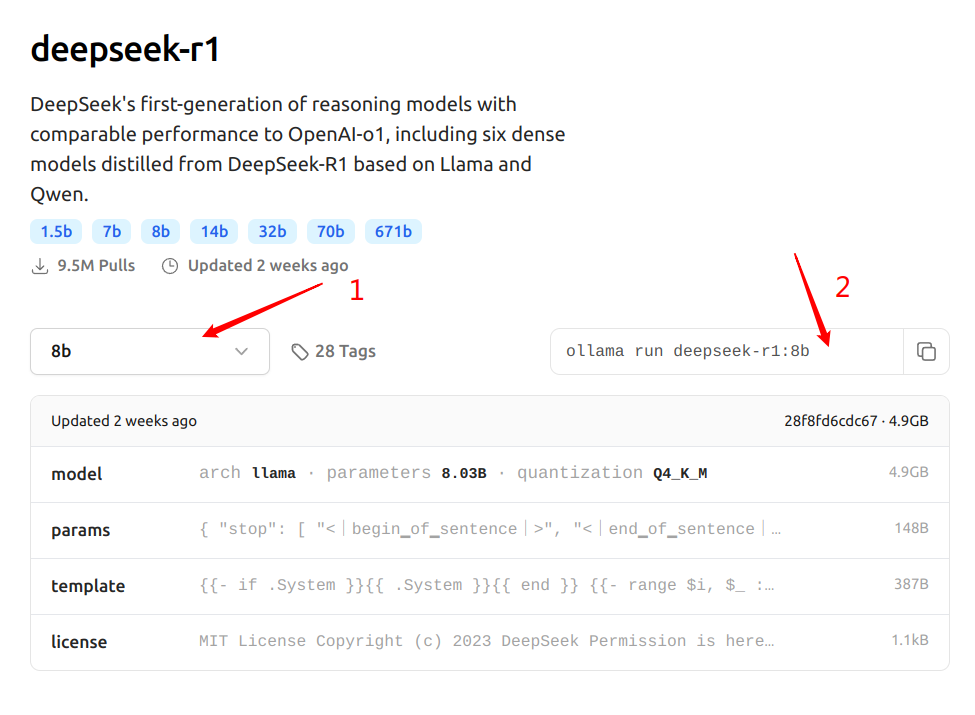

### 常用gpt
deepseek：https://chat.deepseek.com/coder

chatgpt：https://chatgpt.com/

gemini：https://gemini.google.com/app

### 本地部署deepseek

#### 安装ollama
https://ollama.com/

下载对应平台安装即可，对于linux下载的deb使用sudo dpkg -i xxx.deb进行安装

选择模型，点[Models](https://ollama.com/library/deepseek-r1:8b)，选择deepseek-r1，选择1.5b，7b，8b等



终端执行命令如选择8b
```shell
ollama run deepseek-r1:8b
```

#### 图形化界面

1.chatbox

https://github.com/Bin-Huang/chatbox/releases

配置模型：设置-模型

模型提供方选择ollama api

模型选择：deepseek-r1:8b

2.cherry studio

https://cherry-ai.com/download

需要解压才能执行，右键-属性-作为程序执行开启
```shell
./Cherry-Studio-0.9.19-x86_64.AppImage --appimage-extract
```

运行AppRun

ollama pull bge-m3

3.AnythingLLM


https://github.com/infiniflow/ragflow


sudo vi /etc/docker/daemon.json

{
    "registry-mirrors": [
        "https://docker.1panel.live",
        "https://hub.rat.dev"
    ]
}

systemctl daemon-reload

systemctl restart docker