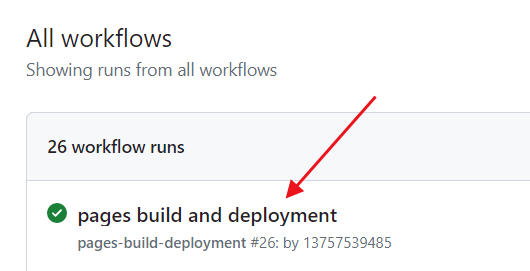
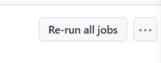

## 环境要求
[安装python](python.md)

## mkdocs官网

https://www.mkdocs.org/user-guide/configuration/#build-directories

## 安装mkdocs
window：
```
pip install mkdocs
```
linux：
```
sudo pip install mkdocs
```

## 升级和查看版本
```
pip install --upgrade mkdocs

mkdocs --version
```

## 创建项目
```
mkdocs new xxx
```

## 查看预览

```
cd xxx
mkdocs serve
```
在http://127.0.0.1:8000进行查看

## 生成网页

```
mkdocs build
```

## 发布
1. github配置

配置git基本信息
```
git config --global user.name "yuli" // 随意填写
git config --global user.email "1875287386@qq.com" // 和github绑定邮箱一致
git config --global credential.helper store
```
生成ssh，执行并一路回车
```
ssh-keygen -t rsa -C '1875287386@qq.com'
```
将id_rsa.pub内容粘贴到网站中
https://github.com/settings/keys

2. github创建项目名为note，仓库必须是public，进入到mkdocs创建的项目文件夹中，根据github上提示命令执行
```
git init
git add .
git commit -m "初始化mkdocs项目"
git remote add origin git@github.com:13757539485/note.git
git branch -M main // 用来存放源码使用
git push -u origin main
```
3. 执行一下命令，工具就会自动将相应内容推送到项目的 gh-pages 分支上
```
mkdocs gh-deploy // 会自动创建分支名为gh-deploy并存放网页源码
```
4. 在github项目中按照图中配置即可


5. 浏览https://username.github.io/project-name

https://13757539485.github.io/note

6. 如果网页没刷新，可以手动重新触发构建发布

https://github.com/13757539485/note/actions

找到失败的job或者最新的



打开后重新触发



## yaml相关注意事项
### 安装material主题
```
pip install mkdocs-material
```
linux需要使用sudo
### 配置主题
```
theme: 
  name: material
  language: zh
  palette:
    primary: 'Light Blue'
    accent: 'Light Blue'
  features:
    - navigation.tabs
  font:
    text: Microsoft YaHei
    code: Courier New
```
### 网页加密插件
```
pip install mkdocs-encrypt-plugin
```
[官方文档](https://github.com/unverbuggt/mkdocs-encryptcontent-plugin/blob/version3/README.md)

在mkdocs.yml中配置插件
```
plugins:
  - encryptcontent:
        password_file: 'xxx.yml'
```
其中xxx.yml使用来配置各种密码，如
```
classified: '000'
confidential:
    - '111'
    - '222'
secret:
    user1: '333'
    user2: '444'
```
某个md文件中调用

1. classified
```
---
level: classified
---
```
则打开页面是需要输入classified对应的密码
2. confidential
```
---
level: confidential
user: 0
---
```
则打开页面是需要输入第一个密码即111
3. secret
```
---
level: secret
user: user1
---
```
则打开页面是需要输入用户名和对应密码
### 其他配置(可忽略)
```
markdown_extensions:
  - admonition
  - codehilite:
      guess_lang: false
      linenums: false
  - toc:
      permalink: true
  - footnotes
  - meta
  - def_list
  - pymdownx.arithmatex
  - pymdownx.betterem:
      smart_enable: all
  - pymdownx.caret
  - pymdownx.critic
  - pymdownx.details
  - pymdownx.emoji:
      emoji_generator: !!python/name:pymdownx.emoji.to_png
      #emoji_generator: !!python/name:pymdownx.emoji.to_svg
      #emoji_generator: !!python/name:pymdownx.emoji.to_png_sprite
      #emoji_generator: !!python/name:pymdownx.emoji.to_svg_sprite
      #emoji_generator: !!python/name:pymdownx.emoji.to_awesome
      #emoji_generator: !!python/name:pymdownx.emoji.to_alt
  - pymdownx.inlinehilite
  - pymdownx.magiclink
  - pymdownx.mark
  - pymdownx.smartsymbols
  - pymdownx.superfences
  - pymdownx.tasklist
  - pymdownx.tilde

extra:
  search:
    language: 'en,zh,jp'

plugins:
  - search
```
主页默认为index.md

更多学习：

https://zhuanlan.zhihu.com/p/613038183
https://squidfunk.github.io/mkdocs-material/setup/changing-the-colors/