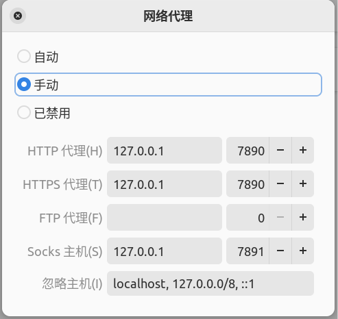

星火商店：https://spark-app.store/

QQ：https://im.qq.com/linuxqq/index.shtml

搜狗输入法：https://shurufa.sogou.com/

火焰截图：官方应用商店/星火商店

- 系统-键盘-键盘快捷键-自定义快捷键-(添加名称火焰截图，命令flameshot gui，快捷键如Alt+A)
- 截图黑屏问题：设置-关于-系统窗口，如果是WayLand需修改成x11，sudo vi /etc/gdm3/custom.conf，WaylandEnable=false去掉#，保存并重启电脑

Clash：https://ikuuu.one

建议直接在星火商店中下载window版本，导入yaml即可

ubuntu中需要在设置中配置，设置-网络-网络代理，如图配置



127.0.0.1 7890

localhost, 127.0.0.0/8, ::1

<a id="linux_terminal">终端中不起作用解决</a>

配置git代理
```shell
git config --global http.proxy http://127.0.0.1:7890
git config --global https.proxy http://127.0.0.1:7890
```
或者git config --local

取消代理
```shell
git config --global --unset http.proxy
git config --global --unset https.proxy
```

浏览器某些网站打不开解决：clash选择规则模式