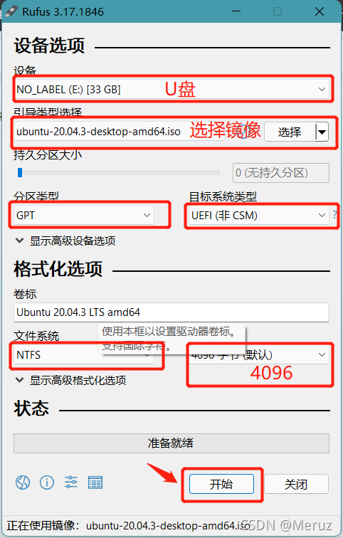
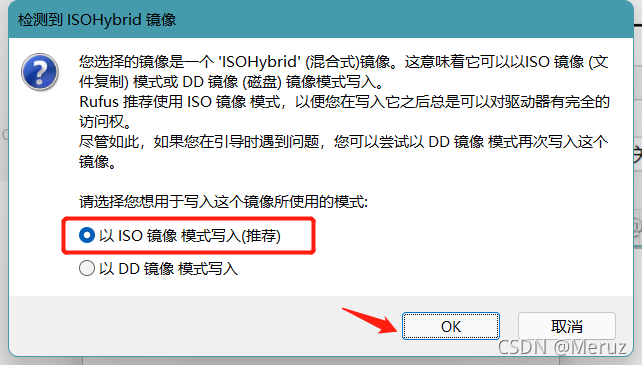

### Windows11安装Ubuntu双系统
#### 下载Ubuntu镜像iso文件
* 官网：
https://ubuntu.com/download/desktop
* 阿里：
https://developer.aliyun.com/mirror/?spm=a2c6h.25603864.0.0.94936c65ILrxWy
* 清华：
https://mirrors.tuna.tsinghua.edu.cn/

#### U盘启动制作工具
官网推荐https://rufus.ie/

运行 rufus-3.10.exe，按照下图选择，点击开始–OK–确定，等待进度条走完–关闭




#### U盘启动安装系统
按照提示

#### 双系统引导界面美化+修改默认启动项
主题下载地址：https://www.gnome-look.org/p/1009236/

百度网盘链接：https://pan.baidu.com/s/1-mOl3_mHZZVh_PVMq9oQ1w 提取码：2pbn

启动Ubuntu系统进行操作
```
解压
tar xvJf Vimix-1080p.tar.xz
进入解压后的文件夹
cd Vimix-1080p
安装
sudo ./install.sh
修改启动设置
sudo gedit /etc/default/grub
```
GRUB_DEFAULT（默认启动项：编号是从0开始的）

GRUB_TIMEOUT_STYLE（是否显示倒计时，hidden的属性表示不会显示倒计时，注释掉该行则显示倒计时）

GRUB_TIMEOUT（等待时间，单位是秒）
按自身需求更改后，保存即可

在命令行输入
```
sudo update-grub
```
重启生效

#### 解决双系统下时间不同步问题
进入Ubuntu系统执行以下命令
```
sudo apt-get install ntpdate //在Ubuntu下更新本地时间
sudo ntpdate time.windows.com
sudo hwclock --localtime --systohc //将本地时间更新到硬件上
```   
然后重启进入Windows，初次重启可能时间依然不同，但是在Windows自动调整一遍后，时间就同步了。
#### vi编辑器键盘错乱的问题
安装vim full版本
首先，要先卸掉旧版的vi，输入以下命令：
```
sudo apt-get remove vim-common
sudo apt-get install vim
```
#### 设置root密码
```
sudo passwd root
```
#### 安装输入法
先安装[星火商店](https://spark-app.store/)，在办公中选中相应的输入法，例如百度输入法，安装中会出现报错，打开终端执行
```
sudo apt install -f
```
打开设置-区域与语言-管理已安装的语言，在弹出的框中选择键盘输入法系统为Fcitx 4

注销电脑，重新打开星火商店重新安装输入法再注销即可

#### 美化主题
打开ubuntu software，搜索并安装GNOME Tweaks和扩展

拓展管理安装：
```
sudo apt install gnome-shell-extension-manager
```
打开拓展管理器选择安装User Themes

mac主题
```
git clone https://github.com/vinceliuice/WhiteSur-gtk-theme.git --depth=1
```
执行
```
./install.sh
```
mac图标
```
git clone https://github.com/vinceliuice/WhiteSur-icon-theme.git --depth=1
```
执行
```
./install.sh
```

打开优化(GNOME Tweaks)，下安装外观，对应用程序、光标、图标、Shell进行主题配置White开头

窗口标题栏修改放置为左

#### 配置samba共享
安装samba
```
sudo apt-get install samba
```
设置用户目录权限
```
sudo chmod 755 /home/username
```
编辑配置文件
```
sudo vi /etc/samba/smb.conf
```
添加内容
```
[Share]  
    Comment = Ubuntu File Share  
    Path = /home/username  
    Browseable = yes  
    Writable = yes  
    Valid Users = username
```
设置访问用户并设置访问密码
```
sudo smbpasswd -a username
```
重启samba服务
```
sudo service smbd restart
```
window电脑直接在文件管理其中输入ubuntu的ip地址即可访问，创建磁盘映射路径为：
```
\\ip\Share
```