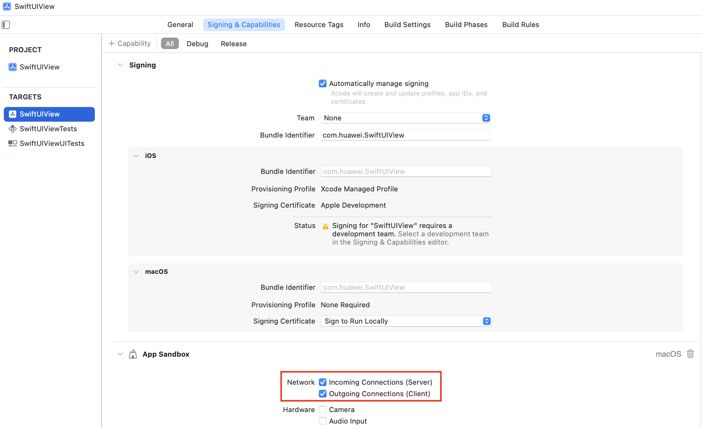

#### 产品分类编码
```
#if os(iOS)
//code
#endif

#if os(macOS)
//code
#endif
```
#### 打包

1.打开菜单Product-Archive

2.选择Distribute App

3.Copy App，选中桌面即可

#### 常见坑
Mac端使用AsyncImage组件加载网络图片报错

异常：finished with error [-1003] Error Domain=NSURLErrorDomain Code=-1003 "未能找到使用指定主机名的服务器。"

解决：勾选红框选项

