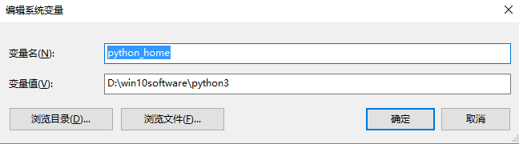
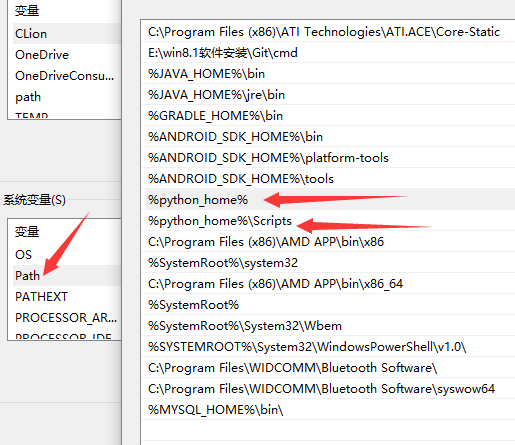

# 安装
进入[官网](https://www.python.org/downloads/)下载安装即可

# 环境变量
## windows

1. 新建python_home，添加安装路径，如图



2. path中添加变量，如图



3. 查看python版本，检测环境是否正常

```cmd
python -V
```

4. 查看pip版本

```cmd
pip -V
```

