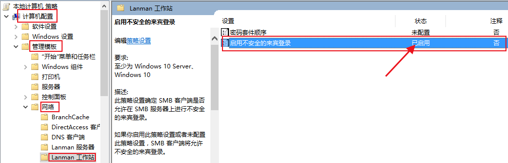

#### 1.安装VMWare虚拟机
官方下载地址：

https://www.vmware.com/cn/products/workstation-pro/workstation-pro-evaluation.html

VMware许可证

17.x

JU090-6039P-08409-8J0QH-2YR7F

ZA5RU-6FYD5-48EPY-3XXEE-PAUGD

ZF3R0-FHED2-M80TY-8QYGC-NPKYF

FC7D0-D1YDL-M8DXZ-CYPZE-P2AY6

ZC3TK-63GE6-481JY-WWW5T-Z7ATA

1Z0G9-67285-FZG78-ZL3Q2-234JG

4A4RR-813DK-M81A9-4U35H-06KND

NZ4RR-FTK5H-H81C1-Q30QH-1V2LA

JU090-6039P-08409-8J0QH-2YR7F

4Y09U-AJK97-089Z0-A3054-83KLA

4C21U-2KK9Q-M8130-4V2QH-CF810

MC60H-DWHD5-H80U9-6V85M-8280D

16.x

ZF3R0-FHED2-M80TY-8QYGC-NPKYF

Z1ZPR-EDGQN-M1JE9-HYFGX-YPGEX

内存：不能超过物理内存
cpu核数：见任务管理器-性能，cpu个数和处理器相乘不能超过20


#### 2.安装系统(以ubuntu为例)

iso镜像下载地址：
[阿里](https://developer.aliyun.com/mirror/?spm=a2c6h.25603864.0.0.94936c65ILrxWy)
[清华](https://mirrors.tuna.tsinghua.edu.cn/)

#### 3.安装samba共享
在ubuntu终端中操作
```
sudo apt-get install samba
sudo apt-get install cifs-utils
```
修改配置
```
sudo cp /etc/samba/smb.conf /etc/samba/smb.conf.bak
sudo vi /etc/samba/smb.conf
```
最后添加一下内容，/home/hfc/可以更改成其他目录
```
[share]
      path = /home/hfc/
      available = yes
      browseable = yes
      public = yes
      writable = yes
```
创建用户
```
sudo touch /etc/samba/smbpasswd
sudo smbpasswd -a hfc(当前系统用户)
```
重启服务
```
sudo /etc/init.d/smbd restart
```
win10开启smb共享服务

Win+R，输入gpedit.msc ,打开组策略，修改以下配置后重启电脑

若开启hyper-v需要关闭，否则影响模拟器使用
关闭方式：
管理员运行终端输入bcdedit /set  hypervisorlaunchtype OFF(恢复AUTO)
Win+R输入services.msc，将HV主机服务禁用

重启电脑生效