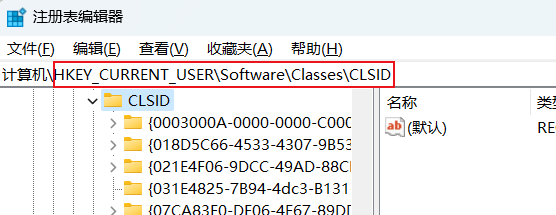
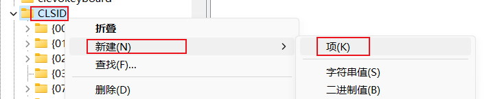
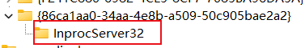
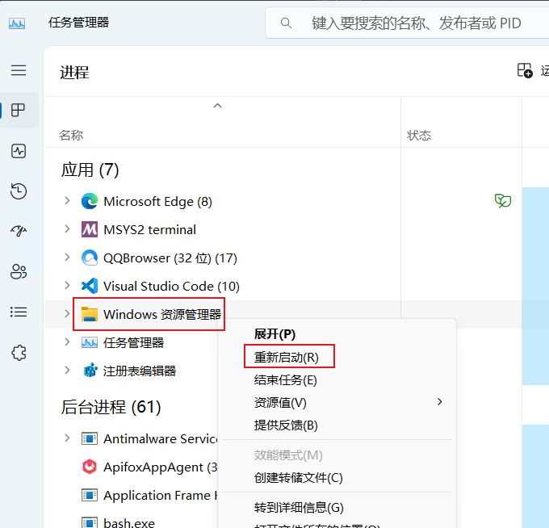

### 1.右键菜单恢复win10

1.win+r打开运行窗口，输入regedit，按下回车键确认即可打开注册表

2.在路径中输入：HKEY_CURRENT_USER\SOFTWARE\CLASSES\CLSID



3.右键点击CLSID项，点击新建一个项，命名为{86ca1aa0-34aa-4e8b-a509-50c905bae2a2}


4.右键点击新建的项，然后再新建一个项，命名为InprocServer32


5.重启资源管理器


命令方式
```
reg.exe delete "HKCUSoftwareClassesCLSID{86ca1aa0-34aa-4e8b-a509-50c905bae2a2}InprocServer32" /va /f
```
或者
```
reg add HKCU\Software\Classes\CLSID\{86ca1aa0-34aa-4e8b-a509-50c905bae2a2}\InprocServer32 /ve /d "" /f
```
需要重启电脑
### 2.拖拽删除文件
新建bat文件，添加代码
```bat
DEL /F /A /Q \\?\%1
RD /S /Q \\?\%1
```

### 3.合并7z.00x
打开cmd
```
copy /b xxx.7z.* xxx.7z
```