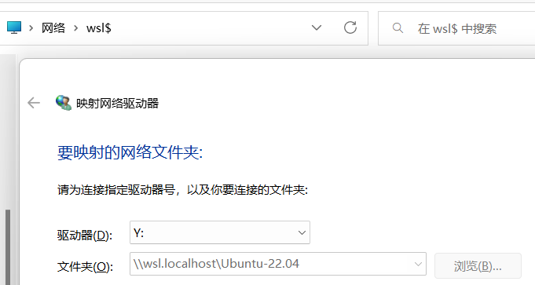

#### 1.Windows功能中勾选
控制面板-程序-启用或关闭

Windows虚拟机监控程序平台、适用于Linux的Windows子系统并重启电脑

#### 2.安装ubuntu
打开应用商店搜索ubuntu并获取，例如选择ubuntu22.04

#### 3.下载更新程序并安装
https://wslstorestorage.blob.core.windows.net/wslblob/wsl_update_x64.msi
#### 4.启动ubuntu
window菜单中打开ubuntu会自动进行安装，完成后输入用户名，密码
#### 5.查看配置
打开powershell输入
```
wsl -l --all -v
```
如果version是2表示已经安装wsl2，如果是1需要进行升级
```
wsl --set-version Ubuntu-22.04 2
```
#### 6.迁移到其他盘，默认安装在c盘
```
wsl --shutdown
```
通过wsl -l --all -v确认是Stopped状态

导出压缩包：
```
wsl --export Ubuntu-22.04 D:\ubuntuback\ubuntu22.04.tar
```
注销系统：
```
wsl --unregister Ubuntu-22.04
```
导入系统：
```
wsl --import Ubuntu-22.04 D:\ubuntu2204 D:ubuntuback\ubuntu22.04.tar
```
Ubuntu-22.04 Linux系统名称和版本

D:\Ubuntu2204 安装路径

D:ubuntuback\ubuntu22.04.tar 镜像所在位置

重新设置用户：
```
ubuntu2204.exe config --default-user yuli
```
释放空间：
```
wsl --shutdown
diskpart
select vdisk file="D:\ubuntu2204\ext4.vhdx"
attach vdisk readonly
compact vdisk
detach vdisk
exit
```
映射window磁盘，文件管理器输入\\wsl$后回车，右键添加映射网络驱动器

